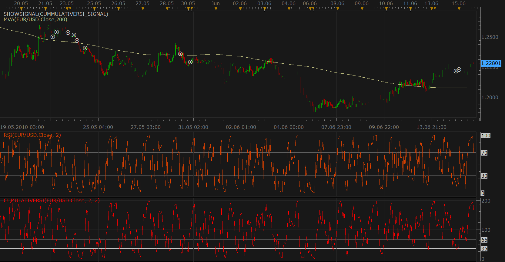

# Cumulative RSI signal

> Source: https://fxcodebase.com/code/viewtopic.php?f=29&t=1341  
> Forum: 29 · Topic 1341 · 1 post(s)

---

## Cumulative RSI signal

**Nikolay.Gekht** · Tue Jun 15, 2010 9:17 am

The signal is described in Chapter 9 of Trading Strategies That Work by Larry Connors and Cesar Alvarez.

The signal logic is the following:
1) Trade when the price is over 200 moving average
2) Enter long when Cumulative RSI(2, 2) crosses below 35
3) Exit when RSI(2) crosses above 65.

MA parameters, RSI parameters and levels are customizable.

The books reported that the strategy worked well on indexes in daily time frame. However, the default parameter looks like that must be tuned for the FOREX.

 



Download:

 [CummulativeRSI_signal.lua](files/2563/CummulativeRSI_signal.lua)

You must also download and install CummulativeRSI indicator: [viewtopic.php?f=17&t=1340](https://fxcodebase.com/code/viewtopic.php?f=17&t=1340)

```lua
-- strategy profile initialization routine
function Init()
    strategy:name("Cumulative RSI");
    strategy:description("The strategy described in Chapter 9 of Trading Strategies That Work by Larry Connors and Cesar Alvarez.");

    strategy.parameters:addGroup("Parameters");
    strategy.parameters:addInteger("MN", "MVA period", "", 200, 1, 1000);
    strategy.parameters:addInteger("N", "RSI period", "", 2, 2, 200);
    strategy.parameters:addInteger("X", "RSI accumulation", "", 2, 1, 200);
    strategy.parameters:addDouble("EL", "Enter Level", "", 35, 0, 200);
    strategy.parameters:addDouble("EX", "Exit Level", "", 65, 0, 200);
    strategy.parameters:addString("Source", "Price", "", "C");
    strategy.parameters:addStringAlternative("Source", "Close", "", "C");
    strategy.parameters:addStringAlternative("Source", "Median", "", "M2");
    strategy.parameters:addStringAlternative("Source", "Typical", "", "M3");
    strategy.parameters:addString("Method", "Moving average method", "The methods marked by an asterisk (*) require the appropriate indicators to be loaded.", "MVA");
    strategy.parameters:addStringAlternative("Method", "MVA", "", "MVA");
    strategy.parameters:addStringAlternative("Method", "EMA", "", "EMA");
    strategy.parameters:addStringAlternative("Method", "LWMA", "", "LWMA");
    strategy.parameters:addStringAlternative("Method", "SMMA*", "", "SMMA");
    strategy.parameters:addStringAlternative("Method", "Vidya (1995)*", "", "VIDYA");
    strategy.parameters:addStringAlternative("Method", "Vidya (1992)*", "", "VIDYA92");
    strategy.parameters:addStringAlternative("Method", "Wilders*", "", "WMA");
    strategy.parameters:addString("Period", "Timeframe", "", "m1");
    strategy.parameters:setFlag("Period", core.FLAG_PERIODS);
    strategy.parameters:addGroup("Signals");
    strategy.parameters:addBoolean("ShowAlert", "Show Alert", "", true);
    strategy.parameters:addBoolean("PlaySound", "Play Sound", "", false);
    strategy.parameters:addFile("SoundFile", "Sound File", "", "");
end

local SoundFile;
local gSource = nil;
local gTickSource = nil;
local gMa = nil;
local gRsi = nil;
local gRsi1 = nil;
local gMaData = nil;
local gRsiData = nil;
local gRsi1Data = nil;
local first;
local inPosition = false;
local EX, EL;

function Prepare()
    local ShowAlert = instance.parameters.ShowAlert;
    if instance.parameters.PlaySound then
        SoundFile = instance.parameters.SoundFile;
    else
        SoundFile = nil;
    end
    EX = instance.parameters.EX;
    EL = instance.parameters.EL;
    assert(not(PlaySound) or (PlaySound and SoundFile ~= ""), "Sound file must be specified");
    assert(instance.parameters.Period ~= "t1", "Signal cannot be applied on ticks");
    ExtSetupSignal("Cumulative RSI signal:", ShowAlert);
    gSource = ExtSubscribe(1, nil, instance.parameters.Period, true, "bar");
    if instance.parameters.Source == "C" then
        gTickSource = gSource.close;
    elseif instance.parameters.Source == "M2" then
        gTickSource = gSource.median;
    elseif instance.parameters.Source == "M3" then
        gTickSource = gSource.typical;
    else
        assert(false, "Unknown price type is chosen");
    end

    gMa = core.indicators:create(instance.parameters.Method, gTickSource, instance.parameters.MN);
    gMaData = gMa.DATA;
    gRsi = core.indicators:create("CUMULATIVERSI", gTickSource, instance.parameters.N, instance.parameters.X, instance.parameters.EL, instance.parameters.EX);
    gRsiData = gRsi.DATA;
    gRsi1 = core.indicators:create("RSI", gTickSource, instance.parameters.N);
    gRsi1Data = gRsi1.DATA;
    first = math.max(gRsiData:first() + 1, gMaData:first());
    local name = profile:id() .. "(" .. instance.bid:instrument() .. "(" .. instance.parameters.Period  .. ")," .. instance.parameters.Method .. "," .. instance.parameters.MN .. "," .. instance.parameters.N .. "," .. instance.parameters.X  .. "," .. instance.parameters.EL  .. "," .. instance.parameters.EX .. ")";
    instance:name(name);
end

function ExtUpdate(id, source, period)
    if id == 1 and period >= first then
        gMa:update(core.UpdateLast);
        gRsi:update(core.UpdateLast);
        gRsi1:update(core.UpdateLast);

        if gTickSource[period] > gMaData[period] and
           core.crossesUnder(gRsiData, EL, period) then
            ExtSignal(gSource, period, "Enter", SoundFile);
            inPosition = true;
        elseif inPosition and
               core.crossesOver(gRsi1Data, EX, period) then
            ExtSignal(gSource, period, "Exit", SoundFile);
            inPosition = false;
        end
    end
end

dofile(core.app_path() .. "\\strategies\\standard\\include\\helper.lua");
```
