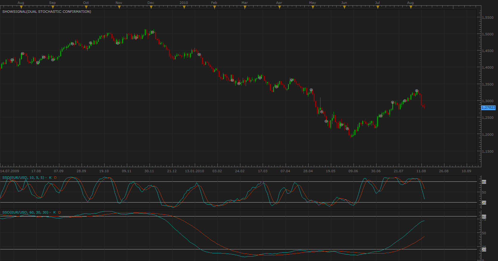

# Dual Stochastic confirmation

> Source: https://fxcodebase.com/code/viewtopic.php?f=29&t=1776  
> Forum: 29 · Topic 1776 · 3 post(s)

---

## Dual Stochastic confirmation

**Apprentice** · Fri Aug 13, 2010 11:40 am

To be confirmed by signals at a shorter time period, must be the same direction as the long-term signal, trend.

Written upon request.

 [Dual Stochastic confirmation.lua](files/3569/Dual%20Stochastic%20confirmation.lua)

---

## Re: Dual Stochastic confirmation

**infinitum** · Thu Aug 19, 2010 2:28 pm

Hey Apprentice, looks good but has some problems. Can you fix it or give us the code????

The error details: [string "Dual Stochastic confirmation.lua"]
and
Attempt to index global 'strategy' (a nil value)

---

## Re: Dual Stochastic confirmation

**Apprentice** · Thu Aug 19, 2010 2:36 pm

That is easy one, just read instructions on how to install the signal.
[viewtopic.php?f=17&t=17](https://fxcodebase.com/code/viewtopic.php?f=17&t=17)
