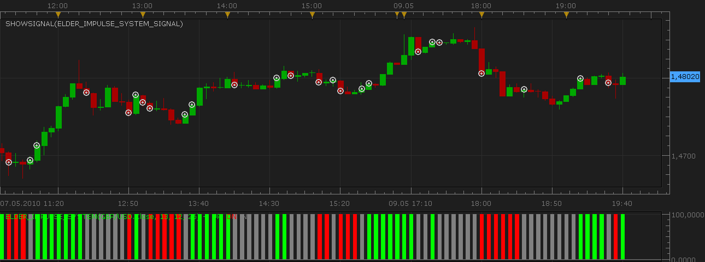

# Elder Impulse System Signal

> Source: https://fxcodebase.com/code/viewtopic.php?f=29&t=995  
> Forum: 29 · Topic 995 · 13 post(s)

---

## Elder Impulse System Signal

**Nikolay.Gekht** · Sun May 09, 2010 6:45 pm

The signal shows when the Elder Impulse System changes to Up, Down or Neutral.

 



Download the signal:

 [Elder_Impulse_System_Signal.lua](files/1850/Elder_Impulse_System_Signal.lua)

The [Elder Impulse System indicator](https://fxcodebase.com/code/viewtopic.php?f=17&t=993) must be also installed!

```lua
function Init()
    strategy:name("Elder Impulse System Signal");
    strategy:description("");

    strategy.parameters:addGroup("Parameter");

    strategy.parameters:addInteger("EMA", "EMA periods for study", "", 13, 1, 100);
    strategy.parameters:addInteger("MACDF", "MACD periods fast", "", 12, 1, 100);
    strategy.parameters:addInteger("MACDS", "MACD periods slow", "", 26, 1, 100);

    strategy.parameters:addString("Period", "Time frame", "", "m1");
    strategy.parameters:setFlag("Period", core.FLAG_PERIODS);

    strategy.parameters:addGroup("Signal");

    strategy.parameters:addBoolean("ShowAlert", "Show Alert", "", true);
    strategy.parameters:addBoolean("PlaySound", "Play Sound", "", false);
    strategy.parameters:addFile("SoundFile", "Sound File", "", "");
end

local SoundFile;
local E, U, D, N;
local gSource = nil;        -- the source stream

function Prepare()
    ShowAlert = instance.parameters.ShowAlert;

    if instance.parameters.PlaySound then
        SoundFile = instance.parameters.SoundFile;
    else
        SoundFile = nil;
    end

    assert(not(PlaySound) or (PlaySound and SoundFile ~= ""), "The sound file must be specified");

    ExtSetupSignal(profile:id() .. ":", ShowAlert);

    gSource = ExtSubscribe(1, nil, instance.parameters.Period, true, "close");

    E = core.indicators:create("ELDER_IMPULSE_SYSTEM", gSource, instance.parameters.EMA, instance.parameters.MACDF, instance.parameters.MACDS);

    U = E:getStream(0);
    D = E:getStream(1);
    N = E:getStream(2);

    local name = profile:id() .. "(" .. instance.bid:instrument() .. "(" .. instance.parameters.Period  .. ")" .. "," .. instance.parameters.EMA  .. "," .. instance.parameters.MACDF .. "," .. instance.parameters.MACDS .. ")";
    instance:name(name);
end

function getElder(period)
    if U:hasData(period) and U[period] == 100 then
        return 1;
    elseif D:hasData(period) and D[period] == 100 then
        return 2;
    elseif N:hasData(period) and N[period] == 100 then
        return 3;
    else
        return 0;
    end
end

-- when tick source is updated
function ExtUpdate(id, source, period)
    E:update(core.UpdateLast);

    local prev, curr;
    prev = getElder(period - 1);
    curr = getElder(period);

    if prev ~= curr then
        if curr == 1 then
            ExtSignal(gSource, period, "UP", SoundFile);
        elseif curr == 2 then
            ExtSignal(gSource, period, "DOWN", SoundFile);
        elseif curr == 3 then
            ExtSignal(gSource, period, "NEUTRAL", SoundFile);
        end
    end
end

dofile(core.app_path() .. "\\strategies\\standard\\include\\helper.lua");
```

---

## Re: Elder Impulse System Signal

**twitjaksono** · Mon Jun 21, 2010 4:32 pm

Hi. I had downloaded the Impulse System and had successfully installed it. However when I had downloaded the Impulse System Signal and tried to install it, I received this message as shown on the image. Could you inform what I should do? Thanks so much.

---

## Re: Elder Impulse System Signal

**Nikolay.Gekht** · Mon Jun 21, 2010 4:43 pm

Please read and follow the instruction on how to install the signal:
[viewtopic.php?f=29&t=602](https://fxcodebase.com/code/viewtopic.php?f=29&t=602)
You are just trying to add the signal using the "add the indicator" command.

---

## Re: Elder Impulse System Signal

**Pride80** · Tue Sep 14, 2010 7:05 am

I agree. I would really like to have the bigger timeframe version of this wonderful indicator .

---

## Re: Elder Impulse System Signal

**Apprentice** · Tue Sep 14, 2010 8:08 am

Added to development cue.

---

## Re: Elder Impulse System Signal

**Pride80** · Tue Sep 14, 2010 1:39 pm

I posted in the wrong topic , i need the higher timeframe version of elder impulse indicator, not signal... i'm sorry if this will cause problems to you

---

## Re: Elder Impulse System Signal

**Apprentice** · Tue Sep 14, 2010 2:15 pm

I assumed it.

---

## Re: Elder Impulse System Signal

**Alexander.Gettinger** · Tue Sep 28, 2010 2:33 am

Please, see this topic: [viewtopic.php?f=17&t=993&p=4846#p4846](https://fxcodebase.com/code/viewtopic.php?f=17&t=993&p=4846#p4846)

---

## Re: Elder Impulse System Signal

**thetruth** · Wed Jul 03, 2013 7:57 am

Good work!
can you add some variant, the idea is: blue candle, green or red candle.(2 candles) is the signal to up or down. and stop when same color candles appears..
thanks.

---

## Re: Elder Impulse System Signal

**Apprentice** · Fri Jul 05, 2013 5:10 am

Your request is added to the development list.

---

## Re: Elder Impulse System Signal

**thetruth** · Tue Oct 15, 2013 3:25 pm

thanks a lot!! and good work!
i need a strategy for this signal, can you develop that?? or where i can found the procedure or tutorial to do that??
thank you again!

---

## Re: Elder Impulse System Signal

**Apprentice** · Thu Oct 17, 2013 3:27 am

All necessary resources are available on this forum.
[http://fxcodebase.com/wiki/index.php/Main_Page](https://fxcodebase.com/wiki/index.php/Main_Page)
[http://fxcodebase.com/documentation.php](https://fxcodebase.com/documentation.php)
My recommendation is to install SDK first.
Within the will find all the educational material needed.

---

## Re: Elder Impulse System Signal

**thetruth** · Thu Oct 17, 2013 8:49 am

thanks!
