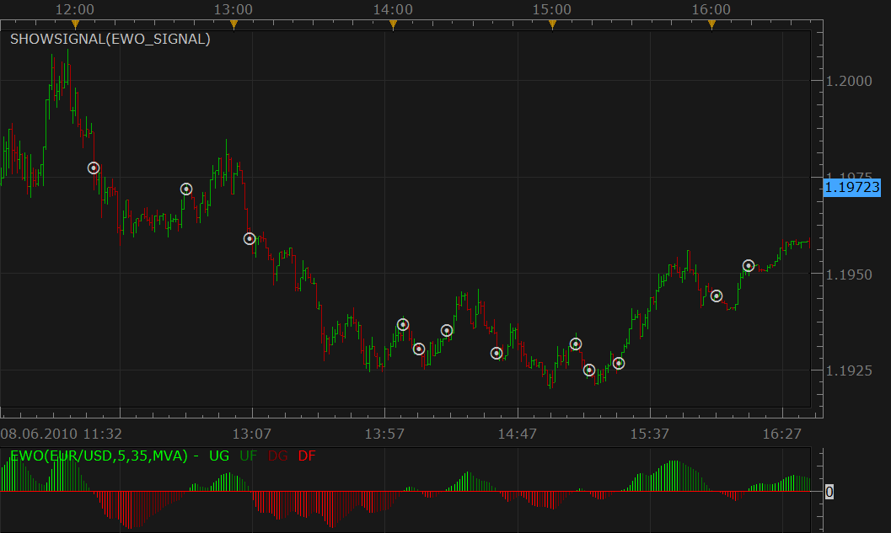

# Elliot Wave oscillator/Cross Zero signal

> Source: https://fxcodebase.com/code/viewtopic.php?f=29&t=1284  
> Forum: 29 · Topic 1284 · 1 post(s)

---

## Elliot Wave oscillator/Cross Zero signal

**Nikolay.Gekht** · Tue Jun 08, 2010 4:20 pm

The signal shows alert when Elliot Wave Oscillator crosses zero line

 

Download:

 [EWO_signal.lua](files/2453/EWO_signal.lua)
