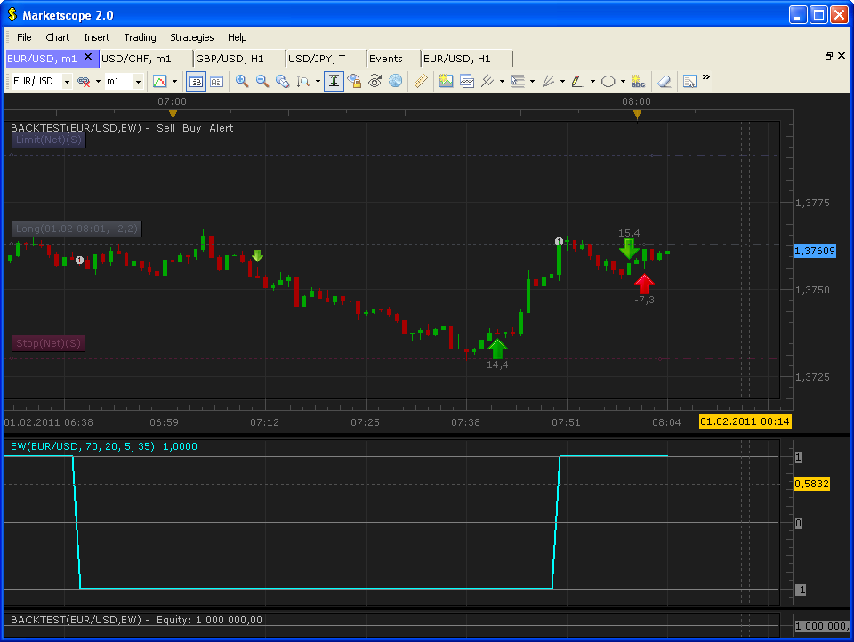

# Elliott Wave Signal

> Source: https://fxcodebase.com/code/viewtopic.php?f=29&t=3302  
> Forum: 29 · Topic 3302 · 9 post(s)

---

## Elliott Wave Signal

**sunshine** · Tue Feb 01, 2011 7:58 am

*Elliott Wave Signal*

The signal is based on the Elliott Wave indicator.
Elliott Wave Indicator gives either a +1 or -1 signal. +1 indicates a long position and -1 indicates a short position. The indicator will always be -1 or +1. You could use the changing of the direction to indicate the start of a new wave.

---

## Re: Elliott Wave Signal

**keyrama** · Tue Feb 01, 2011 8:37 am

Excuse me but, your eurusd M1 chart does not look like mine, at the exact same date and hour. And i'm on bid prices too.

It looks like less choppy.

The symbol on the chart mode doesn't exist on my marketscope version.

Could you explain ?

Thanks, Keyrama

---

## Re: Elliott Wave Signal

**sunshine** · Wed Feb 02, 2011 10:57 am

> **keyrama wrote:**
> Excuse me but, your eurusd M1 chart does not look like mine, at the exact same date and hour. And i'm on bid prices too. It looks like less choppy.

It seems that the vertical scale on my chart is smaller, pay attention to the distance between prices on the price axis.

> **keyrama wrote:**
> The symbol on the chart mode doesn't exist on my marketscope version.

What symbol do you mean?

---

## Re: Elliott Wave Signal

**keyrama** · Thu Feb 03, 2011 8:47 am

It's not a scale problem. For example at 7h51 you have 1.3760, I have 1.3730.

I mean the symbol just on the right of where you select the time frame (m1..)

Is it a logaritmic mode that will be implemented in the next version or something like that ?

Thanks, keyrama

---

## Re: Elliott Wave Signal

**keyrama** · Thu Feb 03, 2011 8:52 am

Oh i'm sorry, i'm in europe so 7h51 on your chart is 14h51 for mine

But the question about the symbol remains.

Thanks, Keyrama

---

## Re: Elliott Wave Signal

**sunshine** · Fri Feb 04, 2011 1:03 pm

> **keyrama wrote:**
> Oh i'm sorry, i'm in europe so 7h51 on your chart is 14h51 for mine
>
> But the question about the symbol remains.
>
> Thanks, Keyrama

It's just a symbol of the candlestick mode. My Trading Station is in the No skin mode. However I hope that a logarithmic scale will appear in one of the next releases

---

## Re: Elliott Wave Signal

**Coondawg71** · Fri Sep 07, 2012 7:49 am

Can we please request a Strategy for this Elliott Wave Signal/Indicator.

Buy when Signal is positive "+1"
Sell when Signal is negative "-1"
unless of course it is easier to write the strategy to open/close positions with crossing of "0"

Please allow the trading parameters to be customized by the user just as the signal/indicator allows.

Thanks,

sjc

---

## Re: Elliott Wave Signal

**Apprentice** · Fri Sep 07, 2012 11:13 am

Requested can be found here.
[viewtopic.php?f=31&t=23132](https://fxcodebase.com/code/viewtopic.php?f=31&t=23132)

---

## Re: Elliott Wave Signal

**Coondawg71** · Sat Sep 08, 2012 5:47 pm

Thanks Apprentice!

sjc
