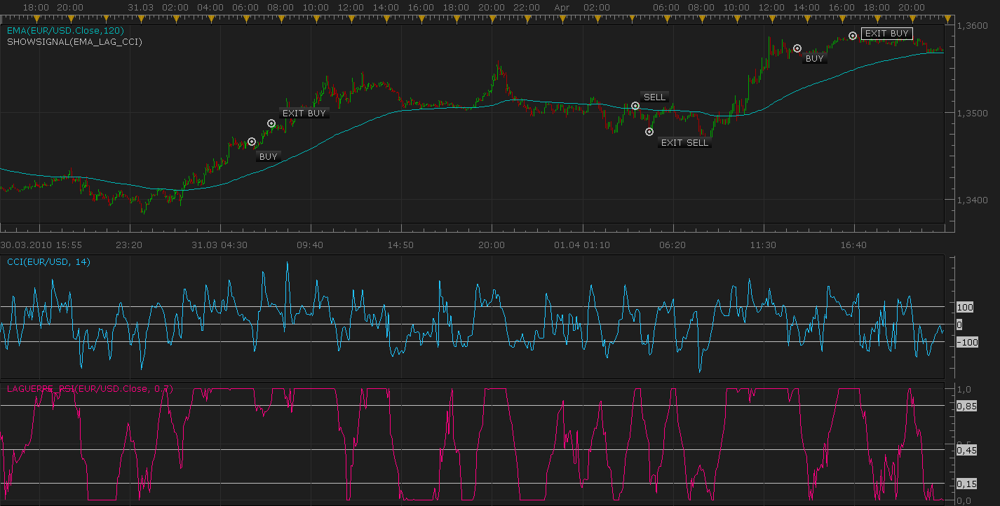

# EMA/Laguerre RSI/CCI custom signal

> Source: https://fxcodebase.com/code/viewtopic.php?f=29&t=601  
> Forum: 29 · Topic 601 · 11 post(s)

---

## EMA/Laguerre RSI/CCI custom signal

**Nikolay.Gekht** · Sun Apr 11, 2010 7:23 pm

The signal is designed to work on EUR/USD with 5 minute time frame.

The signal checks the market when another candle is being closed, i.e. it ignores the latest candle which changes every time when a new tick arise.

The signal shows BUY event when:
PREVIOUS EMA(120) < CURRENT EMA(120)
AND
CURRENT CCI(14) < -5
AND
LAGUERRE RSI == 1

The signal shows SELL event when:
PREVIOUS EMA(120) > CURRENT EMA(120)
AND
CURRENT CCI(14) > 5
AND
LAGUERRE RSI == 1

The signal also monitors both, ask and bid prices and signals EXIT for BUY and SELL operations using Take Profit and Stop Loss values.

The backtest example:

 

Download the signal:

 [EMA_LAG_CCI.lua](files/1068/EMA_LAG_CCI.lua)

The signal requires the custom indicator Laguerre RSI. Please do not forget to download and install it before using the signal. Please find the Laguerre RSI here:
[viewtopic.php?f=17&t=331](https://fxcodebase.com/code/viewtopic.php?f=17&t=331)

The signal source code:

Code: [Select all](https://fxcodebase.com/code/)
`function Init()
    strategy:name("EMA/Laguerre RSI/CCI signal");
    strategy:description("Signals BUY when EMA grows and Lag_RSI = 1 and CCI < -5. Signals SELL when EMA falls, Lag_RSI = -1 and  ");

    strategy.parameters:addGroup("Parameters");

    strategy.parameters:addInteger("EMA", "EMA Parameter", "", 120);
    strategy.parameters:addDouble("LAG", "Laguerre RSI", "", 0.7);
    strategy.parameters:addInteger("CCI", "CCI Parameter", "", 14);
    strategy.parameters:addInteger("TP", "Limit in pips", "", 15);
    strategy.parameters:addInteger("SL", "Stop loss in pips", "", 15);

    strategy.parameters:addString("Period", "Timeframe", "", "m5");
    strategy.parameters:setFlag("Period", core.FLAG_PERIODS);

    strategy.parameters:addGroup("Signals");
    strategy.parameters:addBoolean("ShowAlert", "Show Alert", "", true);
    strategy.parameters:addBoolean("PlaySound", "Play Sound", "", false);
    strategy.parameters:addFile("SoundFile", "Sound File", "", "");
end

local SoundFile;
local EMA;
local LAG;
local CCI;
local gSourceBid = nil;
local gSourceAsk = nil;
local TP;
local SL;
local first;

local BidFinished = false;
local AskFinished = false;
local LastBidCandle = nil;

function Prepare()
    local FastN, SlowN;

    ShowAlert = instance.parameters.ShowAlert;
    if instance.parameters.PlaySound then
        SoundFile = instance.parameters.SoundFile;
    else
        SoundFile = nil;
    end

    assert(not(PlaySound) or (PlaySound and SoundFile ~= ""), "Sound file must be specified");
    assert(instance.parameters.Period ~= "t1", "Signal cannot be applied on ticks");

    ExtSetupSignal("EMA/Lag_RSI/CCI signal:", ShowAlert);

    gSourceBid = core.host:execute("getHistory", 1, instance.bid:instrument(), instance.parameters.Period, 0, 0, true);
    gSourceAsk = core.host:execute("getHistory", 2, instance.bid:instrument(), instance.parameters.Period, 0, 0, false);

    TP = instance.parameters.TP * instance.bid:pipSize();
    SL = instance.parameters.SL * instance.bid:pipSize();

    EMA = core.indicators:create("EMA", gSourceBid.close, instance.parameters.EMA);
    LAG = core.indicators:create("LAGUERRE_RSI", gSourceBid.close, instance.parameters.LAG);
    CCI = core.indicators:create("CCI", gSourceBid, instance.parameters.CCI);

    first = math.max(EMA.DATA:first(), LAG.DATA:first(), CCI.DATA:first()) + 2;

    local name = profile:id() .. "(" .. instance.bid:instrument() .. "(" .. instance.parameters.Period  .. ")" .. instance.parameters.EMA .. "," .. instance.parameters.LAG .. "," .. instance.parameters.CCI .. ")";
    instance:name(name);
end

local LONG = nil;
local SHORT = nil;
local LastDirection=nil;

-- when tick source is updated
function Update()
    if not(BidFinished) or not(AskFinished) then
        return ;
    end

    local period;

    -- check for TP/SL (exit logic)
    if LONG ~= nil then
        period = gSourceBid:size() - 1;
        -- check profit
        if gSourceBid.high[period] >= LONG + TP then
            ExtSignal(gSourceBid.high, period, "Exit Buy (L)", SoundFile);
            LONG = nil;
        elseif gSourceBid.low[period] <= LONG - SL then
            ExtSignal(gSourceBid.high, period, "Exit Buy (S)", SoundFile);
            LONG = nil;
        end
    end
    if SHORT ~= nil then
        period = gSourceAsk:size() - 1;
        -- check profit
        if gSourceAsk.low[period] <= SHORT - TP then
            ExtSignal(gSourceBid.low, period, "Exit Sell (L)", SoundFile);
            SHORT = nil;
        elseif gSourceAsk.high[period] >= SHORT + SL then
            ExtSignal(gSourceBid.high, period, "Exit Sell (S)", SoundFile);
            SHORT = nil;
        end
    end

    -- update moving average
    EMA:update(core.UpdateLast);
    LAG:update(core.UpdateLast);
    CCI:update(core.UpdateLast);

    -- calculate enter logic
    if LastBidCandle == nil or LastBidCandle ~= gSourceBid:serial(gSourceBid:size() - 1) then
        LastBidCandle = gSourceBid:serial(gSourceBid:size() - 1);

        period = gSourceBid:size() - 2;
        if period >= first then
            if LONG == nil and EMA.DATA[period - 2] < EMA.DATA[period - 1] and
               LAG.DATA[period] == 1 and CCI.DATA[period] < -5 and LastDirection~=1 then
                ExtSignal(gSourceAsk, period, "Buy", SoundFile);
                LONG = gSourceAsk.close[period];
                LastDirection=1;
            elseif SHORT == nil and EMA.DATA[period - 2] > EMA.DATA[period - 1] and
                   LAG.DATA[period] == 1 and CCI.DATA[period] > 5 and LastDirection~=-1 then
                ExtSignal(gSourceBid, period, "Sell", SoundFile);
                SHORT = gSourceBid.close[period];
                LastDirection=-1;
            end
        end
    end
end

function AsyncOperationFinished(cookie)
    if cookie == 1 then
        BidFinished = true;
    elseif cookie == 2 then
        AskFinished = true;
    end
end

local gSignalBase = "";     -- the base part of the signal message
local gShowAlert = false;   -- the flag indicating whether the text alert must be shown

-- ---------------------------------------------------------
-- Sets the base message for the signal
-- @param base      The base message of the signals
-- ---------------------------------------------------------
function ExtSetupSignal(base, showAlert)
    gSignalBase = base;
    gShowAlert = showAlert;
    return ;
end

-- ---------------------------------------------------------
-- Signals the message
-- @param message   The rest of the message to be added to the signal
-- @param period    The number of the period
-- @param sound     The sound or nil to silent signal
-- ---------------------------------------------------------
function ExtSignal(source, period, message, soundFile)
    if source:isBar() then
        source = source.close;
    end
    if gShowAlert then
        terminal:alertMessage(source:instrument(), source[period], gSignalBase .. message, source:date(period));
    end
    if soundFile ~= nil then
        terminal:alertSound(soundFile, false);
    end
end`

---

## Re: EMA/Laguerre RSI/CCI custom signal

**cminvest** · Tue Apr 13, 2010 3:01 am

I want install this signal, but it is error by installing

---

## Re: EMA/Laguerre RSI/CCI custom signal

**Nikolay.Gekht** · Tue Apr 13, 2010 9:17 am

Please check whether you used Chart/Manage custom indicator instead of Signals/Manage custom signals command. The first is for indicators only, the second is for signals only.

---

## Re: EMA/Laguerre RSI/CCI custom signal

**ancient-school** · Tue Apr 13, 2010 2:16 pm

Hi, I cannot load this indicator,

I am loading from Marketscope > Charts > Manage Custom Indicators > Load; I have also loaded the laguerre rsi and filter (that works) And am getting the following error message:

The error details: [string "EMA_LAG_CCI.lua"]:2: attempt to index global 'strategy' (a nil value)

Am I missing something?

Your response will be greatly appreciated

Till then
Ian

---

## Re: EMA/Laguerre RSI/CCI custom signal

**ancient-school** · Tue Apr 13, 2010 3:14 pm

Sorry my mistake... Signal Indicator loads fine. I guess I misread that the signal must be loaded from Manage Custom Signals. Mow am waiting to see whether it works

---

## no signal

**boursicoton** · Wed Apr 14, 2010 10:03 am

hello
no signal from stepping on my platform, whether the default signal .... or those added their names on the graph does not even ...
I did everything, restarted, only ... EURUSD signal on the timeframe ...
nothing ..
serious doctor?

---

## Re: EMA/Laguerre RSI/CCI custom signal

**Nikolay.Gekht** · Thu Apr 15, 2010 9:13 am

This signals is not signaling often. As you can see on the backtest chart, the signal appears once in a day.

BTW, the signal when it works do **not** show anything on the chart. It shows alerts/plays sound instead (as the price alerts do).

The snapshot above is the result of the indicator backtesting done using SHOWSIGNAL indicator, which executes the signal using the currently open chart as a historical data and shows the result on the chart. I'm going to prepare an article how to backtest the signals.

---

## Re: EMA/Laguerre RSI/CCI custom signal

**ancient-school** · Sat Dec 18, 2010 11:11 pm

Hi,

Great Stuff here guys!

I was wondering whether you could convert this Signal into a Strategy and also enhance or Combine with the following Strategies:

A) Breakeven Strategy - Option To Set:

1) If Price Moves X Pips in Favour of Trade, Modify Stop Loss to Open + 0 +10 etc...
2) If Price Moves X Pips in Favour of Trade, Modify Stop Loss to Open +0 +10 etc & Exit No of Lots, i.e. Re-Size Position

B) MVA Stop Strategy - Options To Set:

1) Follow MVA Type Selected irrespective as a Stop Loss
2) Activate MVA Type & Period Selected If MVA Type Selected > Open by +1 or +10 etc...
3) Remove Initial Limit Entered If MVA Type Selected > Open by +1 or +10 etc... Yes/No

C) Trading Parameters:
Further to the self-evident set of Trading Parameters add:

1) Trades per Signal, 1 or 2 etc, i.e Number of Trades permitted to Open per Signal generated in the same direction of an existing Open Position.
2) Open Opposite Order if there is a Signal Generated while Trade is active, Yes/No
3) Option to Trade Once or Continuously
4) Option to Trade within Predefined Time, i.e. From 00:00 To 05:30
5) Option to Trade Long Only, Short Only, Long & Short.

Possibly this is asking way too much, but I thought to post this request anyway and leave it up to the Team to decide whether to engage in this development or not.

Regards
Ancient School

---

## Re: EMA/Laguerre RSI/CCI custom signal

**Apprentice** · Sun Dec 19, 2010 6:03 am

Added into the development cue.

---

## Re: EMA/Laguerre RSI/CCI custom signal

**ak_nomiss** · Tue Feb 15, 2011 9:52 pm

can someone tell me why the signal only work once per day ? if it only give out one signal per day then what is the point for the timeframe.

---

## Re: EMA/Laguerre RSI/CCI custom signal

**sunshine** · Tue Feb 22, 2011 9:09 am

> **ak_nomiss wrote:**
> can someone tell me why the signal only work once per day ? if it only give out one signal per day then what is the point for the timeframe.

Hi,
There is no special restriction like "one signal per a day" in the code of this strategy. But this strategy is not signaling often. The signals are not frequent because the signal condition is satisfied rarely.
As for the Timeframe parameter in the signal properties, this parameter is intended to specify a timeframe for indicators that are used in the signal (EMA, CCI, RSI).
