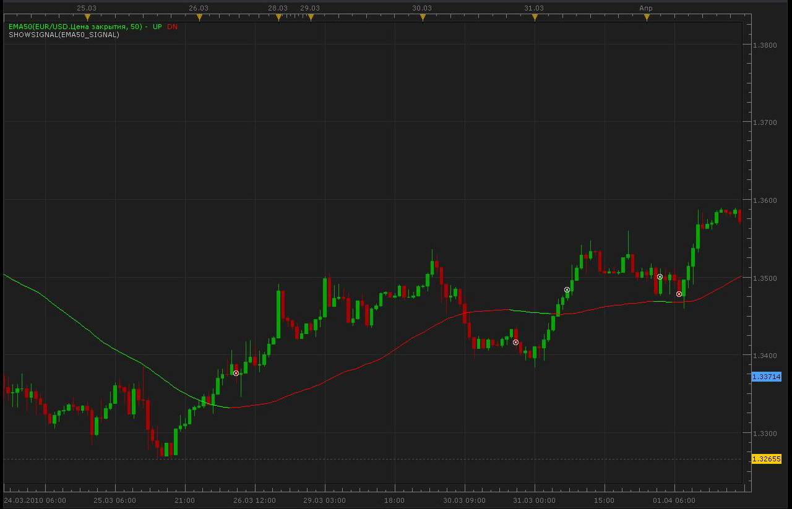

# EMA50 signals

> Source: https://fxcodebase.com/code/viewtopic.php?f=29&t=851  
> Forum: 29 · Topic 851 · 1 post(s)

---

## EMA50 signals

**Alexander.Gettinger** · Mon Apr 26, 2010 9:57 pm

Signal based on indicator EMA50: [viewtopic.php?f=17&t=626](https://fxcodebase.com/code/viewtopic.php?f=17&t=626)

 



```lua
function Init()
    strategy:name("EMA50 signal");
    strategy:description("");

    strategy.parameters:addGroup("Parameters");

    strategy.parameters:addInteger("EMA50_Period", "Period of EMA50", "", 50);

    strategy.parameters:addString("Period", "Timeframe", "", "m5");
    strategy.parameters:setFlag("Period", core.FLAG_PERIODS);

    strategy.parameters:addGroup("Signals");
    strategy.parameters:addBoolean("ShowAlert", "Show Alert", "", true);
    strategy.parameters:addBoolean("PlaySound", "Play Sound", "", false);
    strategy.parameters:addFile("SoundFile", "Sound File", "", "");
end

local SoundFile;
local gSourceBid = nil;
local gSourceAsk = nil;
local first;

local BidFinished = false;
local AskFinished = false;
local LastBidCandle = nil;

local EMA50=nil;

function Prepare()
    local FastN, SlowN;

    ShowAlert = instance.parameters.ShowAlert;
    if instance.parameters.PlaySound then
        SoundFile = instance.parameters.SoundFile;
    else
        SoundFile = nil;
    end
   
    assert(not(PlaySound) or (PlaySound and SoundFile ~= ""), "Sound file must be specified");
    assert(instance.parameters.Period ~= "t1", "Signal cannot be applied on ticks");

    ExtSetupSignal("EMA50 signal:", ShowAlert);

    gSourceBid = core.host:execute("getHistory", 1, instance.bid:instrument(), instance.parameters.Period, 0, 0, true);
    gSourceAsk = core.host:execute("getHistory", 2, instance.bid:instrument(), instance.parameters.Period, 0, 0, false);

    EMA50 = core.indicators:create("EMA50", gSourceBid.close, instance.parameters.EMA50_Period);

    first = EMA50.DATA:first() + 2;

    local name = profile:id() .. "(" .. instance.bid:instrument() .. "(" .. instance.parameters.Period  .. ")" .. instance.parameters.EMA50_Period .. ")";
    instance:name(name);
end

local LastDirection=nil;

-- when tick source is updated
function Update()
    if not(BidFinished) or not(AskFinished) then
        return ;
    end

    local period;

    -- update moving average
    EMA50:update(core.UpdateLast);

    -- calculate enter logic
    if LastBidCandle == nil or LastBidCandle ~= gSourceBid:serial(gSourceBid:size() - 1) then
        LastBidCandle = gSourceBid:serial(gSourceBid:size() - 1);

        period = gSourceBid:size() - 1;
        if period > first then
         if EMA50.UP[period-2]==EMA50.DN[period-2] and EMA50.UP[period-1]<EMA50.DN[period-1] and LastDirection~=1 then
                ExtSignal(gSourceAsk, period, "Buy", SoundFile);
                LastDirection=1;
         elseif EMA50.UP[period-2]==EMA50.DN[period-2] and EMA50.UP[period-1]>EMA50.DN[period-1] and LastDirection~=-1 then
                ExtSignal(gSourceBid, period, "Sell", SoundFile);
                LastDirection=-1;
         end   

        end
    end
end

function AsyncOperationFinished(cookie)
    if cookie == 1 then
        BidFinished = true;
    elseif cookie == 2 then
        AskFinished = true;
    end
end

local gSignalBase = "";     -- the base part of the signal message
local gShowAlert = false;   -- the flag indicating whether the text alert must be shown

-- ---------------------------------------------------------
-- Sets the base message for the signal
-- @param base      The base message of the signals
-- ---------------------------------------------------------
function ExtSetupSignal(base, showAlert)
    gSignalBase = base;
    gShowAlert = showAlert;
    return ;
end

-- ---------------------------------------------------------
-- Signals the message
-- @param message   The rest of the message to be added to the signal
-- @param period    The number of the period
-- @param sound     The sound or nil to silent signal
-- ---------------------------------------------------------
function ExtSignal(source, period, message, soundFile)
    if source:isBar() then
        source = source.close;
    end
    if gShowAlert then
        terminal:alertMessage(source:instrument(), source[period], gSignalBase .. message, source:date(period));
    end
    if soundFile ~= nil then
        terminal:alertSound(soundFile, false);
    end
end
```
