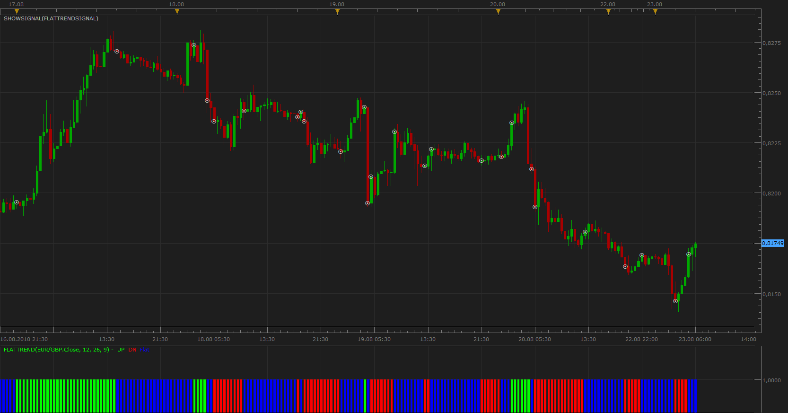

# Flat/Trend Signal

> Source: https://fxcodebase.com/code/viewtopic.php?f=29&t=1905  
> Forum: 29 · Topic 1905 · 1 post(s)

---

## Flat/Trend Signal

**Apprentice** · Mon Aug 23, 2010 5:33 am

The indicator formula is
if SignalMACD<MACD and MACD>0 then indicator show up trend,
if SignalMACD>MACD and MACD<0 then indicator show down trend
else indicator show neutral.

 [FlatTrendSignal.lua](files/3837/FlatTrendSignal.lua)

To work this signal does not need to have external indicators.
