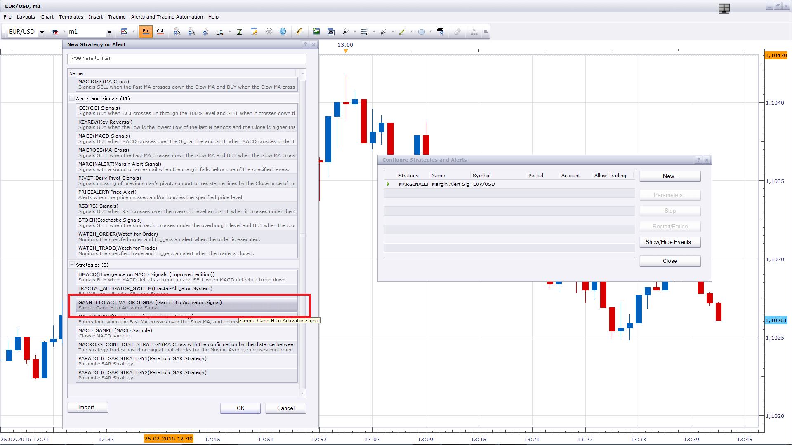

# Gann HiLo Activator Signal

> Source: https://fxcodebase.com/code/viewtopic.php?f=29&t=1547  
> Forum: 29 · Topic 1547 · 3 post(s)

---

## Gann HiLo Activator Signal

**Apprentice** · Tue Jul 20, 2010 6:51 am

To use this simple signal you need to have installed the Gann HiLo Activator indicator.
[viewtopic.php?f=17&t=227&start=0&hilit=ghla](https://fxcodebase.com/code/viewtopic.php?f=17&t=227&start=0&hilit=ghla)

 [Gann HiLo Activator Signal.lua](files/3036/Gann%20HiLo%20Activator%20Signal.lua)

---

## Re: Gann HiLo Activator Signal

**MarkMcCoskey** · Fri Feb 19, 2016 3:04 pm

I've downloaded and installed "GHLA Touchline.lua," yet I cannot get Marketscope 2.0 to recognize this signal. Is there something else I need to do? Thanks so much!

---

## Re: Gann HiLo Activator Signal

**Apprentice** · Thu Feb 25, 2016 2:17 pm

You can find it as a signal / strategy.
