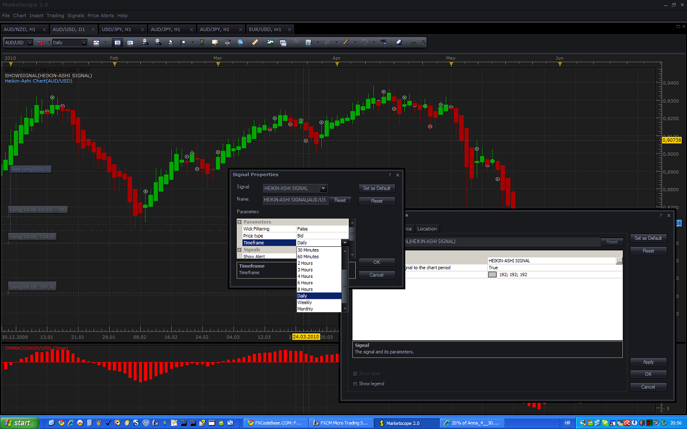

# Heikin-Ashi Signal

> Source: https://fxcodebase.com/code/viewtopic.php?f=29&t=1101  
> Forum: 29 · Topic 1101 · 15 post(s)

---

## Heikin-Ashi Signal

**Apprentice** · Tue May 25, 2010 3:29 am


*Heikin-Ashi Signal with Filtering*

 


*Heikin-Ashi Signal without Filtering*

Signal is pretty simple.
I have added the option to filtering, delay signal until appearance of the first candle without a wick.
Fewer false signals.

Filtering
Up Trend - Open = Low
Down Trend - Open = High

 [Heikin-Ashi Signal.lua](files/2113/Heikin-Ashi%20Signal.lua)

**Heikin-Ashi** ( A Better Candlestick)
Heikin-Ashi are not another Japanese Candlesticks pattern.
Heikin-Ashi Helps identify a trend more easily.

Heikin-Ashi Heikin-Ashi formula
Close = (Open+High+Low+Close)/4
Open = [Open (previous bar) + Close (previous bar)]/2
High = Max (High,Open,Close)
Low = Min (Low,Open, Close)

Simultaneous Upper and Lower Wicks (shadows ) indicates a trend change, Indecision.

---

## Re: Heikin-Ashi Signal

**Apprentice** · Tue May 25, 2010 4:03 am

[Heikin-Ashi Signal without Filtering.lua](files/2118/Heikin-Ashi%20Signal%20without%20Filtering.lua)

---

## Re: Heikin-Ashi Signal

**arunaa** · Wed May 26, 2010 9:59 pm

Hi Apprentice,
 I would be much useful for it to signal when the color of the HA candlestick changes or when dojis are formed(Right now it just signals every 5 minutes, by default, and says Long or Short which is kinda annoying) ..I would like it to signal only **when the color of candlestcick changes or when dojis are formed**..It is at these points that trend changes are occuring and we need to be alerted..

I have attached pic illustrating my idea..

---

## Re: Heikin-Ashi Signal

**Nikolay.Gekht** · Thu May 27, 2010 12:02 pm

Could you please tell what is the parameter of the signal did you use? I ran apprentice's signal this morning on EUR/USD in 5 minute resolution and the alerts were pretty correct. The only difference from your expectation is that Doji candle is not shown.

Please find the version which is a bit simplified and support Doji (you can specify what is "Doji" in terms of max. body length, in pips)

 [Heikin-Ashi Signal 1.lua](files/2232/Heikin-Ashi%20Signal%201.lua)

```lua
function Init()
    strategy:name("Heikin-Ashi Signal 1");
    strategy:description("Heikin-Ashi Signal 1");

    strategy.parameters:addGroup("Parameters");

    strategy.parameters:addDouble("Doji", "Doji candle sensitivity in pips", "", 0.25, 0, 100);

    strategy.parameters:addString("Type", "Price type", "", "Bid");
    strategy.parameters:addStringAlternative("Type", "Bid", "", "Bid");
    strategy.parameters:addStringAlternative("Type", "Ask", "", "Ask");

    strategy.parameters:addString("Period", "Timeframe", "", "m5");
    strategy.parameters:setFlag("Period", core.FLAG_PERIODS);

    strategy.parameters:addGroup("Signals");

    strategy.parameters:addBoolean("ShowAlert", "Show Alert", "", true);
    strategy.parameters:addBoolean("PlaySound", "Play Sound", "", false);
    strategy.parameters:addFile("SoundFile", "Sound File", "", "");
end

local ShowAlert;
local SoundFile;
local BarSource = nil;         -- the source stream
local HA = nil;
local Doji;

-- candle types
local UP = 1;
local DJ = 0;
local DN = -1;

function Prepare()
    -- collect parameters
    ShowAlert = instance.parameters.ShowAlert;

    if instance.parameters.PlaySound then
        SoundFile = instance.parameters.SoundFile;
    else
        SoundFile = nil;
    end

    assert(not(PlaySound) or (PlaySound and SoundFile ~= " "), "Sound file must be specified");

    Doji = instance.parameters.Doji;

    ExtSetupSignal("Heikin-Ashi Signal", ShowAlert);
    BarSource = ExtSubscribe(1, nil, instance.parameters.Period, instance.parameters.Type == "Bid", "bar");
    local ps;
    ps = BarSource:pipSize();
    if ps > 1 then
        ps = math.pow(10, -ps);
    end
    Doji = Doji * ps;
    HA = core.indicators:create("HA", BarSource);

    local name = profile:id() .. "(" .. instance.bid:instrument()  .. ")"
    instance:name(name);
end

-- when tick source is updated
function ExtUpdate(id, source, period)
    HA:update(core.UpdateLast);

    if not(HA.close:hasData(period - 1)) then
        return ;
    end

    local p = Decode(period - 1);
    local c = Decode(period);

    if c == DJ then
        ExtSignal(source.close, period, "Doji", SoundFile);
    elseif c == UP and p ~= UP then
        ExtSignal(source.close, period, "Turns to Up", SoundFile);
    elseif c == DN and p ~= DN then
        ExtSignal(source.close, period, "Turns to Dn", SoundFile);
    end
end

function Decode(period)
    if math.abs(HA.open[period] - HA.close[period]) <= Doji then
        return DJ;
    elseif HA.open[period] > HA.close[period] then
        return DN;
    else
        return UP;
    end

end

dofile(core.app_path() .. "\\strategies\\standard\\include\\helper.lua");
```

---

## Re: Heikin-Ashi Signal

**nick818** · Tue Jun 01, 2010 8:38 pm

i am really excited about using this signal, but when i apply it the signal does not show up until some time after......even with filter off. While signal has been in use I have gone to 'change signal' on the chart and then pressed OK and it reloads (updates) signal and a more recent signal shows up. The signal is not signaling when the candle closes. This maybe something simple i have over-looked but would still appreciate some feed back

---

## Re: Heikin-Ashi Signal

**Nikolay.Gekht** · Wed Jun 02, 2010 9:40 am

Hm... the signal can be shown on the chart only using the "showsignal" indicator which is intended solely for the backtesting of signals on the pre-loaded history data. Do you use the signal this way?

Unfortunately, the back-testing indicator is pretty limited in this version. Further versions will support loading of more historical data as well as receiving a new real-time data.

To apply the signal on the real-time data and get text and sound notification - please apply signal using "Signals->Add Signal" command.

---

## Re: Heikin-Ashi Signal

**nick818** · Wed Jun 02, 2010 4:18 pm

thanks for the reply, yes you were spot on, and i was trying to use the signal(bullet) in real time. Last evening i actually applied the signal to 'add signals' and this works fine. Better in my opinion since their is no need to cycle through charts looking for signal bullets. Thanks again

---

## Heikin Ashi Signal

**EvotsStirevot** · Sun Jun 13, 2010 9:31 pm

Can only seem to get this to work with daily chart. It shows flat on on my 2 min and 5 min charts. Also where can I find info on using in conjunction with cci?

Thanks

---

## Re: Heikin-Ashi Signal

**Apprentice** · Mon Jun 14, 2010 2:08 pm



*Heikin-Ashi Signal*

Did you set the required time frame.
For reference see the picture.

 As Far I know, HA CCI combination has not yet written.
Try to articulate trading strategy that you use in order to be able to write the appropriate signal.

Or you use, need only a combination of HA CCI ?

---

## Re: Heikin-Ashi Signal

**Inv4x1975** · Tue Apr 12, 2011 2:56 pm

Hi, can someone write this signal when the color change (blue to red) and the open is equal to the high, and when the color change red to blue and the open is equal to the low??

thanks

---

## Re: Heikin-Ashi Signal

**JOKER83** · Fri Jul 18, 2014 6:35 am

HALLO
Konnen SIE mir Helfen mit
Heiken Ashi Signal
ICH BRAUCHE Signal Markt Markt auf Verschieden zeitebene
und E-Mail benarichtigung

Hi there
YOU can Help me
Heiken Ashi signal
I NEED signal Market Market on Different time flat
and e-mail send

---

## Re: Heikin-Ashi Signal

**Apprentice** · Sat Jul 19, 2014 4:30 am

Your request is added to the development list.

---

## Re: Heikin-Ashi Signal

**ronanFR** · Thu Apr 09, 2020 1:10 pm

Hello , can you program a heinkin ashi MTF email alert for :
Buy when color is green and candle hadn't low wick
Sell when color is red and candle hadn't high week
Thanks
Ronan

---

## Re: Heikin-Ashi Signal

**Apprentice** · Wed Apr 15, 2020 1:21 pm

Your request is added to the development list.
Development reference 1073.

---

## Re: Heikin-Ashi Signal

**Apprentice** · Sun Apr 19, 2020 5:33 am

Try this version.
[viewtopic.php?f=17&t=69690](https://fxcodebase.com/code/viewtopic.php?f=17&t=69690)
