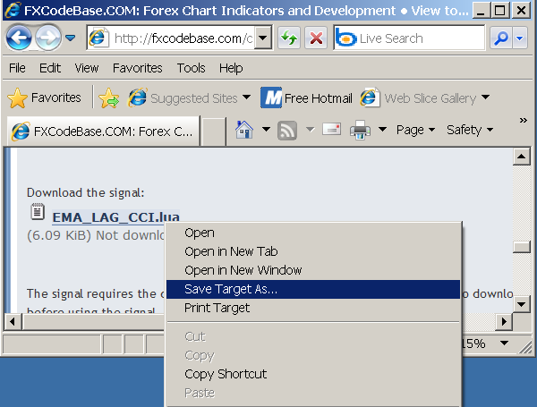
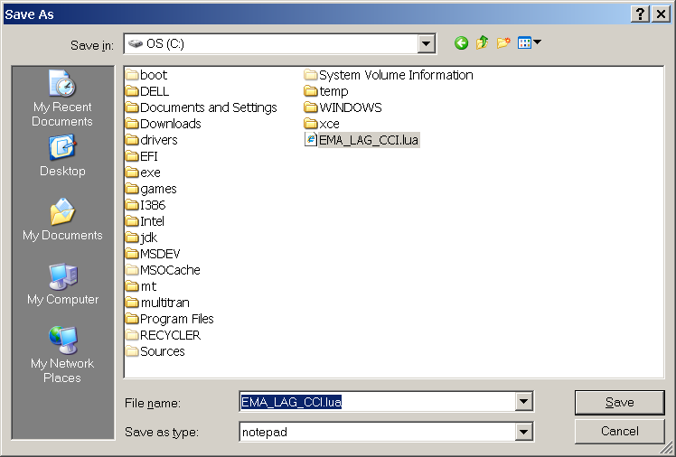
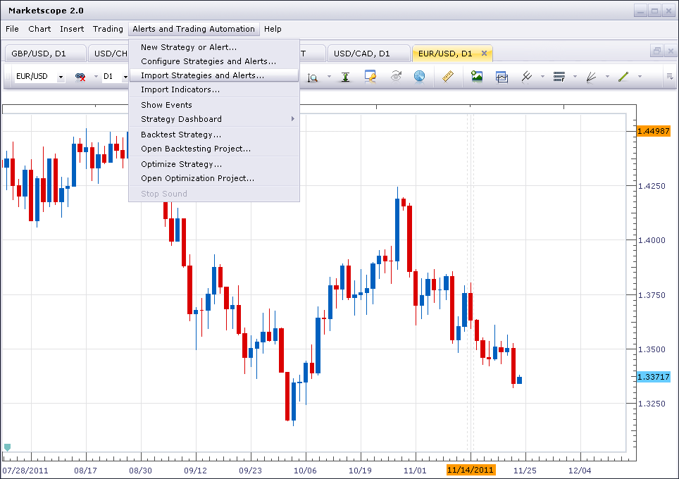
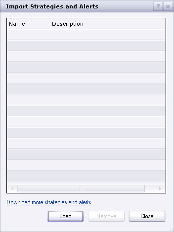
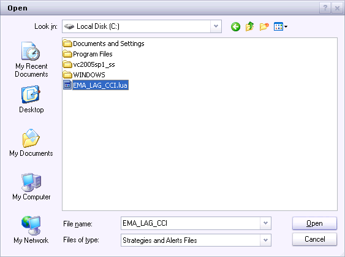
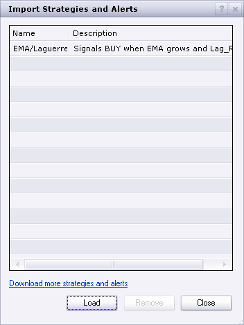
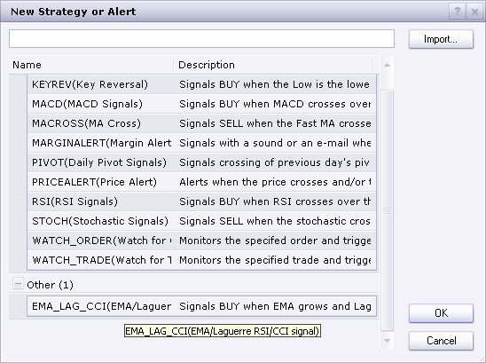

# How to Download and Install a Custom Signal/Strategy

> Source: https://fxcodebase.com/code/viewtopic.php?f=29&t=602  
> Forum: 29 · Topic 602 · 31 post(s)

---

## How to Download and Install a Custom Signal/Strategy

**Nikolay.Gekht** · Sun Apr 11, 2010 7:41 pm

**Download the signal/strategy**

The signal/strategy is usually attached to the post as a file.

Right click on the name of the attached file and then choose "Save Target As" in the context menu.

 

The "Save As" dialog appears. Choose any folder, for example c:\ to save the
signal/strategy. The name of the signal or strategy file (EMA_LAG_CCI.lua in our example) will appear in the dialog automatically.

 

Click the "Save" button. That's all, the signal/strategy is saved.

**Note:** Sometimes, the signal/strategy requires the custom indicators. In that case these indicators are listed in the post. Please do not forget to download and install the custom indicators!

**Install the signal/strategy**

Open Marketscope application. Choose the "Alerts and Trading Automation" menu and then choose "Import Strategies and Alerts".

 

The "Import Strategies and Alerts" dialog box appears. Click "Load".

 

The "Open" dialog box appears. Choose the file you have saved on the previous step (see "Download the signal/strategy").

 

Click "Open". The signal/strategy is loaded and appears in the custom strategy list.

 

That's all, the new signal/strategy is in the list which appears when you choose "New Strategy or Alert".

 

---

## Re: How to Download and Install a Custom Signal

**rtd1879** · Wed Apr 14, 2010 11:06 pm

After I have saved SuperTrend to hard drive and try to download to Marketscope I receive 'error in file.' Suggestion please. Thanks

---

## Re: How to Download and Install a Custom Signal

**Nikolay.Gekht** · Thu Apr 15, 2010 8:59 am

SuperTrend is an indicator, is not a signal. So, you must use Chart->Manager Custom Indicator instead of Signal->Manage Custom Signals.

---

## Re: How to Download and Install a Custom Signal

**rtd1879** · Thu Apr 15, 2010 12:48 pm

> **Nikolay.Gekht wrote:**
> SuperTrend is an indicator, is not a signal. So, you must use Chart->Manager Custom Indicator instead of Signal->Manage Custom Signals.

Thanks! Got it.

---

## Re: How to Download and Install a Custom Signal

**JPLAFOREX** · Wed May 12, 2010 8:52 pm

Hello,

I downloaded this indicator under indicators in my Metatrader4 but I can not paste into the charts. Does this indicator works with metatrader4?????

---

## Re: How to Download and Install a Custom Signal

**Nikolay.Gekht** · Thu May 13, 2010 8:16 am

All **lua** indicators and signals published on this site **are not** for **Metatrader**.
These indicators and signal are for **Marketscope**. This is the charting application distributed together with the FXCM (dbFX) Trading Station Application.
So, in short **none** of the indicators and signals will work for Metatrader.

To get metatrader and indicator signals you should use the metatrader codebase's, for example [http://codebase.mql4.com](http://codebase.mql4.com).

---

## Re: How to Download and Install a Custom Signal

**JPLAFOREX** · Thu May 13, 2010 11:49 am

Thank you!

---

## Re: How to Download and Install a Custom Signal

**Checkz** · Fri Sep 10, 2010 2:31 am

Everytime I try to load a signal I get an error message can someone please help me

---

## Re: How to Download and Install a Custom Signal

**Apprentice** · Fri Sep 10, 2010 3:14 am

Sure.
But to help you gotta tell us more about your problem.
What is the error message, which signal you are trying to load.

---

## Re: How to Download and Install a Custom Signal

**Checkz** · Fri Sep 10, 2010 5:20 am

I FIGURED IT OUT. THANKS BUT I WAS WONDERING IF YOU COULD POST AN UPDATED VERSION OF THE RUMPLED ONES DYNAMIC FIB S/R INDICATOR

---

## Re: How to Download and Install a Custom Signal

**Checkz** · Fri Sep 10, 2010 7:12 am

OK I GOT THE FBSR SIGNAL WORKING BUT I CANT GET THE SOUND TO WORK EVEN AFTER I CLICK THE YES OPTION FOR SOUND. THE SOUND AREA IS BLANK

---

## Re: How to Download and Install a Custom Signal/Strategy

**bolermon** · Mon Jan 10, 2011 2:04 am

I have the same problem. Not triggered alarm indicator EVO and Fisher.

---

## Re: How to Download and Install a Custom Signal

**sunshine** · Mon Jan 10, 2011 8:47 am

> **Checkz wrote:**
> OK I GOT THE FBSR SIGNAL WORKING BUT I CANT GET THE SOUND TO WORK EVEN AFTER I CLICK THE YES OPTION FOR SOUND. THE SOUND AREA IS BLANK

Hi,
Please try the corrected version: [viewtopic.php?f=29&t=984](https://fxcodebase.com/code/viewtopic.php?f=29&t=984)

---

## Re: How to Download and Install a Custom Signal/Strategy

**sunshine** · Mon Jan 10, 2011 12:57 pm

> **bolermon wrote:**
> I have the same problem. Not triggered alarm indicator EVO and Fisher.

Which signals you use? I use the Fisher signal:
[viewtopic.php?f=29&t=2268&p=4796&hilit=fisher#p4796](https://fxcodebase.com/code/viewtopic.php?f=29&t=2268&p=4796&hilit=fisher#p4796)
And it works well. The sound is played once the alert is triggered.

---

## Re: How to Download and Install a Custom Signal/Strategy

**bolermon** · Mon Jan 10, 2011 5:29 pm

I use the same signal. when I launched on the first time it worked fine, but then stopped. He did not even show the events in the log. While the Backtest and Showsignal display signals correctly. Excuse me for my English, I use a translator.

---

## Re: How to Download and Install a Custom Signal/Strategy

**bolermon** · Mon Jan 10, 2011 7:20 pm

Just checked. Signals working fine at all pairs but GBP/USD does not work. What is the problem, help please?

---

## Re: How to Download and Install a Custom Signal/Strategy

**sunshine** · Tue Jan 11, 2011 9:27 am

Please tell me version of your Trading Station (it is in the main menu -> Help -> About).
What timeframe do you use?

---

## Re: How to Download and Install a Custom Signal/Strategy

**bolermon** · Wed Jan 12, 2011 7:49 pm

Version 01.10.010311, timeframe - 1m. Today launched the signals and everything works fine. I'll try to test a few more days. I hope this problem will be no more.

---

## Re: How to Download and Install a Custom Signal/Strategy

**R3boot** · Thu Mar 17, 2011 11:27 pm

hi all

so i downloaded a strategy and installed it, but seems it doesn't work somehow it has been hours and no trade has been triggered even though there are lots of trades should be made according to the strategy

any advice?

---

## Re: How to Download and Install a Custom Signal/Strategy

**sunshine** · Fri Mar 18, 2011 7:55 am

Hi,
Please check the "Allow Trading" parameter in the properties of your strategy. By default the value is set to "No".
Note that on this site there are two kinds of expert advisors: signals and strategies.
The "Allow Trading" parameter is available for strategies only. Signals have no this parameter as they cannot trade.

> **R3boot wrote:**
> hi all
>
>
> so i downloaded a strategy and installed it, but seems it doesn't work somehow it has been hours and no trade has been triggered even though there are lots of trades should be made according to the strategy
>
>
> any advice?

---

## Re: How to Download and Install a Custom Signal/Strategy

**R3boot** · Fri Mar 18, 2011 11:46 am

sunshine

many thanks

---

## Re: How to Download and Install a Custom Signal/Strategy

**amorgos89** · Wed Nov 23, 2011 12:23 pm

Impossible to use the signals in the new version
 how made one? Thank you

---

## Re: How to Download and Install a Custom Signal/Strategy

**amorgos89** · Wed Nov 23, 2011 2:15 pm

Impossible to install(settle) customs signals in the new version the signals do not display in graphs. L recording of the file opens a piece of news(short story) fenetre " dashboard strategie " with a strategie piece of news(short story). Thank you for your reponses

---

## Re: How to Download and Install a Custom Signal/Strategy

**Ekaterina** · Thu Nov 24, 2011 4:51 am

Hi,

> **amorgos89 wrote:**
> Impossible to install(settle) customs signals in the new version the signals do not display in graphs. L recording of the file opens a piece of news(short story) fenetre " dashboard strategie " with a strategie piece of news(short story). Thank you for your reponses

I've tried to install Custom Signals many times and haven't meet any problems!
Try to use the new Instruction "How to Download and Install a Custom Indicator".
It has been updated for new November Marketscope version
Please see viewtopic.php?f=17&t=17&p=18#p18

---

## Re: How to Download and Install a Custom Signal/Strategy

**sunshine** · Thu Nov 24, 2011 5:22 am

If the issue persists, please send me as much information as possible about the error, including the exact error message you are receiving along with screenshots in order for me to be able to best assist you.

---

## Re: How to Download and Install a Custom Signal/Strategy

**amorgos89** · Thu Nov 24, 2011 8:55 am

I have called fxcm and they told me that customs signal does not work more on the new version (it is considere as a strategie and by consequent no signal is open in graphs but appears in dashboard like a strategy. Ex :"sample rsi signal"
 can you confirm me? Thank you.

---

## Re: How to Download and Install a Custom Signal/Strategy

**TraderKen** · Thu Nov 24, 2011 11:54 pm

I have the same problem. I often use the "ShowSignal" indicator to see a signal showing on my chart. Now with the new TradingStation update, the indicator "ShowSignal" even does not exist in the group "Add Indicators" anymore. I already tried to reload a backup "ShowSignal" indicator but it still doesn't work with this new version. A message "Failed to load..." appeared. Please help us. Thanks.

---

## Re: How to Download and Install a Custom Signal/Strategy

**Apprentice** · Sat Nov 26, 2011 4:54 am

Can you please read the following.
[viewtopic.php?f=29&t=8448](https://fxcodebase.com/code/viewtopic.php?f=29&t=8448)

---

## Re: How to Download and Install a Custom Signal/Strategy

**amorgos89** · Sun Nov 27, 2011 5:17 am

it's a pity to delete functions useful as customs signals
 how long before next update?

---

## Re: How to Download and Install a Custom Signal/Strategy

**UniqOption** · Tue Feb 16, 2016 9:11 pm

Really thanks for the detailed tutorial mate !

---

## Re: How to Download and Install a Custom Signal/Strategy

**ChaosBlacKnight** · Sat Jul 11, 2020 11:48 pm

Hi.

I am experiencing a problem with a JS that's loaded here, The_River_JS.jpl.

[viewtopic.php?f=48&t=66082&p=119034&hilit=the+river#p119034](https://fxcodebase.com/code/viewtopic.php?f=48&t=66082&p=119034&hilit=the+river#p119034)

When following the instructions on this page, including the renaming of the extension to .lua, I receive the following error on Marketscope 2.0:

the language dll does not support the requested feature

Any help would be greatly appreciated.

Cheers.

The complete code inside the JS file is:

function Init()
{
 indicator.name("The River");
 indicator.description("Presented by ForPipSake");
 indicator.requiredSource(core.Tick);
 indicator.type(core.Indicator);

 indicator.parameters.addGroup("Calculation");
 indicator.parameters.addInteger("Period", "Period", "", 50);
 indicator.parameters.addInteger("Power", "Power", "", 2, 1, 9);
 indicator.parameters.addDouble("Deviation", "Deviation", "", 1);

 indicator.parameters.addGroup("Style");
 indicator.parameters.addColor("clrReg", "Color regression", "Color regression", core.rgb(255, 0, 0));
 indicator.parameters.addColor("clrBand", "Color band", "Color band", core.rgb(0, 0, 255));
 indicator.parameters.addInteger("width", "width", "width", 1, 1, 5);
 indicator.parameters.addInteger("style", "style", "style", core.LINE_SOLID);
 indicator.parameters.setFlag("style", core.FLAG_LEVEL_STYLE);
}

var first;
var source = null;
var Period;
var Power;
var Deviation;
var BuffReg=null;
var BuffBandUp=null;
var BuffBandDn=null;

function Prepare()
{
 source = instance.source;
 Period=instance.parameters.Period;
 Power=instance.parameters.Power;
 Deviation=instance.parameters.Deviation;
 first = source.first()+2;
 var name = profile.id() + "(" + source.name() + ", " + instance.parameters.Period + ", " + instance.parameters.Power + ", " + instance.parameters.Deviation + ")";
 instance.name(name);
 BuffReg = instance.addStream("BuffReg", core.Line, name + ".Regression", "Regression", instance.parameters.clrReg, first);
 BuffBandUp = instance.addStream("BuffBandUp", core.Line, name + ".BandUp", "BandUp", instance.parameters.clrBand, first);
 BuffBandDn = instance.addStream("BuffBandDn", core.Line, name + ".BandDn", "BandDn", instance.parameters.clrBand, first);
 BuffReg.setWidth(instance.parameters.width);
 BuffReg.setStyle(instance.parameters.style);
 BuffBandUp.setWidth(instance.parameters.width);
 BuffBandUp.setStyle(instance.parameters.style);
 BuffBandDn.setWidth(instance.parameters.width);
 BuffBandDn.setStyle(instance.parameters.style);
}

function Update(period, mode)
{
