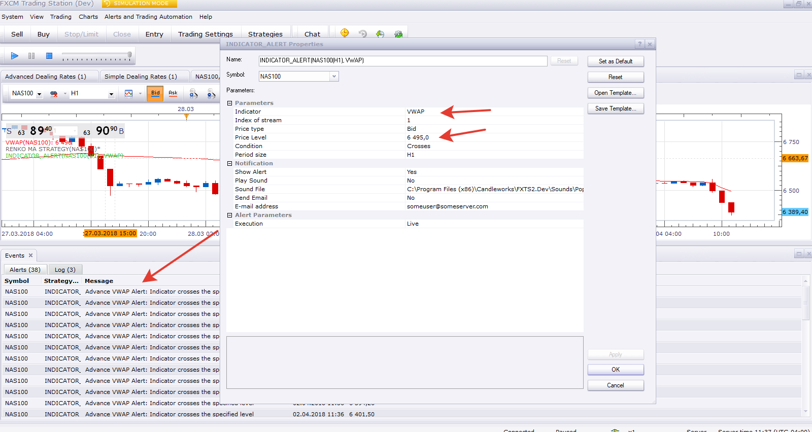

# Indicator Alert

> Source: https://fxcodebase.com/code/viewtopic.php?f=29&t=7741  
> Forum: 29 · Topic 7741 · 47 post(s)

---

## Indicator Alert

**sunshine** · Tue Nov 01, 2011 7:18 am

The simple signal which plays a sound, shows a message and/or sends an email when an indicator crosses the specified level.

---

## Re: Indicator Alert

**subliminal** · Sat Nov 05, 2011 12:50 pm

This looks great! How would this work with a cci indicator (forex freedom bars.. so when colour changes?)

---

## Re: Indicator Alert

**Apprentice** · Sun Nov 06, 2011 10:47 am

Small bug fixed.

---

## Re: Indicator Alert

**nookie** · Wed Nov 16, 2011 3:35 pm

This is great, is it possible to work on tick volume also ?

---

## Re: Indicator Alert

**virgilio** · Fri Nov 18, 2011 3:01 pm

I am trying to use this indicator with the "Three TF MA Strategy" but it doesn;t work. Any comments on how to?

---

## Re: Indicator Alert

**virgilio** · Fri Nov 18, 2011 3:01 pm

I am trying to use this indicator with the "Three TF MA Strategy" but it doesn;t work. Any comments on how to?

---

## Re: Indicator Alert

**Apprentice** · Sat Nov 19, 2011 3:45 am

This Alert/Signal can be applied only to Indicators.
Not to other strategies/signals.

---

## Re: Indicator Alert

**nookie** · Fri Jul 06, 2012 8:20 pm

Is it possible this indicator to work together with the following one?

123PatternsV6

[viewtopic.php?f=27&t=8816&p=22338&hilit=123#p22338](https://fxcodebase.com/code/viewtopic.php?f=27&t=8816&p=22338&hilit=123#p22338)

---

## Re: Indicator Alert

**Apprentice** · Mon Jul 09, 2012 6:47 am

Yes. this request is already added to the list of development

---

## Re: Indicator Alert

**RJH501** · Mon Aug 20, 2012 8:25 am

Hello,

If it is possible could you add the ability for this indicator to recognize and alarm the overbought and oversold candles.

It will be appreciated!

Regards,

RJH

---

## Re: Indicator Alert

**Apprentice** · Wed Aug 22, 2012 2:01 am

Your request is added to the development list.

---

## Re: Indicator Alert

**luciana** · Tue Jan 08, 2013 7:44 am

Hi, when trying to use with MTF_SAR I get an error message: Incorect index of stream. The indicator has only 0 stream(s). (didn't work with 0 either)
Would you please advise whether I can use the Indicator alert with MTF_SAR and what the error means; what should I input for these two to work together.
Thank you.

---

## Re: Indicator Alert

**Apprentice** · Wed Jan 09, 2013 5:25 pm

Unfortunately in the current implementation, this will work.
They are not compatible.
SAR or Indicator Alert, should be modified.
Will try to offer something in the days ahead.

---

## Re: Indicator Alert

**luciana** · Wed Jan 09, 2013 7:09 pm

Looking very much forward to it.
Thanks for the reply. Luciana

---

## Re: Indicator Alert

**Apprentice** · Fri Jan 11, 2013 1:18 pm

Try to use this version of SAR.
[viewtopic.php?f=17&t=29613](https://fxcodebase.com/code/viewtopic.php?f=17&t=29613)
The problem with the standard SAR version,
It have two output streeam Indicator Alert do not know how to find way to get around this problem.

---

## Re: Indicator Alert

**luciana** · Mon Jan 14, 2013 8:54 pm

Thanks.

---

## Price Target Info

**queldorei** · Tue Jun 11, 2013 8:06 pm

hi, I need to put the price bars over the heiken ashi candles.

Can you help me with a price bar no candles indicator?

Thanks

---

## Re: Indicator Alert

**Apprentice** · Wed Jun 12, 2013 5:24 am

Please explain.
Alert, which will give a signal when Indicator, cross OB / OS levels?

---

## Re: Indicator Alert

**Patrick Sweet** · Wed Sep 11, 2013 1:34 am

This looks great.
I can set an Alert on any timeframe (i.e., a timeframe different that the chart? I assume so as it allows the input....but am I correct in assuming this?).

---

## Re: Indicator Alert

**Apprentice** · Wed Sep 11, 2013 3:27 am

U can use it on any timeframe or pair.

---

## Re: Indicator Alert

**amazon1a** · Wed Jan 29, 2014 11:10 am

Hi Apprentice,

I run multiple instances at the same time of both Alerts and Strategies and multiple platform instances as well on 2 VPS systems. I am trying to optimize my work station setup - particularly the Alert functionality.

A number of Indicators have Strategies built off them, ie DSS Bressert. For Alerts does it make a difference if I run a Strategy in Alert mode, ie do not permit it to trade, or run Alerts via Indicator_alert? Is one or the other better in terms of platform stability or consumption of computer resources?

Love your work, AG

---

## Re: Indicator Alert

**Apprentice** · Thu Jan 30, 2014 4:03 am

As rule of thumb, it is always better to use all in one, build in solutions.
Stability, incompatibility or resource consumption may be affected.

---

## Re: Indicator Alert

**Patrick Sweet** · Tue Feb 04, 2014 5:04 am

I am wondering, can we add a 'source' field to run the indicator off another indicator on my MScope template?

I run say RSI and I want to know when an MA of the RSI crosses OB/OS, for example (not just when RSI does). I use other types of indies of indies and would like to use them as a 'Source' input into the indicator alert.

Doable?
P

---

## Re: Indicator Alert

**Apprentice** · Thu Feb 06, 2014 3:20 am

Unfortunately not.
Such addition should be hard coded within Alert.

---

## Re: Indicator Alert

**man4pak40** · Tue Apr 28, 2015 12:32 am

I downloaded this indicator under indicators in my Metatrader4 but I can not paste into the charts. Does this indicator works with metatrader4?????

---

## Re: Indicator Alert

**Apprentice** · Tue Apr 28, 2015 2:25 am

Unfortunately not.
It is written for FXCM TS2 / Marketcope.
You can only use MQ4 or EX4 with MT4.

---

## Re: Indicator Alert

**IQFX36** · Mon Oct 26, 2015 9:47 am

Hello!
It dosen't work for me!
Any idea!!!
Thanks!

---

## Re: Indicator Alert

**Finny7** · Sat Feb 25, 2017 2:49 am

For Indicator Alert (signals), under the options of choosing how you want the indicator to give you the alert. When you want the indicator to cross or TOUCHES, it gives you the alert. Example, under the RSI when the line touches the overbought or oversold level during a live candle, it doesn't give the live signal. It only gives the signal after the candle closes. Is there another a signal that would give a LIVE signal? Please let me know.

---

## Re: Indicator Alert

**Finny7** · Sat Feb 25, 2017 7:59 pm

May request a Indicator Alert with a LIVE option?

---

## Re: Indicator Alert

**Apprentice** · Tue Feb 28, 2017 4:36 am

Your request is added to the development list, Under Id Number 3758
 If someone is interested to do this task, please contact me.

---

## Re: Indicator Alert

**Apprentice** · Tue Feb 28, 2017 4:36 am

Your request is added to the development list, Under Id Number 3758
 If someone is interested to do this task, please contact me.

---

## Re: Indicator Alert

**Apprentice** · Sat Mar 04, 2017 7:45 am

Live option added.

---

## Re: Indicator Alert

**Finny7** · Sun Mar 05, 2017 5:23 pm

Thank you so much Apprentice!

---

## Re: Indicator Alert

**Finny7** · Sun Mar 05, 2017 10:42 pm

The alert notification is not working?

---

## Re: Indicator Alert

**Apprentice** · Mon Mar 06, 2017 5:23 am

Fixed.

---

## Re: Indicator Alert

**Zc263547** · Tue May 15, 2018 4:43 pm

> **sunshine wrote:**
> The simple signal which plays a sound, shows a message and/or sends an email when an indicator crosses the specified level.

It is seemed not able to work with the indicator "real volume by price",
could you please improve it to fit the indicator? Thanks very much!

---

## Re: Indicator Alert

**Zc263547** · Tue May 15, 2018 10:14 pm

it is seemed that it can not suit for the indicator of real volume by price,would you please improve it to fit the indicator?thanks very much!

---

## Re: Indicator Alert

**Apprentice** · Fri May 18, 2018 5:06 am

Your request is added to the development list under Id Number 4141

---

## Re: Indicator Alert

**Zc263547** · Sat May 19, 2018 1:33 am

> **Apprentice wrote:**
> Your request is added to the development list under Id Number 4141

thanks a lot! but where to find the id 4141,thanks!

---

## Re: Indicator Alert

**ANTONIO** · Mon Nov 26, 2018 6:29 am

Hi apprentice,
Can you add the indicator VWAP?

Thank you

---

## Re: Indicator Alert

**Apprentice** · Wed Nov 28, 2018 5:24 am

VWAP posted here?
[viewtopic.php?f=17&t=65661&p=117194&hilit=VWAP#p117194](https://fxcodebase.com/code/viewtopic.php?f=17&t=65661&p=117194&hilit=VWAP#p117194)

---

## Re: Indicator Alert

**ANTONIO** · Wed Nov 28, 2018 6:45 am

Yes apprentice,

Thank you

---

## Re: Indicator Alert

**Apprentice** · Wed Nov 28, 2018 7:56 am

You have to install VWAP to your TS and select it from the list of available indicators.

---

## Re: Indicator Alert

**ANTONIO** · Wed Nov 28, 2018 8:56 am

Hi apprentice,

It doesn't work, I have choose crosses or touches in live only for the VWAP WEEK and it doesn't send notifications ( I'm watching in the same time the price and the indicator at my chart- I have already install the VWAP)

Thank you

---

## Re: Indicator Alert

**Apprentice** · Mon Dec 03, 2018 5:04 am

It works. Maybe you expects it to alert when the close price
crosses the indicator?
And I've updated Prepare and header

---

## Re: Indicator Alert

**ANTONIO** · Mon Dec 03, 2018 7:23 am

Hi apprentice,
I must register also the price in the field PRICE LEVEL?

Thank you

---

## Re: Indicator Alert

**Apprentice** · Fri Dec 07, 2018 7:37 am

[Indicator_Alert.lua](files/122571/Indicator_Alert.lua)

I've added a parameter which allows comparing with the close price.
(Use close price)
