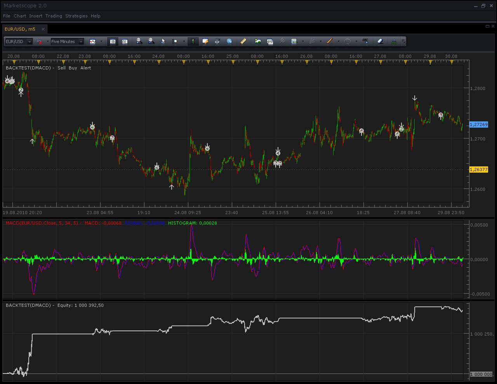
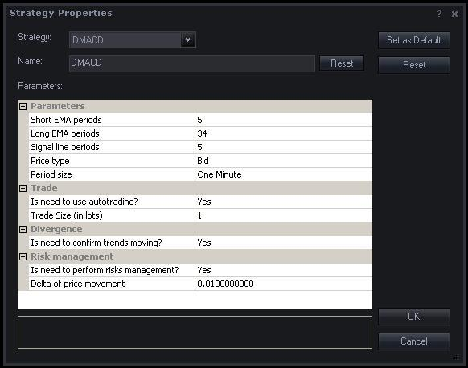
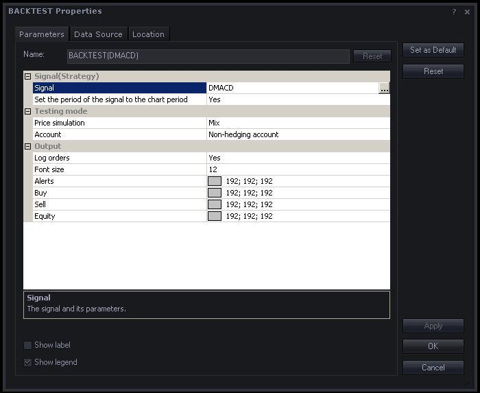
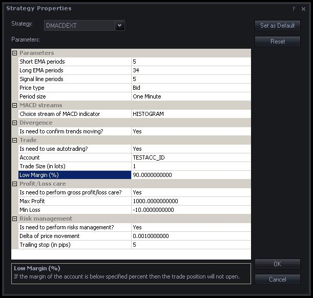
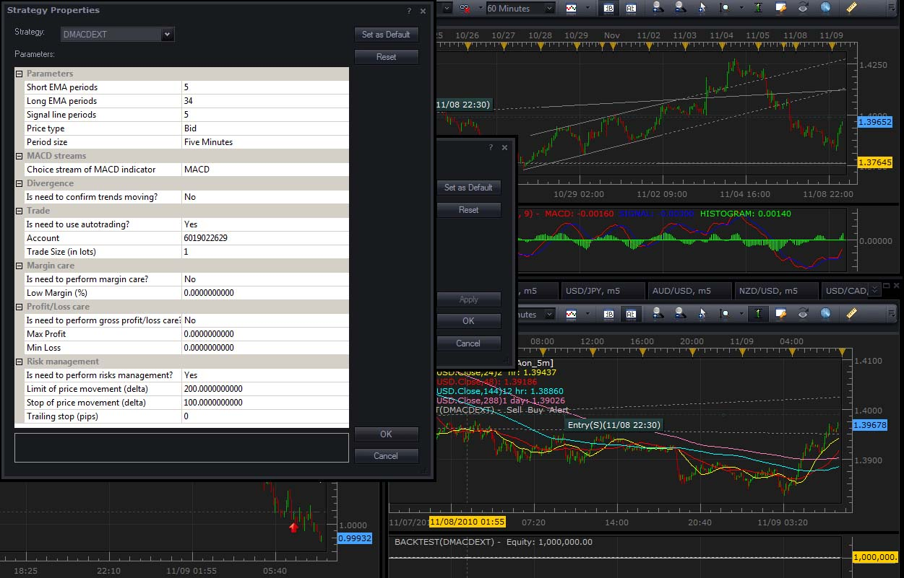
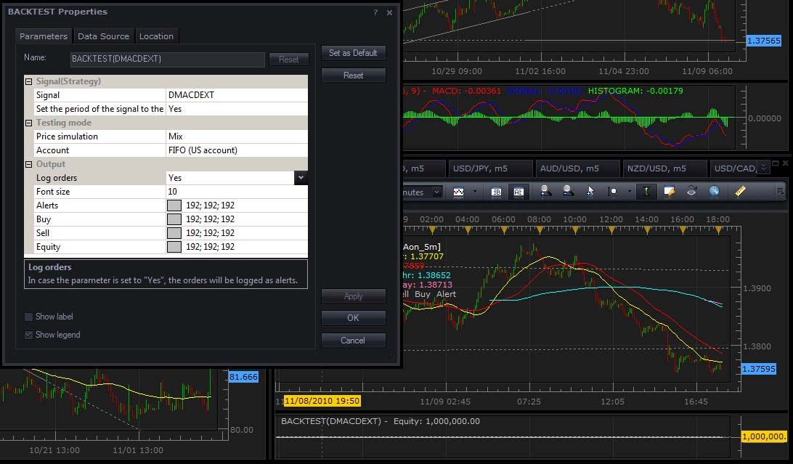

# (NEW) Introduce dMACD strategy (Divergence on MACD Signals)

> Source: https://fxcodebase.com/code/viewtopic.php?f=31&t=1985  
> Forum: 29 · Topic 1985 · 92 post(s)

---

## (NEW) Introduce dMACD strategy (Divergence on MACD Signals)

**Konstantin.Usanov** · Mon Aug 30, 2010 6:27 am

Hi!

I’d like to introduce dMACD strategy (Divergence on MACD Signals).
Base calculation approach (relative to divergence) was taken from “MACD Divergence indicator and signal” ([http://fxcodebase.com/code/viewtopic.php?f=17&t=869](https://fxcodebase.com/code/viewtopic.php?f=17&t=869)).

My primary goal was to research for trading on divergence signals (all types: True and Hide) with complete risk management (by limit/stop orders) and implement the auto trading with full back testing of dMACD strategy.

 

*dMACD*

 [dMACD.lua](files/4029/dMACD.lua)

 **Note: improved version exists with full functional Risk Management and more (look at post, Tue Dec 14, 2010 [http://www.fxcodebase.com/code/viewtopic.php?f=31&t=1985&p=6747#p6747](http://www.fxcodebase.com/code/viewtopic.php?f=31&t=1985&p=6747#p6747))**

 [dMACD.lua.rc](files/4029/dMACD.lua.rc)

 **Note: improved version exists with full functional Risk Management and more (look at post, Tue Dec 14, 2010 [http://www.fxcodebase.com/code/viewtopic.php?f=31&t=1985&p=6747#p6747](http://www.fxcodebase.com/code/viewtopic.php?f=31&t=1985&p=6747#p6747))**

...

**Note**. Please do not use the strategy on live accounts unless you carefully checked and implicitly decided that the strategy meets your trading goals. Please do not forget that you are solely and fully responsible for all the trades made by the strategy exactly like for the trades executed manually.

The Strategy was revised and updated on December 18, 2018.

---

## Re: Introduce dMACD strategy (Divergence on MACD Signals)

**Konstantin.Usanov** · Mon Aug 30, 2010 6:32 am

..., the dMACD is friendly customized (by tuning strategy properties) and can be used not only for auto trading features but also as signal of True/Hide divergence.

 

*dMACD properties*

Next picture discovers the divergence at glance as it’s implemented by the dMACD strategy.

 

*Divergences at work*

Please also take a look at result of back testing for dMACD strategy.

 [Backtesting result.zip](files/4030/Backtesting%20result.zip)

My conclusion: trading on divergence signals more profitable when used Hidden divergence as additional signal to True divergence and as well the Risk management taken into account.

I’m open for any questions and discussions.

Thanks!

**NB**
Currently used symmetric risk management approach, when limit and stop established by the same value (delta).

---

## Re: Introduce dMACD strategy (Divergence on MACD Signals)

**DS0167** · Mon Aug 30, 2010 3:41 pm

Thank you for this huge work

One question, do we need to download the indicator before using this strategy ?

FYI, I tried a backtest with the same pair and time frame than you and my results are not as good as yours... any idea ?

Kind regards,
Danielle

---

## Re: Introduce dMACD strategy (Divergence on MACD Signals)

**Konstantin.Usanov** · Mon Aug 30, 2010 11:02 pm

Hi Danielle!
Thanks a lot!

You do not need to download the MACD indicator before using dMACD strategy.
The MACD is standard indicator for FXCM Trading Station (FXTS) and may be found at
corresponded folder (for example: “C:\Program Files\Candleworks\FXTS2\indicators\Standard”).

Provided pictures with results of back testing are contain the MACD indicator (at middle) for additional information purposes only, since the dMCAD strategy is based on MACD indicator. In generally, you do not need to attach the MACD indicator to charts for using dMACD strategy.

I have guessed about different results of yours back testing. Perhaps your BACKTEST Properties are different from mine? Please check it’s with next picture.

 

*Backtesting properties*

The “Backtesting_properties.JPG” is also included to “Backtesting result.zip” that is provided at previous posts.

---

## Re: Introduce dMACD strategy (Divergence on MACD Signals)

**Konstantin.Usanov** · Tue Aug 31, 2010 5:13 am

Hi!
The dMACD strategy becomes more friendlier and more profitable.

Added choice of one from three MACD indicator’s stream to divergence computation:
MACD or SIGNAL or HISTOGRAM. (new “MACD streams” group of dMACD properties has presented)

I have back tested the new version of dMACD strategy and discovered that with HISTOGRAM stream the new dMACD strategy has more profitable then previous version (was based exactly on MACD stream of MACD indicator).
The MACD stream may be also choose in “MACD streams” group of strategy properties and new dMACD strategy will have the same behaviour as previous version (top message at this post).

Please checkout the new version dMACD strategy

 [dMACD.lua](files/4060/dMACD.lua)

 [dMACD.lua.rc](files/4060/dMACD.lua.rc)

and latest back testing result.

 [Backtesting result (new version dMACD).zip](files/4060/Backtesting%20result%20%28new%20version%20dMACD%29.zip)

Thanks!

---

## Re: Introduce dMACD strategy (Divergence on MACD Signals)

**dagoncho** · Sat Sep 04, 2010 6:18 pm

Hi Konstantin,
 I can't open .lua files. I've used recommended booster but didn't work.

Regards.

---

## Re: Introduce dMACD strategy (Divergence on MACD Signals)

**Konstantin.Usanov** · Mon Sep 06, 2010 12:30 am

Hi dagoncho!
Could you please tell me more about your problem?
All provided .lua files are opening without problems and work fine.

Please follow next simple “check list” for self:

1. Download both files (dMACD.lua and dMACD.lua.rc).

2. Copy dMACD.lua and dMACD.lua.rc files to your “FXCM Trading Station” (FXTS) custom strategy folder, for example: “C:\Program Files\Candleworks\FXTS2\strategies\Custom”.

3. Restart FXTS and log in to FXTS with Demo account.
(if you do not have Demo account, please create Practice Account at FXCM, [http://www.fxcm.com/open-free-100k.jsp](http://www.fxcm.com/open-free-100k.jsp))

4. Open Marketscope.

5. Add the BACKTEST indicator to a chart.
(to do this, simply select “Add Indicator” on the “Insert” menu of Marketscope and choose the BACKTEST indicator from the list)

6. Open BACKTEST Properties by double-clicking the indicator label.

7. Select “dMACD” as Signal (the first parameter of the BACKTEST properties).

8. Specify all necessary properties for dMACD strategy.
(to do this, you should click the little button with three dots to the right of the selected strategy in the BACKTEST properties)

9. Finish with the settings and close the BACKTEST Properties dialog box by clicking OK, the back testing process will start and you will see the Equity chart at the bottom of the chart window as a result of work of dMACD strategy.

10. That’s all.

---

## Re: Introduce dMACD strategy (Divergence on MACD Signals)

**mmarwaha** · Mon Sep 27, 2010 3:11 am

hi,
could you tell me on which time frame this strategy should be best used.

---

## Re: Introduce dMACD strategy (Divergence on MACD Signals)

**Konstantin.Usanov** · Mon Sep 27, 2010 6:57 am

Hi!
From my point of view the best time frame is 60 minutes (H1).

---

## Re: Introduce dMACD strategy (Divergence on MACD Signals)

**robin76** · Thu Sep 30, 2010 4:30 am

Hi, I like this strategy, but I have a problem: it opens more than one position, and when it open a position in the opposite direction, it does'nt work, because it clode the current on, and nothing more.
Can you enter a check to let it open only one position, or a number estabilished in global configuration?
Thanks

---

## Re: Introduce dMACD strategy (Divergence on MACD Signals)

**vigird** · Thu Sep 30, 2010 4:28 pm

Another position in the opposite direction won't close the current one if you have hedging enabled on your account.

---

## Re: Introduce dMACD strategy (Divergence on MACD Signals)

**Konstantin.Usanov** · Fri Oct 01, 2010 3:31 am

Robin, you may also turn off the “**Risk management**” by switch the “**Is need to perform risks management?**” parameter to “**No**”. In this case only “true market order” will be created for opening a position at any currently available market rate.
This switching off will lead to open only one position at time as you desire.

---

## Re: Introduce dMACD strategy (Divergence on MACD Signals)

**jdariux** · Mon Oct 25, 2010 3:02 pm

Frist of all congratulate all the staff here in fxcodebase.com for your extraordinary work and the magnificent service you provide to all of us, really this team is amazing.
I would like to ask for a little change in this strategy adding the possibility to configure stop loss, Trailing Stop and take profit in the configuration panel. I was trying to do it by myself but it didn’t work well, I guess programming is not my strong, even though the change is not significant and not difficult to do it.
THANK YOU VERY MUCH FOR ALL YOUR HARD WORK.
JDARIUX

---

## Re: Introduce dMACD strategy (Divergence on MACD Signals)

**jdariux** · Mon Oct 25, 2010 3:29 pm

And also if you can add the step that before opening a trade should check if the margin is below X % of the account (configurable in the panel). If this condition is correct (Low margin) the position should not open. I guess is to introduce the latest signal of margin alert from Nikolai [viewtopic.php?f=31&t=2442](https://fxcodebase.com/code/viewtopic.php?f=31&t=2442) in this strategy (but again I don’t know how to do it). I was thinking in that the other day and now you have the signal, what are the odds? You are the best!!!!.
regards
Jdariux

---

## Re: Introduce dMACD strategy (Divergence on MACD Signals)

**Konstantin.Usanov** · Tue Oct 26, 2010 7:08 am

Thanks a lot!

Please take a look at draft of new version of dMACD strategy.

 [dMACDext.lua](files/5556/dMACDext.lua)

 

*dMACDext properties*

Note, this extended edition is not requiring additional .RC file.
I hope all your desires are fulfilled. In any case, feel free to contact me.

Thanks.

---

## Re: Introduce dMACD strategy (Divergence on MACD Signals)

**jdariux** · Tue Oct 26, 2010 1:00 pm

Thank you Konstantin I will test it but it looks even better than I thought.

---

## Re: Introduce dMACD strategy (Divergence on MACD Signals)

**Konstantin.Usanov** · Thu Oct 28, 2010 2:37 am

I’d like to share improved version of dMACDext strategy.

 [dMACDext.lua](files/5629/dMACDext.lua)

The new parameter "**Is need to perform strict care?**" has been added to "Profit/Loss care" group.

 

*new dMACDext properties*

If "Is need to perform strict care?" = **YES**then trade position will not opened when locking or limiting actions have been happen (it means that current value for Gross P/L of account overcomes established limits, "Max Profit" and "Min Loss" parameters), see lines 245…248:

Code: [Select all](https://fxcodebase.com/code/)
`local GrossPL = account.GrossPL;
   if GrossPL > instance.parameters.profit or GrossPL < instance.parameters.loss then
      return;
   end`

If "Is need to perform strict care?" = **NO**then trade position will opened and later, if current value (recalculated automatically after open position) for Gross P/L of account overcomes established limits ("Max Profit" and "Min Loss" parameters) then True market close order will be created, see lines 279…283:

Code: [Select all](https://fxcodebase.com/code/)
`local GrossPL = account.GrossPL;
   if GrossPL > instance.parameters.profit or GrossPL < instance.parameters.loss then
     valuemap.OrderType = "CM"; -- True market close order closes a position…    
     terminal:execute(id, valuemap);
   end`
Thanks.

---

## Re: Introduce dMACD strategy (Divergence on MACD Signals)

**Konstantin.Usanov** · Wed Nov 03, 2010 2:36 am

Hi!

I’d like to introduce modified version of dMACDext strategy.
(**Thanks a lot to Jdariux for review and additional ideas!**)

Changes:

**1.** True market order + limit order + stop order are create at once now.
(previous version created True market order at first and then tried (with some issues that was fixed) to create limit + stop orders via opened position)

**2.** Reports error (if happen) while orders are create.

**3.** Strict care for P/L is permanent now.
(without “strict” previous version was not profitable)

**4.** Margin care is dedicated now (for handy uses).

**5.** Limit and Stop values are separated now (for handy uses) with ability to switch off its using.

**6.** Commented context of parameters for better understanding.

 

*Properties of modified version dMACDext*

 [dMACDext.lua](files/5765/dMACDext.lua)

Thanks.

---

## Re: Introduce dMACD strategy (Divergence on MACD Signals)

**Viriato** · Fri Nov 05, 2010 6:45 am

Hi everybody! This is my first post. Excuse me about my poor english!

Konstantin, thanks for all. You and your work is the main reason to writte here! I think your strategy is very good. It's very logic, powerful, has a lot of configurable parameters and promising results.

My problem (and I think it's the same problem for many users) is to optimizate this and other strategies. We have the BACKTEST indicator to simulate the results of our strategies, but we have to change manually the parameters to get results. My idea is to develop a indicator to apply to the dMACD strategy in the moment of maximal zoom out for one timeframe, and this indicator makes iterations with the main parameters of the dMACD strategy (short EMA periods, from 1 to 25; long EMA periods, from 1 to 50; and signal Periods, from 1 to 25, for example), and compare the equity results for these iterations and give us the parameters for the better equity result.

I try to develop a indicator derived from the BACKTEST indicator. I only eliminate the signals code (buys, sells and alerts) and I keep only the equity chart and the report. But my LUA level isn't good and I can't develop the next step.

Konstantin or everybody that reads this: What do you think about it? Do you use another systems to optimizate dMACD? Can everybody help with this work?

Thanks to everybody for your time and sorry for my poor english!

Viriato

---

## Re: Introduce dMACD strategy (Divergence on MACD Signals)

**a0007002** · Sun Nov 07, 2010 10:51 am

I couldn't find any info in the forum on this already so will ask here since it relates to all strategy backtesting. When performing a test of a strategy (dMACD in this case) my equity line never changes from 1,000,000. It is a straight line across from left to right no matter what time frame or how much data I zoom in or out on the chart. How do I get the backtest equity to show profit/loss? I contacted FXCM (micro email support) and they never answered me.

---

## Re: Introduce dMACD strategy (Divergence on MACD Signals)

**Apprentice** · Sun Nov 07, 2010 11:01 am

Try to set "Is need to use autotrading" option to Yes.
This should fix your problem.

---

## Re: Introduce dMACD strategy (Divergence on MACD Signals)

**Konstantin.Usanov** · Mon Nov 08, 2010 4:18 am

Hi Viriato!
Thanks a lot!

Please pay attention, you are trying to select parameters of ordinary MACD signal only ("Short EMA periods", "Long EMA periods", "Signal line periods") that will lead to change only the moment when divergence is detected.

Of course, its indirectly affects to profit, but I think, since this strategy based on exactly MACD indicator and used it to detect the divergence, is better for your approach to try other “sources of divergence”, RSI or CCI indicators, for example, i.e. other indicators type of oscillator.

Thanks.

---

## Re: Introduce dMACD strategy (Divergence on MACD Signals)

**Konstantin.Usanov** · Mon Nov 08, 2010 4:19 am

Hi a0007002!

If you still have problems with Backtesting of strategy,
please share properties of BACKTEST and used strategy too.
(simple make screen shots and post its)

Thanks.

---

## Re: Introduce dMACD strategy (Divergence on MACD Signals)

**Viriato** · Tue Nov 09, 2010 4:13 am

Thanks for your answer, Konstantin!

I try to make it, and I continue studying LUA step by step too!

Viriato

---

## Re: Introduce dMACD strategy (Divergence on MACD Signals)

**a0007002** · Tue Nov 09, 2010 7:47 am

It did not work. I have this problem for ALL strategies not just this one. Here is my screen shot with settings and with backtest equity unmoved shown also on bottom right.

 

---

## Re: Introduce dMACD strategy (Divergence on MACD Signals)

**Konstantin.Usanov** · Tue Nov 09, 2010 8:24 am

Hi a0007002!

Ok..., could you please provide also
"BACKTEST Properties" screen shot and
your version number of FXCM Trading Station?

Thanks.

---

## Re: Introduce dMACD strategy (Divergence on MACD Signals)

**a0007002** · Tue Nov 09, 2010 6:17 pm

This has occurred on all versions since it came out with the backtest feature.
currently using version 1.09.101210

 

---

## Re: Introduce dMACD strategy (Divergence on MACD Signals)

**Konstantin.Usanov** · Thu Nov 11, 2010 3:07 am

Hi a0007002!

I have only one guess about your problem with Backtesting, for your timeframe and selected stream of MACD the strategy does not detect divergence. Since divergence is main signal for trading in dMACD(ext), you do not have any changes of Equity in this case.

Please try to select other timeframes and streams of MACD.

For example,
(Currency pair, Timeframe, Stream of MACD)
EUR/USD, 5 minutes, MACD – divergence is rarely detected.
EUR/USD, 60 minutes, HISTOGRAM – divergence is often detected.

You also told:

> I have this problem for ALL strategies not just this one.

Please pay attention, not all strategies has ability to work in “Autotrading” mode. In this case any changes of Equity in Backtesting will not show also.

Thanks.

---

## Re: Introduce dMACD strategy (Divergence on MACD Signals)

**Konstantin.Usanov** · Fri Nov 12, 2010 4:00 am

Hi!

I’d like to share the last version of **dMACDext**strategy (improved edition), **version 2.1**.

The main goal of new version was to provide full functional **Risk Management**for trading operations powered by Limit and Stop orders for all types of accounts (**FIFO, US accounts also supported**). As well the new version working with the same values and diapasons of corresponded parameters for Risk Management as provided it’s by **FXCM Trading Station**, for handy uses.

Also supported the full functional logging of orders creation, errors reporting and revised strategy parameter’s list, for handy uses too.

Moreover, strategy has ability to perform Margin and Profit/Loss Care for specified account.

Algorithm of dMACDext strategy, version 2.1 (full list):

**1.** Strategy detects divergence (True or Hide).
**2.** Depends on trend movement strategy decides to buy or to sell.
**3.** Trade operation is beginning.
**4.** Its does begin from checks.
**5.** First check is for Margin. (Margin of account compare with given value in parameters)
**6.** If margin of account (current value at this moment, moment of trade) less or equal
value from parameters then trade is not process.
**7.** Second check is P/L care. (GrossPL of account compare with given values in parameters)
**8.** If GrossPL of account (current value at this moment, moment of trade) more or less then corresponded values from parameters then trade is not process.
**9.** Otherwise, trade is continuing and True market order opens the position at currently available market rate for buy or sell direction depends on detected trend movement.
**10.** If risk management is using then Limit or Stop orders will be also opened at this moment.

I hope the new improved version of dMACDext will be useful and comfortable.
Trade for pleasure with full Risk Management!

 [dMACDext.lua](files/6065/dMACDext.lua)

 

*dMACDext properties*

 

*Example of logging (for FIFO account)*

Thanks.

---

## Re: (NEW) Introduce dMACD strategy (Divergence on MACD Signals)

**Caalador** · Tue Nov 23, 2010 2:27 pm

Hi Konstantin,

Nice job here! I've been testing your strategy and it works well on backlogs, however.

I was wondering why you set it to Mix simulation of price instead of Close. Isn't close more realistic?
If you use Close, it rarely provides profit though.

Just wondering, I'm still kind of a newbie

---

## Re: (NEW) Introduce dMACD strategy (Divergence on MACD Signals)

**Konstantin.Usanov** · Wed Nov 24, 2010 3:36 am

Hi Caalador,

Thanks a lot!

Mix mode (“Price simulation” parameter of BACKTEST) is more realistic for backtesting process.

Please take a look at next picture. There is dMACDext strategy applied for backtest (top part of picture) and with the same properties in “real trade place” (bottom part of picture), at the same time.

 

*Mix mode of backtesting process*

As you can see, BUY/SELL signals are produced at one time.

But, if you change the “Price simulation” parameter of BACKTEST to “Close” the backtesting process will have less data (ticks per period of the history) for simulation and BUY/SELL signals of backtesting will not concur with signals in “real trade place”. This situation will provide rarely profit, so I have suggested using “Mix” mode for backtesting process, in general cases.

**NB**
For additional information,
if “Price simulation” parameter of BACKTEST sets to “Close” we have only one (1) tick per period of the history and if it sets to “Mix” or other we have eleven (11) ticks per period of the history.

Thanks.

---

## Re: (NEW) Introduce dMACD strategy (Divergence on MACD Signals)

**Caalador** · Wed Nov 24, 2010 9:34 am

Thanks! Outstanding reply and explanation.

I am succesfully using your strategy now on my windows system with a locale that uses . as the decimal seperator. I did notice it gives *very* strange results when using it on a windows machine that has another localized setting, such as Dutch, where the , (comma) is used for decimal seperation....

I'll just keep my locale on English, just thought you might want to know!

---

## Re: (NEW) Introduce dMACD strategy (Divergence on MACD Signals)

**Konstantin.Usanov** · Thu Nov 25, 2010 12:49 am

Hi Caalador,

Could you please explain what exactly means

> it gives *very* strange results…

Since I have Russian locale, that also has “,” (comma) as decimal separation and do not have problem.

Thanks in advance.

---

## Re: (NEW) Introduce dMACD strategy (Divergence on MACD Signals)

**amgalanbaatar** · Fri Nov 26, 2010 7:40 am

Hello, I tried to download DMACD,but I couldn't download it as shown in the example of how to download indicators and strategies. Please advise me on this. Thank you.(I right-clicked on the file but there was not any command like "save target as". )

> **Konstantin.Usanov wrote:**
> Hi!
>
>
> I’d like to introduce dMACD strategy (Divergence on MACD Signals).
> Base calculation approach (relative to divergence) was taken from “MACD Divergence indicator and signal” ([http://fxcodebase.com/code/viewtopic.php?f=17&t=869](https://fxcodebase.com/code/viewtopic.php?f=17&t=869)).
>
> My primary goal was to research for trading on divergence signals (all types: True and Hide) with complete risk management (by limit/stop orders) and implement the auto trading with full back testing of dMACD strategy.
>
>
>
> backtest_dMACD.JPG
>
>
>
>
> dMACD.lua
>
> **Note: improved version with full functional Risk Management exists (look at post, Fri Nov 12, 2010 [http://www.fxcodebase.com/code/viewtopic.php?f=31&t=1985&p=6065#p6065](http://www.fxcodebase.com/code/viewtopic.php?f=31&t=1985&p=6065#p6065))**
>
>
> dMACD.lua.rc
>
> **Note: improved version with full functional Risk Management exists (look at post, Fri Nov 12, 2010 [http://www.fxcodebase.com/code/viewtopic.php?f=31&t=1985&p=6065#p6065](http://www.fxcodebase.com/code/viewtopic.php?f=31&t=1985&p=6065#p6065))**
>
> ...
>
> **Note**. Please do not use the strategy on live accounts unless you carefully checked and implicitly decided that the strategy meets your trading goals. Please do not forget that you are solely and fully responsible for all the trades made by the strategy exactly like for the trades executed manually.

---

## Re: (NEW) Introduce dMACD strategy (Divergence on MACD Signals)

**Caalador** · Fri Nov 26, 2010 4:53 pm

> **Konstantin.Usanov wrote:**
> Hi Caalador,
>
> Could you please explain what exactly means
>
> > it gives *very* strange results…
>
>
> Since I have Russian locale, that also has “,” (comma) as decimal separation and do not have problem.
>
> Thanks in advance.

well, if I do a backtest, it doesn't show a smooth graph, and it never has a profit.

I did some messing around and discovered it only works when risk management is disabled. The fields where I can enter maximum loss and maximum profit don't allow the , to be entered.

Again though, I don't mind, just thought I should let you know

Playing around with it something else came to mind; can you build in email notifications of the net result when an order is closed? ie: the profit or loss?

---

## Re: (NEW) Introduce dMACD strategy (Divergence on MACD Signals)

**Konstantin.Usanov** · Mon Nov 29, 2010 7:19 am

Hi amgalanbaatar!

Could you please tell me what’s browser and which version used by you?
What’s happen when you just click on “**dMACDext.lua**” file?

In any case, there is direct link to last version of strategy. (dMACDext, version 2.1)
[http://www.fxcodebase.com/code/download/file.php?id=2306](http://www.fxcodebase.com/code/download/file.php?id=2306)

Please check it.

Thanks.

---

## Re: (NEW) Introduce dMACD strategy (Divergence on MACD Signals)

**Konstantin.Usanov** · Mon Nov 29, 2010 7:32 am

Hi Caalador,

OK…, I got it, thanks.

Please take a look at new version (**2.2**) of dMACDext strategy.

Now is possible to monitoring for trade positions with notification by E-mail.

 

*dMACDext properties (version 2.2)*

 [dMACDext.lua](files/6438/dMACDext.lua)

 [E-mail notification sample.txt](files/6438/E-mail%20notification%20sample.txt)

I hope the new version will be useful.

**NB**
Please, do not forget to properly configure the Send Email Functionality of FXCM Trading Station.
(look at this post for details: “How to Configure SendEmail Functionality” [http://www.fxcodebase.com/code/viewtopic.php?f=29&t=2232](http://www.fxcodebase.com/code/viewtopic.php?f=29&t=2232))

Thanks.

---

## Re: (NEW) Introduce dMACD strategy (Divergence on MACD Signals)

**Caalador** · Tue Dec 07, 2010 5:46 am

very nice! I am going to install a virtual machine on my server and see if your strategy (and FXCM) and the email stuff will work in an RDP session Will keep you posted, might take a while until I get it up, cuz I just got back from the US

---

## Re: (NEW) Introduce dMACD strategy (Divergence on MACD Signals)

**uglock** · Tue Dec 07, 2010 9:41 pm

> **Caalador wrote:**
> va virtual machine on my server and see if your strategy (and FXCM) and the email stuff will work in an RDP session

Based on my experience, the Trading Station/Marketscope works very well via RDP. Personally I have one PC with platform running my strategies working for weeks without any crash or hang. I use my laptop to monitor trades execution with either RDP or just another Trading Station under the same login.

---

## Re: (NEW) Introduce dMACD strategy (Divergence on MACD Signals)

**Caalador** · Mon Dec 13, 2010 3:05 pm

ok, tried it in a windows XP vm....but the strategy properties say "TESTACC_ID" instead of my account number. I'm logged into the real server though. Any thoughts? I also tried backtesting with that, it just got a huge loss on every currency pair with the default settings, which it doesn't on my laptop...

---

## Re: (NEW) Introduce dMACD strategy (Divergence on MACD Signals)

**Konstantin.Usanov** · Tue Dec 14, 2010 1:48 am

Hi!

There is next version (**2.3**) of dMACDext strategy.

Now is possible to choice Price Stream (data source, including Volumes) for basic MACD indicator.

 

*dMACDext properties (version 2.3)*

 [dMACDext.lua](files/6747/dMACDext.lua)

Thanks.

---

## Re: (NEW) Introduce dMACD strategy (Divergence on MACD Signals)

**Konstantin.Usanov** · Tue Dec 14, 2010 2:54 am

…, I’d like to share the backtesting result of dMACDext strategy, **version 2.3**.

Profit gains up to **18.5 M$** during four years and 600 K$ (approx) for one year.
Please take a look at next pictures for details.

 

*dMACDext backtesting (on Volumes)*

 

*dMACDext backtesting on Volumes (during approx one year)*

 

*BACKTEST properties (on Volumes)*

Thanks.

---

## Re: (NEW) Introduce dMACD strategy (Divergence on MACD Signals)

**Caalador** · Tue Dec 14, 2010 6:06 am

What period do you set your strategy to? In your screenshot it shows minute, but in previous versions and posts you mentioned hourly to be optimal for your strategy?

Also, I still have the TESTACC_ID thing in my RDP sessions, where strategies don't seem to work normally. Where on my normal FXCM I see my account number...(see my previous post, I think it was approved later by the mod/admin)

---

## Re: (NEW) Introduce dMACD strategy (Divergence on MACD Signals)

**Konstantin.Usanov** · Tue Dec 14, 2010 8:04 am

Hi Caalador,

For published backtesting results I have used “Daily” period.

Please pay attention to “Set the period of the signal to the chart period” parameter of BACKTEST, in case “Yes” the “Period size” parameter of dMACDext strategy will be equal to chart period and does not matter what value sets for “Period size” parameter of dMACDext.

In general ways, for divergence based strategies (as dMACDext) the hourly and up timeframe periods are more optimal.

For backtesting you will always have TESTACC_ID instead of account number, no matter is it real account or demo. Please confirm that you do not using backtesting in your case.

Thanks.

---

## Re: (NEW) Introduce dMACD strategy (Divergence on MACD Signals)

**Caalador** · Tue Dec 14, 2010 9:09 am

Hmm, interesting, in backtesting it always shows my account number...I'm using Windows 7 64x, joined to a domain. But it does the same on my personal computer.

The only place where it shows TESTACC_ID is on my virtual machine (windows xp x32), where the strategies don't work...weird.

Thanks for the info on strategies by the way, it's good to know more about optimal periods

---

## Re: (NEW) Introduce dMACD strategy (Divergence on MACD Signals)

**Konstantin.Usanov** · Wed Dec 15, 2010 3:28 am

Hi Caalador,

> in backtesting it always shows my account number

Could you please provide your screen shot, like this picture:
[http://www.fxcodebase.com/code/download/file.php?id=2631&mode=view](http://www.fxcodebase.com/code/download/file.php?id=2631&mode=view)

And for double check, what's version of FXCM Trading Station you using?

Thanks in advance.

---

## Re: (NEW) Introduce dMACD strategy (Divergence on MACD Signals)

**Caalador** · Wed Dec 15, 2010 9:28 am

ok, tradinsgtation on computer WITHOUT RDP: 01.09.091010

and tradingstation on computer WITH RDP: 01.09.101210

strange how it shows or hides the account number isn't it? And how very different the backtesting result is...I don't understand

---

## Re: (NEW) Introduce dMACD strategy (Divergence on MACD Signals)

**Konstantin.Usanov** · Thu Dec 16, 2010 3:18 am

Hi Caalador,

First of all you have old version of FXCM Trading Station (01.09.091010) in case "WITHOUT RDP". This version really showed Account Number in backtesting mode. This behavior was changed in next versions and currently available 01.09.101210 version show TESTACC_ID in this case.

Also I have retested the dMACDext strategy on “your environment”. I have installed instance of WinXP x32 on virtual machine: VMWare on Linux(Ubuntu), connected to VM by Remote Desktop Connection from my desktop and installed currently available 01.09.101210 version of FXCM Trading Station to WinXP x32.

All works fine, w/o any problem and I have exactly the same result for backtesting (profit approx 800 K$) as on my desktop.

 

*dMACDext on WinXP x32 via RDP*

Please take a look at attached archive for full details.

 [dMACDext on virtual machine (windows xp x32).zip](files/6821/dMACDext%20on%20virtual%20machine%20%28windows%20xp%20x32%29.zip)

Could you please reinstall the FXCM Trading Station with last available 01.09.101210 version?
[http://www.fxcm.com/forex-software-download.jsp](http://www.fxcm.com/forex-software-download.jsp)
May be something wrong with your instance of FXTS?

Please keep in touch with me, I have interesting what’s wrong for your environment.

Thanks.

---

## Re: (NEW) Introduce dMACD strategy (Divergence on MACD Signals)

**Caalador** · Tue Dec 28, 2010 8:29 am

ok, I have the newest version now on all 5 virtual machines and they are consistent now. I'm testing your strategy over different periods and with different options to assess their viability on test accounts instead of backtesting

So far I've noticed it sometimes dives very deep into the margin limit and opens a huge amount of positions when risk management is not used. And it rarely closes these positions....but so far so good.

---

## Re: (NEW) Introduce dMACD strategy (Divergence on MACD Signals)

**Caalador** · Tue Jan 11, 2011 11:27 am

Hi Konstantin,

after the recent update my Marketscope gives the following error when it starts:

An error occurred during the calculation of the indicator 'BACKTEST'. The error details: [string "backtest.lua"]:138: [string "C:\Program Files\Candleworks\FXTS2\strategi..."]:176: attempt to index upvalue 'MACD' (a nil value).

Is that a problem or should I ignore it?

And I can also report profitable results from some of the 7 virtual machines I'm running with your strategy on demo accounts. the new Volume strategy only works a little if you use the daily period, hourly does not work and just keeps running into losses.

The old 'Typical' selection also works well on daily, and sometimes on hourly, but it's way more reliable on daily...this from 22 days of testing so far.

I will keep testing your strategies for 3 months and I will post the final results here.

---

## Re: (NEW) Introduce dMACD strategy (Divergence on MACD Signals)

**Konstantin.Usanov** · Wed Jan 12, 2011 1:45 am

Hi Caalador,

About reported error during the calculation of the indicator 'BACKTEST', I have guess something wrong with FXCM Trading Station environment. Please try to reinstall FXCM Trading Station with last available **01.10.010311** version from [http://www.fxcm.com/forex-software-download.jsp](http://www.fxcm.com/forex-software-download.jsp).

Just reinstalled it’s too (for testing) and no one error for backtesting.

Working with “Volumes” please pay attention, not all currency pairs and timeframes are well profitable. I have best backtesting results with **xxx/JPY**and **D1**. (where xxx is USD and EUR)

Applying timeframes below D1 (i.e. H8, H6, H4 and so on) will lead to worse profit, since based Price Stream (Volume) in this case is not well represented (has not enough values).

Thanks a lot for report about ‘Typical selection’ and thanks in advance for your future ‘final results‘.

---

## Re: (NEW) Introduce dMACD strategy (Divergence on MACD Signals)

**mazdaq100** · Wed Jan 12, 2011 8:44 am

> **Caalador wrote:**
> Hi Konstantin,
>
> after the recent update my Marketscope gives the following error when it starts:
>
> An error occurred during the calculation of the indicator 'BACKTEST'. The error details: [string "backtest.lua"]:138: [string "C:\Program Files\Candleworks\FXTS2\strategi..."]:176: attempt to index upvalue 'MACD' (a nil value).
>
> Is that a problem or should I ignore it?
>
> And I can also report profitable results from some of the 7 virtual machines I'm running with your strategy on demo accounts. the new Volume strategy only works a little if you use the daily period, hourly does not work and just keeps running into losses.
>
> The old 'Typical' selection also works well on daily, and sometimes on hourly, but it's way more reliable on daily...this from 22 days of testing so far.
>
> I will keep testing your strategies for 3 months and I will post the final results here.

I am getting the same error message. Have you managed to resolve this Caalador? I have downloaded the latest version Trading Station but this hasn't solved it.

---

## Re: (NEW) Introduce dMACD strategy (Divergence on MACD Signals)

**Konstantin.Usanov** · Thu Jan 13, 2011 1:27 am

Hi mazdaq100,

I still have no an errors and share my set of properties. For strong testing I have turn on all trading parameters and all works fine, without an errors.

 [dMACDext set properties.zip](files/7414/dMACDext%20set%20properties.zip)

One more guesses what about standard MACD indicator for your instance of FXCM Trading Station? Is it possible to add MACD indicator to chart?

Thanks.

---

## Re: (NEW) Introduce dMACD strategy (Divergence on MACD Signals)

**Caalador** · Thu Jan 13, 2011 12:27 pm

> **mazdaq100 wrote:**
> I am getting the same error message. Have you managed to resolve this Caalador? I have downloaded the latest version Trading Station but this hasn't solved it.

I just removed all the backtests (the test thing in the graph in marketscope in the bottom that shows profit/loss for the tested strategy) and readded them and the problem went away. I did see a similar error once more when I lost my internet connection while it was running but it didn't seem to cause any problems.

---

## Re: (NEW) Introduce dMACD strategy (Divergence on MACD Signals)

**mazdaq100** · Fri Jan 14, 2011 10:47 am

Thanks for your help, I've got it working now.

---

## Re: (NEW) Introduce dMACD strategy (Divergence on MACD Signals)

**Egioras** · Sat Jan 15, 2011 8:32 am

Hello everyone.I´m allso have error massage on EUR/USD but it works on USD/JPY. EUR/JPY is not working.

---

## Re: (NEW) Introduce dMACD strategy (Divergence on MACD Signals)

**Konstantin.Usanov** · Mon Jan 17, 2011 12:39 am

Hi Egioras,

Could you please share your BACKTEST and Strategy Properties? I have retested **dMACDext version 2.3** on EUR/USD, EUR/JPY currency pairs and did not find any problem, all works fine.

Thanks in advance.

---

## Re: (NEW) Introduce dMACD strategy (Divergence on MACD Signals)

**pippelin** · Mon Jan 17, 2011 8:03 am

Hi
i just started to use this awesome strategy but first couple of time it didn't let me to backtest it , when i changed the auto trading to yes
Then I've restarted the platform and now i can use it but it gives me flat equity bar
for the record i use the latest version of trading station and i did change auto trading to yes

---

## Re: (NEW) Introduce dMACD strategy (Divergence on MACD Signals)

**Konstantin.Usanov** · Tue Jan 18, 2011 1:20 am

Hi pippelin,

That’s right, trading parameter “**Is need to use autotrading?**” sets to “No” by default for safety using the dMACDext in ‘real trading place’ of FXCM Trading Station.

This means the strategy do not start trading till then you explicitly set this parameter to “Yes”. In other words, it looks like as for cars, the vehicle do not go until you press accelerator (pedal), since all control is own you and for trading strategy too.

In mode “Is need to use autotrading?” = “No” the strategy acts as signal only.

Please take a look at next picture,

 

*BACKTEST and Strategy Properties*

you can see BACKTESTing of strategy and all properties.

Could you please check it for you with the same properties and the same currency pair (EUR/USD) and timeframe (m1)?
I have also latest version of trading station (**01.10.010311**) and all works fine.

Thanks in advance.

---

## Re: (NEW) Introduce dMACD strategy (Divergence on MACD Signals)

**knightflyer** · Tue Jan 18, 2011 11:55 am

I must have missed something but how do you prevent this from opening multiple positions, one after the other, in the same direction. Thanks.

---

## Re: (NEW) Introduce dMACD strategy (Divergence on MACD Signals)

**Konstantin.Usanov** · Wed Jan 19, 2011 1:46 am

Hi knightflyer,

You do not missed anything.

Strategy does not prevent to opening multiple positions, in the same direction.

Creation of any position is triggered by divergence calculation. Sequence of positions and theirs directions depends only on results of divergence detection.

So, if strategy detects next divergence sequences: “Buy, Buy, Sell, Buy”, for example, the corresponded positions will be opened in the same sequence.

**NB**
For real trading, in case ‘Hedging account’ you will have exactly the same sequence of positions,
i.e. “Buy, Buy, Sell, Buy”.
In case ‘Non-hedging account’ (FIFO, US-account) the third position (Sell) will close first (Buy), so result will be “Buy, Buy”.

Thank you too.

---

## Re: (NEW) Introduce dMACD strategy (Divergence on MACD Signals)

**knightflyer** · Wed Jan 19, 2011 3:02 am

Thanks for that Konstantin, I have been using various time frames for back testing and have found daily to be the most reliable. If this works half as well in real life as in the back tests it should be fantastic. Fingers crossed here we go.

---

## Re: (NEW) Introduce dMACD strategy (Divergence on MACD Signals)

**mikes2010** · Wed Jan 19, 2011 11:03 pm

Hi,

When I try to backtest this strategy, I get the following error:

[string "dMACDext.lua"] 150 : attempt to index a nil value

How can I fxi this issue?

Thanks
Mike

---

## Re: (NEW) Introduce dMACD strategy (Divergence on MACD Signals)

**Apprentice** · Thu Jan 20, 2011 6:32 am

We tested this strategy.
However, with partial success (fifty percent).

Can you give me more information.
What type of account you use.
Real or Demo,
 what version of the platform you use,
Do you have a Uk or U.S. account,

---

## Re: (NEW) Introduce dMACD strategy (Divergence on MACD Signals)

**pippelin** · Thu Jan 20, 2011 11:25 am

> **Konstantin.Usanov wrote:**
> Hi pippelin,
>
> That’s right, trading parameter “**Is need to use autotrading?**” sets to “No” by default for safety using the dMACDext in ‘real trading place’ of FXCM Trading Station.
>
> This means the strategy do not start trading till then you explicitly set this parameter to “Yes”. In other words, it looks like as for cars, the vehicle do not go until you press accelerator (pedal), since all control is own you and for trading strategy too.
>
> In mode “Is need to use autotrading?” = “No” the strategy acts as signal only.
>
>
> Could you please check it for you with the same properties and the same currency pair (EUR/USD) and timeframe (m1)?
> I have also latest version of trading station (**01.10.010311**) and all works fine.
>
> Thanks in advance.

Thanks a lot Konstantin.Usanov
i will try your advice as soon as i get a chance and i let you know

---

## Re: (NEW) Introduce dMACD strategy (Divergence on MACD Signals)

**Blackcat2** · Thu Jan 20, 2011 9:06 pm

Hi Konstantin,
Does the strategy gives signal if I set the autotrading to no? At the moment I want to use it as signal only, does it give buy/sell signal?

Can this be used in 15M timeframe or less?

Thanks
BC

---

## Re: (NEW) Introduce dMACD strategy (Divergence on MACD Signals)

**Konstantin.Usanov** · Mon Jan 24, 2011 1:29 am

Hi Blackcat2,

> Does the strategy gives signal if I set the autotrading to no?

Yes, the strategy produces signal only (alert message), in case if parameter “Is need to use autotrading?” sets to “No”.

> At the moment I want to use it as signal only, does it give buy/sell signal?

Yes, sure.
For example (for sell):

"**EUR/USD Divergence on MACD Signals:to SELL@01/24 00:59/1,35936**"

 [2939](files/7665/dMACDext%20signal.JPG)

> Can this be used in 15M timeframe or less?

Yes, the strategy can be used in any timeframes, except ticks (T). But need to keep in mind the one logic rules: Not all timeframes are best for divergence detection.

Thank you too.

---

## Re: (NEW) Introduce dMACD strategy (Divergence on MACD Signals)

**Caalador** · Thu Jan 27, 2011 11:14 am

Soo, the limit/stop part of the strategy, does that apply to the P/L or to the Gross P/L?

Example:

i want to trade 1 lot , limit 25 stop 100.

if i want to set it to trade 5 lots each time, do i set the limit to 125 and stop to 500?

---

## Re: (NEW) Introduce dMACD strategy (Divergence on MACD Signals)

**Egioras** · Thu Jan 27, 2011 5:34 pm

Hi again,Constantin.Simply i can´t load dMACD file to platform.I´m using FXCM.But loading dMACDext is ok.

---

## Re: (NEW) Introduce dMACD strategy (Divergence on MACD Signals)

**Caalador** · Thu Jan 27, 2011 7:12 pm

Egioras, you're trying to load it as an indicator, you should load it as a strategy, in marketscope

---

## Re: (NEW) Introduce dMACD strategy (Divergence on MACD Signals)

**Konstantin.Usanov** · Fri Jan 28, 2011 12:47 am

Hi Egioras,

As I can see on yours snapshots **you are trying to load strategies (dMACD and dMACDext) as indicators**, since you shown “Add Indicator” -> “Manage Custom Indicators” dialogs.

This is wrong way to load strategies, please load strategies by corresponded dialogs that are destined for strategies exactly.

For example, “Add Strategy” -> “Manage Custom Strategies” dialogs.

Thanks.

---

## Re: (NEW) Introduce dMACD strategy (Divergence on MACD Signals)

**Konstantin.Usanov** · Fri Jan 28, 2011 1:19 am

Hi Caalador,

Please note, the **limit/stop part of the strategy applies to market price** (price movement), not for P/L or to the Gross P/L.

Since, in this case, we are talking about conditional orders please take a look at next useful information:

There are three kinds of a conditional order:

**Entry**
Used for opening a position when the market price reaches the price specified by the trader. Can be either Entry Stop or Entry Limit. The Entry Stop order is the one which is placed at a less-favorable price than the current market price (higher price if buying, lower if selling). The Entry Limit order is the one which is placed at a better price than the market price (lower price if buying, higher if selling).

**Stop**
Used for closing a previously opened position when the market price reaches the price specified by the trader. The stop order is used for preventing further losses incurred on the position.

**Limit**
Used for closing a previously opened position when the market price reaches the price specified by the trader. The limit order is used for locking in profit.

Stop and Entry Stop orders are always executed in full amount at the best available price. Limit and Entry Limit orders are always executed at the price specified by the trader. If the price is unavailable, such orders will wait until the market reaches the specified price again. With Limit and Entry Limit orders, partial fills may occur.

Note: If the trader places two opposite entry orders and hedging is not allowed on the account, the execution of one order will open a position and the execution of the other order will fully or partially close this position.

I hope, it will help you.

Thanks.

---

## Re: (NEW) Introduce dMACD strategy (Divergence on MACD Signals)

**Caalador** · Fri Jan 28, 2011 3:17 pm

ah yeah, ok so I shouldn't multiply my stop or limit by the lot size, understood

---

## Re: (NEW) Introduce dMACD strategy (Divergence on MACD Signals)

**PipGrabber** · Sun Feb 20, 2011 7:43 pm

> **mikes2010 wrote:**
> Hi,
>
> When I try to backtest this strategy, I get the following error:
>
> [string "dMACDext.lua"] 150 : attempt to index a nil value
>
> How can I fxi this issue?
>
> Thanks
> Mike

I'm having the same problem at EUR/USD. Is there a fix to this? Only setting the basic properties and leaving the extended options as is. But its giving me the error above too.

---

## Re: (NEW) Introduce dMACD strategy (Divergence on MACD Signals)

**Konstantin.Usanov** · Tue Feb 22, 2011 1:59 am

Hi PipGrabber!

To fix this issue try to manually install the strategy.

Do not load it’s by Trading Station via “Manage Custom Strategies” -> “Load”.
If you already did it, please remove loaded strategy (via “Manage Custom Strategies” -> “Remove”) before next steps.

Just assume, you have instance Trading Station on
“C:\Program Files\Candleworks\FXTS2” folder, so you need to put downloaded strategy to
“**C:\Program Files\Candleworks\FXTS2\strategies\Custom**” folder manually.

The best way to do this is directly select
“C:\Program Files\Candleworks\FXTS2\strategies\Custom” folder
when you start downloads strategy from FXCodeBase.

Then, just restart Trading Station and use custom strategy as you want.

I hope this will helpful for you.

Thanks.

---

## Re: (NEW) Introduce dMACD strategy (Divergence on MACD Signals)

**d10gen3** · Mon Feb 28, 2011 12:17 pm

Hello, I have been looking fora way to limit the orders on this strategy. What I mean is the following:
I would like to be able to tell the strategy:
Keep a maximum of 1 or 2 or 3 positions open and each one of a maximum of 1 or 2 or 3 lots.

I would like the strategy to have 1 open short of 1 lot and until that trade is not closed, the strategy should not try to short again.

Is that possible? Any help will be welcome, by the way this strategy is so far the one who has had the best results for me.

---

## Re: (NEW) Introduce dMACD strategy (Divergence on MACD Signals)

**Konstantin.Usanov** · Tue Mar 01, 2011 7:36 am

Hi d10gen3!

The strategy was primary designed to produce trading operations due to all divergence occurrences, since is not benefit to lost or miss some of divergence signals for trading.

If you are real looking correct way to limit the produced orders (however, orders always follow divergence detection and this detections are not so much, basically, so and orders will be produced no so much), please use all available facilities:
“**Margin care**”,
“**Profit/Loss care**” or
“**Risk management**” (full functional).

For additional information there is general algorithm of dMACDext strategy:

**1**. Strategy detects divergence (True or Hide).
**2**. Depends on trend movement strategy decides to buy or to sell.
**3**. Trade operation is beginning.
**4**. It does begin from checks.
**5**. First check is for Margin. (Margin of account compare with given value in parameters)
**6**. If margin of account (current value at this moment, moment of trade) less or equal
value from parameters then trade is not process.
**7**. Second check is P/L care. (GrossPL of account compare with given values in parameters)
**8**. If GrossPL of account (current value at this moment, moment of trade) more or less then corresponded values from parameters then trade is not process.
**9**. Otherwise, trade is continuing and True market order opens the position at currently available market rate for buy or sell direction depends on detected trend movement.
**10**. If risk management is using then Limit or Stop orders will be also opened at this moment.

Thanks.

---

## Re: (NEW) Introduce dMACD strategy (Divergence on MACD Signals)

**d10gen3** · Tue Mar 01, 2011 6:51 pm

Well, I wanted the limit that i asked for three baic reasons:

1. I tested the other day the strategy with a 65 USD account, with a 15 minute candle chart on EURUSD. I had Margin care at 85%, trailing stop 30 pips behind, following every 10 pips. The script goes short once, EURUSD goes up 10 pips and comes back, when i'm loosing 5 pips again, another signal is reached (that's like 10 minutes after first short), the script goes short again, but the market retracts another 10 pips and i get a margin call which closes both shorts, i end up loosing 25 pips. But the market reacts and EURUSD falls 90 pips.
If the strategy wouldn't have opened the second short, i would have ended with +70 pips (that's where my TP was).

2. If the market gets flat (from 15:30 to 19:00 Central Daylight Time), the strategy usually receives a lot of signals to go short or long, even if i set it up to use Volume as price stream. When the market wakes up again, sometimes it goes in the opposite direction. With a limit to the number of positions open, you can prevent a margin call due to % of used account.

3. Finally, the idea of autotrading is to create a strategy that operates the way i would do it even when i'm sleeping, well, i would never use more than 50% of my account resources, that means i always want to have at least 50% of my account as backup, but the stratefy does not take that into consideration.

Well, thanks very much for taking the time to answer to my post. If I had the knowledge, i would implement those changes by myself, but i tried and i didn't succeed, so, if someone else is interested in helping me, that will be much appreciated.

---

## Re: (NEW) Introduce dMACD strategy (Divergence on MACD Signals)

**Caalador** · Tue Mar 08, 2011 1:45 pm

Hi guys,

so, I tested this strategy for about 3 months, automated. I've tried it on 1 hour and 1 day charts mostly. I've learned that it's generally more effective to have a higher stoploss than limit, by at least a factor 3.

Overall all accounts that I left fully automated ran into losses at some point. However, I've used an hourly one semi-manually where I get an email when the strategy opens a position. I then disable the strategy and manually finish the trade with set limits of 35 pips profit, 120 pips loss. I sometimes open secondary positions if the trade goes into -50 pips and move the stoploss down.

I started with a 50$ account, and it's at 209$ now, and has never used more than 50% margin.

Also, I've tested it without any settings for stop/loss or margin, and I've noticed it will just keep opening positions continuously. When the general trend is in a certain direction, this will mean it will open more positions in that direction, and never close them because it won't open positions in the opposite direction. In other words if you monitor it well, you can get huge profits, but the risk is also pretty severe.

Konstantin, have you looked at the Ichimoku as a possible basis for your strategy, instead of MACD? I've been using that together with your strategy and it is getting me more profitable results.

Possibly, is there some way you could make your strategy so that it can validate against 2 charts? For example:

IF trend on daily chart is down AND trend of hourly chart is down: OPEN SHORT
That way you could trade hourly charts, but never go against the daily trends.

Hope my feedback is usable

---

## Re: (NEW) Introduce dMACD strategy (Divergence on MACD Signals)

**Konstantin.Usanov** · Wed Mar 09, 2011 7:55 am

Hi Caalador,

Thanks a lot for your feedback, it’s real usable.

About

> possible basis for your strategy

please take a look at:

“**Divergence Explorer strategy**”
[http://www.fxcodebase.com/code/viewtopic.php?f=31&t=2841&p=6496](http://www.fxcodebase.com/code/viewtopic.php?f=31&t=2841&p=6496)

It’s the same strategy as dMACDext but can use different indicators (not only MACD) for divergence calculation and trading.

Thanks.

---

## Re: (NEW) Introduce dMACD strategy (Divergence on MACD Signals)

**Caalador** · Wed Mar 09, 2011 4:01 pm

Hmm, does that mean the indicators have to give the right signals? I just tried the standard one for ichimoku and it didn't seem to do anything in a backtest (with trade allowed)

---

## Re: (NEW) Introduce dMACD strategy (Divergence on MACD Signals)

**hesessa** · Sat May 14, 2011 4:46 pm

if configured it to start with the same currency pair (i.g EUR/USD) if i want to to short when the trend is down and go long when the trend is up, should i configure the price type one for ask and one for bid?

thx

---

## Re: (NEW) Introduce dMACD strategy (Divergence on MACD Signals)

**Konstantin.Usanov** · Mon May 16, 2011 7:06 am

..., you should not configure the price type one for ask and one for bid, since strategy will decide about certain trading operation automatically by divergence calculation.

---

## Re: (NEW) Introduce dMACD strategy (Divergence on MACD Signals)

**WannabeSage** · Mon Jun 27, 2011 8:22 am

Question about Margin Care

First, thanks for providing this, it's working very well for me for the last 4 weeks.

I just noticed that when I have Margin Care activated, the strategy would not act even when a signal would reduce the position. For example, I have my margin set at 90%, and I am at 91% available. My open positions are long. The next long order would take it below margin requirement. But the system would not trigger even if the signal is short.

Is this intended behavior or am I doing something wrong?

Thanks

---

## Re: (NEW) Introduce dMACD strategy (Divergence on MACD Signals)

**Konstantin.Usanov** · Tue Jun 28, 2011 1:23 am

Hi WannabeSage,

You are welcome!

It’s intended behavior of strategy, but you have not real noticed about the “Margin Care” feature. Let me explain.

The “Margin Care” feature is based on values ‘usable margin’ and ‘equity’ of account selected for trading. These account’s attributes will be taken at work at moment when dMACDext strategy decide to make any trade operation (Buy or Sell). If calculated margin of account

Code: [Select all](https://fxcodebase.com/code/)
`(account.UsableMargin / account.Equity) * 100` less or equal value from parameters then trade operation is not process.

In other words, the “Margin Care” feature is always acting prior to any trade operation produced by strategy.

This approach insures your account’s resources when the “AutoTrading” feature of dMACDext strategy is acting. Since, for example, you may have other trading operation (manual or produced by other strategies) that works on the same account and they also may reduce available account’s resources.

Thanks.

---

## Re: (NEW) Introduce dMACD strategy (Divergence on MACD Signals)

**arindam89** · Thu Jan 12, 2012 7:59 am

> **Konstantin.Usanov wrote:**
> Hi d10gen3!
>
> The strategy was primary designed to produce trading operations due to all divergence occurrences, since is not benefit to lost or miss some of divergence signals for trading.
>
> If you are real looking correct way to limit the produced orders (however, orders always follow divergence detection and this detections are not so much, basically, so and orders will be produced no so much), please use all available facilities:
> “**Margin care**”,
> “**Profit/Loss care**” or
> “**Risk management**” (full functional).
>
> For additional information there is general algorithm of dMACDext strategy:
>
> **1**. Strategy detects divergence (True or Hide).
> **2**. Depends on trend movement strategy decides to buy or to sell.
> **3**. Trade operation is beginning.
> **4**. It does begin from checks.
> **5**. First check is for Margin. (Margin of account compare with given value in parameters)
> **6**. If margin of account (current value at this moment, moment of trade) less or equal
> value from parameters then trade is not process.
> **7**. Second check is P/L care. (GrossPL of account compare with given values in parameters)
> **8**. If GrossPL of account (current value at this moment, moment of trade) more or less then corresponded values from parameters then trade is not process.
> **9**. Otherwise, trade is continuing and True market order opens the position at currently available market rate for buy or sell direction depends on detected trend movement.
> **10**. If risk management is using then Limit or Stop orders will be also opened at this moment.
>
> Thanks.

hi
can u add profit/loss care link [viewtopic.php?f=31&t=1985&p=8548&hilit=profit%2Floss+care#p8548](https://fxcodebase.com/code/viewtopic.php?f=31&t=1985&p=8548&hilit=profit%2Floss+care#p8548)
to the MA strategy link [viewtopic.php?f=31&t=11075&p=23049&hilit=profit%2Floss+care#p23049](https://fxcodebase.com/code/viewtopic.php?f=31&t=11075&p=23049&hilit=profit%2Floss+care#p23049)
would be great ful to you if you could add profit/loss care parameter to the 2 MA strategy
thanks
by

---

## Re: (NEW) Introduce dMACD strategy (Divergence on MACD Signals)

**eligason** · Thu Apr 19, 2012 9:30 pm

It seems that I am having a problem with this program. It is only executing short positions. There is probably something that I'm doing wrong but I cant figure it out.
Can someone help?
Thank You

---

## Re: (NEW) Introduce dMACD strategy (Divergence on MACD Signa

**POPPJOBB** · Thu Mar 28, 2013 12:09 pm

Hi,
I am new to Strategy trading.
Please excuse my newbie question.
I am looking at and testing the MACD Histogram divergence on 4 hr timeframe.
I have read almost all the posts on the DMACD threads.
I cannot figure out what the exit of a trade is if there is no Stop or Limit set.
How is a Histogram Divergence trade exited?

---

## Re: (NEW) Introduce dMACD strategy (Divergence on MACD Signa

**jetaro** · Wed Aug 24, 2016 8:59 am

Hi, I'm trying to run this strategy to trade live, but I notice in the strategies tab in Trading Station it shows "allow Trading" is set to no. I have "Is need to use autotrading" set to yes. Will it still do autotrading or is there some way for Trading Station to show allow trading set to yes? I am using version 2.3 of the dMACD strategy. Thanks in advance!

---

## Re: (NEW) Introduce dMACD strategy (Divergence on MACD Signa

**Apprentice** · Sat Dec 17, 2016 9:03 am

Strategy was revised and updated.

---

## Re: (NEW) Introduce dMACD strategy (Divergence on MACD Signa

**fabio70** · Sat Apr 11, 2020 6:43 am

Dear amgalanbaatar,

I was not able to install the file dMACD.lua.rc since TS does not recognize the extension "rc". What I have to do to install it?
Fabio

---

## Re: (NEW) Introduce dMACD strategy (Divergence on MACD Signa

**Apprentice** · Sun Apr 12, 2020 10:17 am

Download both files. (.lua and .lua.rc)
Rename file names.
TS already has the same name strategy.
Drag and drop .lua to your TS chart.
.lua.rc should be installed as well.

If not, copy both files in your \Candleworks\FXTS2\strategies\Custom folder.
