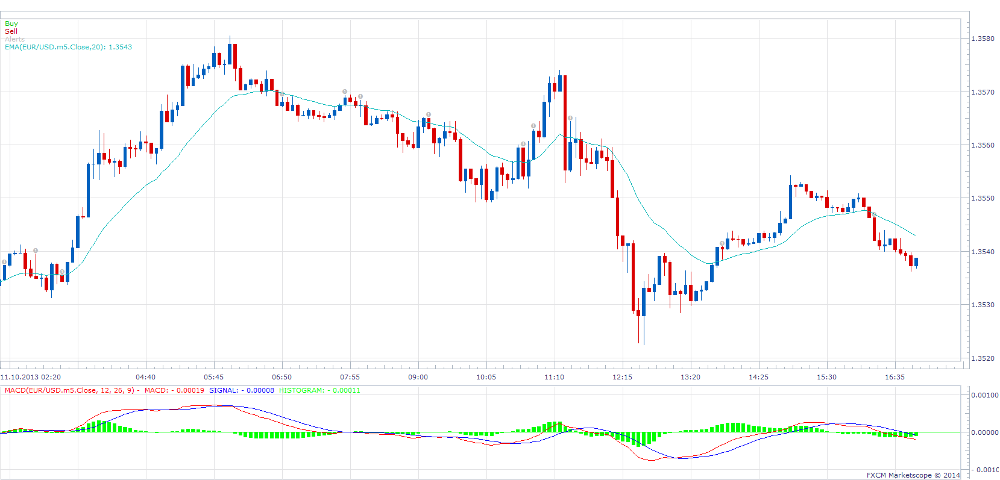

# Momentum Signal

> Source: https://fxcodebase.com/code/viewtopic.php?f=29&t=60205  
> Forum: 29 · Topic 60205 · 3 post(s)

---

## Momentum Signal

**Apprentice** · Wed Jan 15, 2014 5:57 am

Alert, will be given,
If Price Crosses Over Moving Average
And MACD Cross Over Occurred Within LookBack Periods

Short signal is reversed.

 [Momentum Signal.lua](files/92045/Momentum%20Signal.lua)

---

## Re: Momentum Signal

**bluegreen** · Fri Jan 17, 2014 5:16 am

Thanks Apprentice, I really appreciate how much time these signals save and the opportunities you find that you woud otherwise miss without these alrts.

---

## Re: Momentum Signal

**Apprentice** · Fri Jan 17, 2014 12:23 pm

Update.
Please Re-Download.
