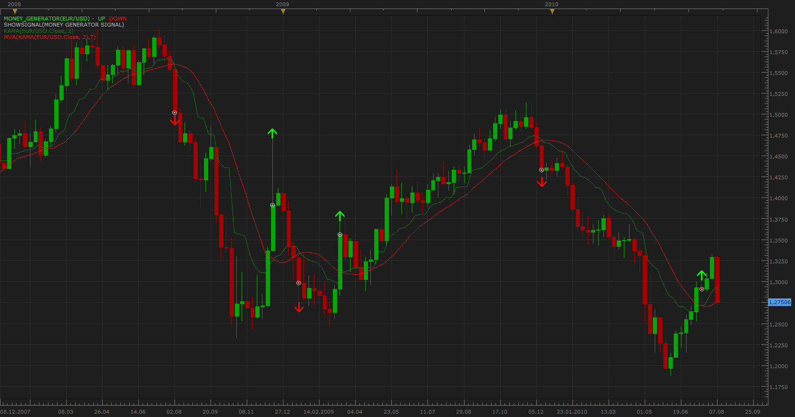

# Money Generator Strategy Signal

> Source: https://fxcodebase.com/code/viewtopic.php?f=29&t=1795  
> Forum: 29 · Topic 1795 · 6 post(s)

---

## Money Generator Strategy Signal

**Apprentice** · Sat Aug 14, 2010 11:08 am

Signal is generated when KAMA (green line) crosses MVA (red line) .
NOTE: MVA gets its DATA SOURCE from KAMA.

 [Money Generator Signal.lua](files/3594/Money%20Generator%20Signal.lua)

---

## Re: Money Generator Strategy Signal

**Zorro69** · Sat Jun 02, 2012 3:23 pm

Money Maker Signal

Hi Apprentice,

i like the signal you coded here: search.php?fid[]=29

My strategy is a little different (and better, i think): I use ARSI 14 instead MVA 7.

As i am no programmer at all: Do you think you can do a variation of the Money Maker -> with ARSI instead of MVA?

That would be great!

---

## Re: Money Generator Strategy Signal

**Apprentice** · Mon Jun 04, 2012 1:26 am

Your request is added to the development list.

---

## Re: Money Generator Strategy Signal

**Zorro69** · Mon Jun 04, 2012 4:30 am

> **Apprentice wrote:**
> Your request is added to the development list.

Thank you!

---

## Re: Money Generator Strategy Signal

**Gulliver** · Mon Jun 04, 2012 3:48 pm

Hi Apprentice,

do you can make this strategy to be a autotrde strategy?

and can choose more kind of moving avgrages,

i think that well be useful , thanks.

---

## Re: Money Generator Strategy Signal

**Apprentice** · Thu Jun 07, 2012 3:08 am

Your request is added to the development list.
