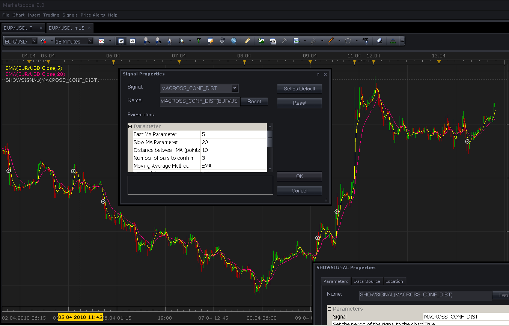

# Moving Average cross with confirmation by distance b/w lines

> Source: https://fxcodebase.com/code/viewtopic.php?f=29&t=639  
> Forum: 29 · Topic 639 · 8 post(s)

---

## Moving Average cross with confirmation by distance b/w lines

**Nikolay.Gekht** · Tue Apr 13, 2010 7:54 pm

Updated by ng Jun, 08
a) Different moving average methods can be chosen for fast and slow MA
b) Different prices (open, close, high...) can be chosen for fast and slow MA
c) TMA (triangle) and TEMA (triple EMA) moving averages are added to the list.

The signals checks for the cross between two moving average lines and signals if the distance between lines become bigger that the specified during the next N bars. If lines do not diverge, the signal will not appear. If you specify 0 as the distance and 0 as a number of bars, the signal will work exactly as the standard MA cross signal.

 



Download:

 [macross_conf_dist.lua](files/1138/macross_conf_dist.lua)

Source:

```lua
function Init()
    strategy:name("MA Corss with the confirmation by the distance between lines");
    strategy:description("The signal checks for the Moving Average crosses confirmed by the distance between the MA lines");

    strategy.parameters:addGroup("Parameter");

    strategy.parameters:addInteger("FMA_N", "Fast Moving Average Period", "", 5);
    strategy.parameters:addString("FMA_M", "Fast Moving Average Method", "The methods marked by an asterisk (*) require the appropriate strategys to be loaded.", "MVA");
    strategy.parameters:addStringAlternative("FMA_M", "MVA", "", "MVA");
    strategy.parameters:addStringAlternative("FMA_M", "EMA", "", "EMA");
    strategy.parameters:addStringAlternative("FMA_M", "LWMA", "", "LWMA");
    strategy.parameters:addStringAlternative("FMA_M", "TMA", "", "TMA");
    strategy.parameters:addStringAlternative("FMA_M", "SMMA*", "", "SMMA");
    strategy.parameters:addStringAlternative("FMA_M", "Vidya (1995)*", "", "VIDYA");
    strategy.parameters:addStringAlternative("FMA_M", "Vidya (1992)*", "", "VIDYA92");
    strategy.parameters:addStringAlternative("FMA_M", "Wilders*", "", "WMA");
    strategy.parameters:addStringAlternative("FMA_M", "TEMA*", "", "TEMA1");
    strategy.parameters:addString("FMA_P", "Fast Moving Average Price", "", "C");
    strategy.parameters:addStringAlternative("FMA_P", "Open", "", "O");
    strategy.parameters:addStringAlternative("FMA_P", "High", "", "H");
    strategy.parameters:addStringAlternative("FMA_P", "Low", "", "L");
    strategy.parameters:addStringAlternative("FMA_P", "Close", "", "C");
    strategy.parameters:addStringAlternative("FMA_P", "Median", "", "M");
    strategy.parameters:addStringAlternative("FMA_P", "Typical", "", "T");
    strategy.parameters:addStringAlternative("FMA_P", "Weighted", "", "W");

    strategy.parameters:addInteger("SMA_N", "Slow Moving Average Period", "", 20);
    strategy.parameters:addString("SMA_M", "Slow Moving Average Method", "The methods marked by an asterisk (*) require the appropriate strategys to be loaded.", "MVA");
    strategy.parameters:addStringAlternative("SMA_M", "MVA", "", "MVA");
    strategy.parameters:addStringAlternative("SMA_M", "EMA", "", "EMA");
    strategy.parameters:addStringAlternative("SMA_M", "LWMA", "", "LWMA");
    strategy.parameters:addStringAlternative("SMA_M", "TMA", "", "TMA");
    strategy.parameters:addStringAlternative("SMA_M", "SMMA*", "", "SMMA");
    strategy.parameters:addStringAlternative("SMA_M", "Vidya (1995)*", "", "VIDYA");
    strategy.parameters:addStringAlternative("SMA_M", "Vidya (1992)*", "", "VIDYA92");
    strategy.parameters:addStringAlternative("SMA_M", "Wilders*", "", "WMA");
    strategy.parameters:addStringAlternative("SMA_M", "TEMA*", "", "TEMA1");

    strategy.parameters:addString("SMA_P", "Slow Moving Average Price", "", "C");
    strategy.parameters:addStringAlternative("SMA_P", "Open", "", "O");
    strategy.parameters:addStringAlternative("SMA_P", "High", "", "H");
    strategy.parameters:addStringAlternative("SMA_P", "Low", "", "L");
    strategy.parameters:addStringAlternative("SMA_P", "Close", "", "C");
    strategy.parameters:addStringAlternative("SMA_P", "Median", "", "M");
    strategy.parameters:addStringAlternative("SMA_P", "Typical", "", "T");
    strategy.parameters:addStringAlternative("SMA_P", "Weighted", "", "W");

    strategy.parameters:addInteger("Dist", "Distance between MA (points) to confirm", "", 10);
    strategy.parameters:addInteger("ConfN", "Number of bars to confirm", "Use 0 to confirm on the same bar only", 3);

    strategy.parameters:addString("Type", "Type of the price", "", "Bid");
    strategy.parameters:addStringAlternative("Type", "Bid", "", "Bid");
    strategy.parameters:addStringAlternative("Type", "Ask", "", "Ask");

    strategy.parameters:addString("Period", "Time frame", "", "m1");
    strategy.parameters:setFlag("Period", core.FLAG_PERIODS);

    strategy.parameters:addGroup("Signal");

    strategy.parameters:addBoolean("ShowAlert", "Show Alert", "", true);
    strategy.parameters:addBoolean("PlaySound", "Play Sound", "", false);
    strategy.parameters:addFile("SoundFile", "Sound File", "", "");
end

local SoundFile;
local FMA, SMA;
local Dist;
local ConfN;
local BUY, SELL;
local gSource = nil;        -- the source stream
local first;

function CreateIndicator(method, n, price)
    local source;
    if not(gSource:isBar()) then
        source = gSource;
    elseif price == "O" then
        source = gSource.open;
    elseif price == "H" then
        source = gSource.high;
    elseif price == "L" then
        source = gSource.low;
    elseif price == "C" then
        source = gSource.close;
    elseif price == "M" then
        source = gSource.median;
    elseif price == "T" then
        source = gSource.typical;
    elseif price == "W" then
        source = gSource.weighted;
    end
    return core.indicators:create(method, source, n);
end

function Prepare()
    local FastN, SlowN;

    -- collect parameters
    FMA_N = instance.parameters.FMA_N;
    SMA_N = instance.parameters.SMA_N;
    Dist = instance.parameters.Dist;
    ConfN = instance.parameters.ConfN;

    assert(FMA_N < SMA_N, "Fast MA must be faster than slow MA");

    ShowAlert = instance.parameters.ShowAlert;

    if instance.parameters.PlaySound then
        SoundFile = instance.parameters.SoundFile;
    else
        SoundFile = nil;
    end

    assert(not(PlaySound) or (PlaySound and SoundFile ~= ""), "Sound File must be specified");

    BUY = "BUY";
    SELL = "SELL";

    local fastsource, slowsource;

    ExtSetupSignal(profile:id() .. ":", ShowAlert);
    if instance.parameters.Period == "t1" then
        gSource = ExtSubscribe(1, nil, instance.parameters.Period, instance.parameters.Type == "Bid", "close");
    else
        gSource = ExtSubscribe(1, nil, instance.parameters.Period, instance.parameters.Type == "Bid", "bar");
    end

    FMA = CreateIndicator(instance.parameters.FMA_M, instance.parameters.FMA_N, instance.parameters.FMA_P);
    SMA = CreateIndicator(instance.parameters.SMA_M, instance.parameters.SMA_N, instance.parameters.SMA_P);

    first = math.max(FMA.DATA:first(), SMA.DATA:first()) + 1;

    local pip;
    pip = gSource:pipSize();
    if pip > 1 then
        -- workaround for bug in Marketscope Apr, 10 release
        -- for a  history returned via getHistory() the pipSize returns precision
        -- instead of pipsize
        Dist = math.pow(10, -pip) * Dist;
    else
        Dist = pip * Dist;
    end

    local name = profile:id() .. "(" .. instance.bid:instrument()  .. "(" .. instance.parameters.Period  .. ")," ..
                                        instance.parameters.FMA_M .. "(" .. instance.parameters.FMA_N .. ")," ..
                                        instance.parameters.SMA_M .. "(" .. instance.parameters.SMA_N .. ")," ..
                                        Dist .. "," .. ConfN .. ")";

    instance:name(name);
end

local CurrDist = nil;
local Signal = nil;
local PrevDate = nil;

-- when tick source is updated
function ExtUpdate(id, source, period)
    -- update moving average
    FMA:update(core.UpdateLast);
    SMA:update(core.UpdateLast);

    if period <= first then
        return ;
    end

    if CurrDist ~= nil and PrevDate < gSource:date(period) then
        CurrDist = CurrDist + 1;
    end

    PrevDate = gSource:date(period);

    if core.crossesOver(FMA.DATA, SMA.DATA, period) then
         CurrDist = 0;
         Signal = 1;
    elseif core.crossesOver(SMA.DATA, FMA.DATA, period) then
         CurrDist = 0;
         Signal = -1;
    end

    if CurrDist ~= nil and CurrDist < ConfN then
        if Signal > 0 then
            if (FMA.DATA[period] - SMA.DATA[period]) >= Dist then
                ExtSignal(gSource, period, BUY, SoundFile);
                CurrDist = nil;
            end
        else
            if (SMA.DATA[period] - FMA.DATA[period]) >= Dist then
                ExtSignal(gSource, period, SELL, SoundFile);
                CurrDist = nil;
            end
        end
    end
end

dofile(core.app_path() .. "\\strategies\\standard\\include\\helper.lua");
```

---

## Re: Moving Average cross with confirmation by distance b/w lines

**Shadow77** · Wed Apr 21, 2010 4:03 am

Hello,
I got an error when i import this Custom signals
can you please have a look

---

## Re: Moving Average cross with confirmation by distance b/w lines

**Nikolay.Gekht** · Wed Apr 21, 2010 9:08 am

The first thing to check: you must use Signal->Manage Custom Signals, not Chart->Manage Custom Indicators.

---

## Re: Moving Average cross with confirmation by distance b/w lines

**Shadow77** · Wed Apr 21, 2010 9:31 am

Hi again, thanks it's working great With your indication
thanks again

---

## Re: Moving Average cross with confirmation by distance b/w lines

**patick** · Thu May 06, 2010 9:40 pm

Thank you, again, very much.... great signal!

* If I could request one modification by adding TMA as an optional smoothing method?

---

## Re: Moving Average cross with confirmation by distance b/w lines

**Nikolay.Gekht** · Tue Jun 08, 2010 3:29 pm

Updated.

---

## Re: Moving Average cross with confirmation by distance b/w lines

**NID007** · Wed Mar 23, 2011 11:02 am

> **Nikolay.Gekht wrote:**
> Updated.

Hi Nikolay ,

Great strategy

can we please get this strategy to trade long and short on the signals and it must continue to fuction as it does currently , on a Tick (T) time frame ,as I want to trade it on a tick chart ,as this strategy works well .
I must stress it must work on tick data please ,
many thanks for your positive work

rergards

Nid007

---

## Re: Moving Average cross with confirmation by distance b/w lines

**sunshine** · Thu Mar 31, 2011 6:09 am

Hi NID007,
Please find the strategy for this signal here:
[http://fxcodebase.com/code/viewtopic.php?f=31&t=3795](https://fxcodebase.com/code/viewtopic.php?f=31&t=3795)
