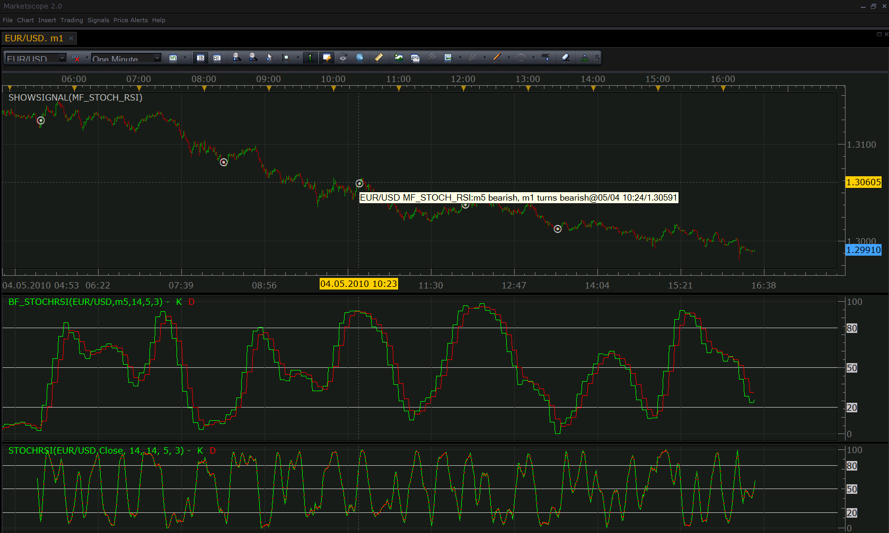

# Multiframe Stochastic RSI signal

> Source: https://fxcodebase.com/code/viewtopic.php?f=29&t=952  
> Forum: 29 · Topic 952 · 11 post(s)

---

## Multiframe Stochastic RSI signal

**Nikolay.Gekht** · Tue May 04, 2010 3:46 pm

The signal monitor two Stochastic RSI indicators applied on the different time frames and signals when the longer time frame stochastic is in the bearish (overbought) zone and the shorter frame stochastic crosses the overbought level (becomes bearish) or when the longer time frame stochastic is in the bullish (oversold) zone and the shorter frame stochastic crosses the oversold level (becomes bullish).

 



Download signal

 [mf_stoch_rsi.lua](files/1746/mf_stoch_rsi.lua)

The signal requires the [Stochastic RSI](http://www.fxcodebase.com/code/viewtopic.php?f=17&t=451) indicator installed.

Please, do not forget that signal must be installed via Signals->Manage Custom Signals and indicator must be installed via Indicators->Manage Custom Indicators.

**Important note about testing the signal using SHOWSIGNAL indicator**

This signal (unlike all other currently existing signals) operates on **two different time frames**, so, to test this signal correctly, please to the following:

1) Open the chart to the the indicator in the shorter time (e.g. 5 minutes). Load as much data as you want to test the signal on.
2) [if you want to check the signal against indicators] Apply StochRSI on the chart.
3) [if you want to check the signal against indicators] Apply [Bigger time frame Stochastic RSI](http://www.fxcodebase.com/code/viewtopic.php?f=17&t=761) with the longer time frame (e.g. 15 minutes).
4) Apply SHOWSIGNAL indicator.
In the SHOWSIGNAL indicator parameters:
4a) Select the signal parameter. The ellipsis button appears. Click on the button. The signal selection dialog appears. Select mf_stoch_rsi signal and set up the first time frame to the shorter time frame (5 minute in our example) and the second time frame to the longer time frame (15 minutes in our example). Click OK to close the signal parameters.
4b) Set the "Set the period of the signal to the chart period" parameter to **false**.
5) Apply the SHOWSIGNAL indicator.

```lua
function Init()
    strategy:name("Multiframe Stoch RSI signal");
    strategy:description("Signals when two Stoch RSI moves in the same zone");

    strategy.parameters:addInteger("OS", "Oversold level", "", 20, 1, 50);
    strategy.parameters:addInteger("OB", "Overbought level", "", 80, 50, 99);
    strategy.parameters:addString("TF1", "Fast Stochastic time frame", "", "m5");
    strategy.parameters:setFlag("TF1", core.FLAG_PERIODS);
    strategy.parameters:addInteger("N1", "Fast Stochastic Number of periods for RSI", "", 14, 1, 200);
    strategy.parameters:addInteger("K1", "Fast Stochastic %K Stochastic Periods", "", 14, 1, 200);
    strategy.parameters:addInteger("KS1", "Fast Stochastic %K Slowing Periods", "", 5, 1, 200);
    strategy.parameters:addInteger("D1", "Fast Stochastic %D Slowing Stochastic Periods", "", 3, 1, 200);

    strategy.parameters:addString("TF2", "Fast Stochastic time frame", "", "m30");
    strategy.parameters:setFlag("TF2", core.FLAG_PERIODS);
    strategy.parameters:addInteger("N2", "Fast Stochastic Number of periods for RSI", "", 14, 1, 200);
    strategy.parameters:addInteger("K2", "Fast Stochastic %K Stochastic Periods", "", 14, 1, 200);
    strategy.parameters:addInteger("KS2", "Fast Stochastic %K Slowing Periods", "", 5, 1, 200);
    strategy.parameters:addInteger("D2", "Fast Stochastic %D Slowing Stochastic Periods", "", 3, 1, 200);

    strategy.parameters:addBoolean("ShowAlert", "Show Alert", "", true);
    strategy.parameters:addBoolean("PlaySound", "Play Sound", "", false);
    strategy.parameters:addFile("SoundFile", "Sound file", "", "");
end

local OS, OB;
local SoundFile;
local gSource1 = nil;
local gSource2 = nil;
local RSI1 = nil;
local RSI2 = nil;
local RSI1D = nil;
local RSI2D = nil;

function Prepare()
    local ShowAlert = instance.parameters.ShowAlert;
    OS = instance.parameters.OS;
    OB = instance.parameters.OB;
    if instance.parameters.PlaySound then
        SoundFile = instance.parameters.SoundFile;
    else
        SoundFile = nil;
    end
    assert(not(PlaySound) or (PlaySound and SoundFile ~= ""), "Sound file must be specified");

    local s, e;
    local l1, l2;
    s, e = core.getcandle(instance.parameters.TF1, 0, 0);
    l1 = e - s;
    s, e = core.getcandle(instance.parameters.TF2, 0, 0);
    l2 = e - s;
    assert(l1 < l2, "The first time frame must be shorter than the second timeframe");

    gSource1 = ExtSubscribe(1, nil, instance.parameters.TF1, true, "close");
    gSource2 = ExtSubscribe(2, nil, instance.parameters.TF2, true, "close");

    ExtSetupSignal(profile:id() .. ":", ShowAlert);

    local name = profile:id() .. "(" .. instance.bid:instrument()  .. "," ..
                 "STOCHRSI(" .. instance.parameters.TF1 .. ", " .. instance.parameters.N1 .. ", " .. instance.parameters.K1  .. ", " .. instance.parameters.KS1   .. ", " .. instance.parameters.D1 .. "), " ..
                 "STOCHRSI(" .. instance.parameters.TF2 .. ", " .. instance.parameters.N2 .. ", " .. instance.parameters.K2  .. ", " .. instance.parameters.KS2   .. ", " .. instance.parameters.D2 .. "))";
    instance:name(name);
end

function ExtUpdate(id, source, period)
    local stream;

    if RSI1 == nil then
        RSI1 = core.indicators:create("STOCHRSI", gSource1, instance.parameters.N1, instance.parameters.K1, instance.parameters.KS1, instance.parameters.D1);
        RSI1D = RSI1:getStream(1);
    end
    if RSI2 == nil then
        RSI2 = core.indicators:create("STOCHRSI", gSource2, instance.parameters.N2, instance.parameters.K2, instance.parameters.KS2, instance.parameters.D2);
        RSI2D = RSI2:getStream(1);
    end
    RSI1:update(core.UpdateLast);
    RSI2:update(core.UpdateLast);

    if id ~= 1 then
        return ;
    end

    if gSource1:size() > RSI1D:first() + 1 and
       gSource2:size() > RSI2D:first() + 1 then
        if RSI2D[NOW] > OB and core.crossesOver(RSI1D, OB, NOW) then
           ExtSignal(instance.bid, instance.bid:size() - 1, instance.parameters.TF2 .. " bearish, " .. instance.parameters.TF1 .. " turns bearish", SoundFile);
        end
        if RSI2D[NOW] < OS and core.crossesUnder(RSI1D, OS, NOW) then
           ExtSignal(instance.bid, instance.bid:size() - 1, instance.parameters.TF2 .. " bullish, " .. instance.parameters.TF1 .. " turns bullish", SoundFile);
        end
    end
end

dofile(core.app_path() .. "\\strategies\\standard\\include\\helper.lua");
```

---

## Re: Multiframe Stochastic RSI signal

**aarons_alive** · Wed May 05, 2010 1:25 pm

This looks interesting, i will give it a go and let you know how much i lose!! lol only kidding.

---

## Re: Multiframe Stochastic RSI signal

**satejchaudhary** · Sun Aug 19, 2012 2:42 am

hi Nikolay
This signal is awesome.
Is is possible to add an email alert option to this signal.

Thanks
Satej

---

## Re: Multiframe Stochastic RSI signal

**Apprentice** · Mon Aug 20, 2012 2:10 am

Your request is added to the development list.

---

## Re: Multiframe Stochastic RSI signal

**BabyBull** · Sun Aug 26, 2012 7:52 pm

Hello Nikolay, this looks interesting. I have a few questions. I cannot find a SHOWSIGNAL either within Marketscope or FXCodeBase. How do I get that indicator? If I am not mistaken the standard Stochastic and RSI use the close of "a" moving average of some type. Is there a way to program this indicator with the JMA for quicker response and a smoother line? And finally would it be possible to turn this into a strategy so that it can be back tested and/or optimized? Thank you for your time

---

## Re: Multiframe Stochastic RSI signal

**Apprentice** · Mon Aug 27, 2012 6:34 am

SHOWSIGNAL was thrown out of the last version of the TS.
Upon user request, Nikolay has promised to be returned in the future.
JMA RSI is possible to implement.
I believe that there are already several RSI strategy.

---

## Re: Multiframe Stochastic RSI signal

**BabyBull** · Mon Aug 27, 2012 9:47 am

Thank you for your quick response. I don't think i phrased my question correctly. Can the JMA be incorporated into the indicators used with the MTF StochasticRSI indicator? For instance the standard Stochastic has 3 different smoothing choices for %K and %D. The RSI is calculated on the close of the EMA. Is it possible to give the user the ability to modify the parameters withing the MTF StochasticRSI on both the upper and lower time frames? An additional question is where can I find a sound file for the alert? And finally maybe a better question is, would the MTF StochasticRSI respond quicker with a smoother line if the user could adjust the types of MA's? Thank you, Steve

---

## Re: Multiframe Stochastic RSI signal

**Apprentice** · Mon Aug 27, 2012 10:47 am

JMA Stochastic RSI can be found here.
[viewtopic.php?f=17&t=22755](https://fxcodebase.com/code/viewtopic.php?f=17&t=22755)

Sorry, have not pay attention read your request.
As for MFT version, since TS, supports other time frames
we do not write MTF indicators.
 You can change indicator time frame indicator,
by changing indikator source time frame.

---

## Re: Multiframe Stochastic RSI signal

**Apprentice** · Mon Aug 27, 2012 11:02 am

Adaptable Stochastic RSI can be found here.
[viewtopic.php?f=17&t=22756](https://fxcodebase.com/code/viewtopic.php?f=17&t=22756)
Unfortunately this version does not support the JMA.

---

## Re: Multiframe Stochastic RSI signal

**BabyBull** · Mon Aug 27, 2012 11:28 am

Again, thank you your quick response

---

## Re: Multiframe Stochastic RSI signal

**Apprentice** · Mon Aug 27, 2012 12:42 pm

Strategy can be found here.
[viewtopic.php?f=31&t=22758](https://fxcodebase.com/code/viewtopic.php?f=31&t=22758)
Do not have JMA support for now.

I have also fix sound selection problem in this signal.
