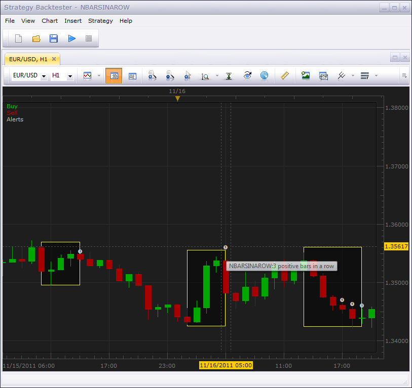

# N Bars in a row

> Source: https://fxcodebase.com/code/viewtopic.php?f=29&t=8347  
> Forum: 29 · Topic 8347 · 6 post(s)

---

## N Bars in a row

**vstrelnikov** · Tue Nov 22, 2011 5:54 pm

The strategy triggers an alert, when N positive or negative bars forms a row.

 

 [NBarsInARow.lua](files/18470/NBarsInARow.lua)

---

## Re: N Bars in a row

**jdutchak67** · Mon Apr 16, 2012 7:12 pm

Does this strategy work? I have installed and have seen 3 bars of same color in a row and do not have any signal alert , box, alert of anykind. running this on m5

---

## Re: N Bars in a row

**jdutchak67** · Mon Apr 16, 2012 8:32 pm

how do i get the boxes and circle symbol to show? it does alert but does not do those?

---

## Re: N Bars in a row

**Apprentice** · Tue Apr 17, 2012 2:26 am

This was added for easier pattern recognition.
Signals and strategies, can not provide this type of overlay.

---

## Re: N Bars in a row

**Reymondpolanco** · Fri Aug 11, 2017 6:40 pm

can you make a indicator to enumerate the candels, something like these:

---

## Re: N Bars in a row

**Apprentice** · Sun Aug 13, 2017 4:59 am

Can you tell me more about the algorithm used?
Provide Description, formula or indicator code.
