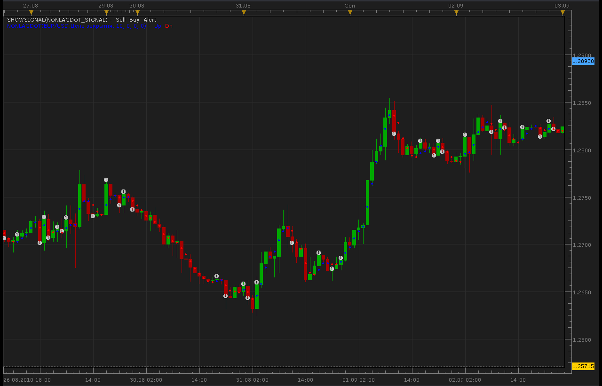

# NonLagDot signal

> Source: https://fxcodebase.com/code/viewtopic.php?f=29&t=2072  
> Forum: 29 · Topic 2072 · 1 post(s)

---

## NonLagDot signal

**Alexander.Gettinger** · Sun Sep 05, 2010 11:03 pm

[viewtopic.php?f=27&t=1988](https://fxcodebase.com/code/viewtopic.php?f=27&t=1988)

 

Code: [Select all](https://fxcodebase.com/code/)
`function Init()
    strategy:name("NonLagDot signal");
    strategy:description("");

    strategy.parameters:addGroup("Parameters");
    strategy.parameters:addInteger("Length", "Length", "Length", 10);
    strategy.parameters:addInteger("Filter", "Filter", "Filter", 0);
    strategy.parameters:addDouble("Deviation", "Deviation", "Deviation", 0);
    strategy.parameters:addString("TypeSignal", "Type of signal", "", "direct");
    strategy.parameters:addStringAlternative("TypeSignal", "direct", "", "direct");
    strategy.parameters:addStringAlternative("TypeSignal", "reverse", "", "reverse");

    strategy.parameters:addString("Period", "Timeframe", "", "m5");
    strategy.parameters:setFlag("Period", core.FLAG_PERIODS);

    strategy.parameters:addGroup("Signals");
    strategy.parameters:addBoolean("ShowAlert", "Show Alert", "", true);
    strategy.parameters:addBoolean("PlaySound", "Play Sound", "", false);
    strategy.parameters:addFile("SoundFile", "Sound File", "", "");
end

local SoundFile;
local gSourceBid = nil;
local gSourceAsk = nil;
local first;
local Coeff;
local Phase;
local Len;
local buff0=0;
local trend0=0;
local buff=0;
local trend=0;

local BidFinished = false;
local AskFinished = false;
local LastBidCandle = nil;

function Prepare()
    local FastN, SlowN;

    ShowAlert = instance.parameters.ShowAlert;
    if instance.parameters.PlaySound then
        SoundFile = instance.parameters.SoundFile;
    else
        SoundFile = nil;
    end
   
    assert(not(PlaySound) or (PlaySound and SoundFile ~= ""), "Sound file must be specified");
    assert(instance.parameters.Period ~= "t1", "Signal cannot be applied on ticks");

    ExtSetupSignal("Rsi trend color signal:", ShowAlert);

    gSourceBid = core.host:execute("getHistory", 1, instance.bid:instrument(), instance.parameters.Period, 0, 0, true);
    gSourceAsk = core.host:execute("getHistory", 2, instance.bid:instrument(), instance.parameters.Period, 0, 0, false);

    first = gSourceBid:first() + 2;
    Coeff=3.*math.pi;
    Phase=instance.parameters.Length-1;
    Len=instance.parameters.Length*4.+Phase;

    local name = profile:id() .. "(" .. instance.bid:instrument() .. "(" .. instance.parameters.Length  .. ")" .. instance.parameters.Filter .. ")" .. instance.parameters.Deviation .. ")";
    instance:name(name);
end

local LastDirection=nil;

-- when tick source is updated
function Update()
    if not(BidFinished) or not(AskFinished) then
        return ;
    end

    local period;

    -- calculate enter logic
    if LastBidCandle == nil or LastBidCandle ~= gSourceBid:serial(gSourceBid:size() - 1) then
        LastBidCandle = gSourceBid:serial(gSourceBid:size() - 1);

        period = gSourceBid:size() - 1;
        if period > first+Len+2 then
         local Weight=0;
         local Sum=0;
         local t=0;
         for i=0,Len-1,1 do
          local g=1./(Coeff*t+1.);
          if t<=0.5 then
           g=1.;
          end
          local beta=math.cos(math.pi*t);
          local alpha=g*beta;
          Sum=Sum+alpha*gSourceBid.close[period-i];
          Weight=Weight+alpha;
          if t<1. then
           t=t+1./(Phase-1.);
          elseif t<Len-1. then
           t=t+7./(4.*instance.parameters.Length-1.);
          end
         end
         buff0=buff;
         if Weight>0. then
          buff=(1.+instance.parameters.Deviation/100.)*Sum/Weight;
         end
         if instance.parameters.Filter>0. then
          if math.abs(buff-buff0)<Filter*gSourceBid:pipSize() then
           buff=buff0;
          end
         end
        trend0=trend;
        if buff-buff0>instance.parameters.Filter*gSourceBid:pipSize() then
         trend=1;
        end
        if buff0-buff>instance.parameters.Filter*gSourceBid:pipSize() then
         trend=-1;
        end
         
         if ((trend0<trend and instance.parameters.TypeSignal=="direct") or (trend0>trend and instance.parameters.TypeSignal=="reverse")) and LastDirection~=1 then
          ExtSignal(gSourceAsk, period, "Buy", SoundFile);
          LastDirection=1;
         end
         if ((trend0>trend and instance.parameters.TypeSignal=="direct") or (trend0<trend and instance.parameters.TypeSignal=="reverse")) and LastDirection~=-1 then
          ExtSignal(gSourceBid, period, "Sell", SoundFile);
          LastDirection=-1;
         end
       
        end
    end
end

function AsyncOperationFinished(cookie)
    if cookie == 1 then
        BidFinished = true;
    elseif cookie == 2 then
        AskFinished = true;
    end
end

local gSignalBase = "";     -- the base part of the signal message
local gShowAlert = false;   -- the flag indicating whether the text alert must be shown

-- ---------------------------------------------------------
-- Sets the base message for the signal
-- @param base      The base message of the signals
-- ---------------------------------------------------------
function ExtSetupSignal(base, showAlert)
    gSignalBase = base;
    gShowAlert = showAlert;
    return ;
end

-- ---------------------------------------------------------
-- Signals the message
-- @param message   The rest of the message to be added to the signal
-- @param period    The number of the period
-- @param sound     The sound or nil to silent signal
-- ---------------------------------------------------------
function ExtSignal(source, period, message, soundFile)
    if source:isBar() then
        source = source.close;
    end
    if gShowAlert then
        terminal:alertMessage(source:instrument(), source[period], gSignalBase .. message, source:date(period));
    end
    if soundFile ~= nil then
        terminal:alertSound(soundFile, false);
    end
end`

For work this signal must be installed NonLagDot indicator: [viewtopic.php?f=17&t=1721](https://fxcodebase.com/code/viewtopic.php?f=17&t=1721)
