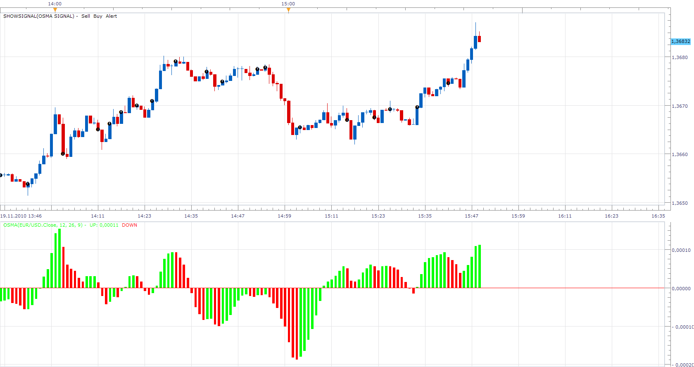

# OsMA (MACD Histogram) Signal

> Source: https://fxcodebase.com/code/viewtopic.php?f=29&t=2744  
> Forum: 29 · Topic 2744 · 12 post(s)

---

## OsMA (MACD Histogram) Signal

**Apprentice** · Fri Nov 19, 2010 3:54 pm

OsMA is Difference between the Moving Average Convergence/Divergence and the signal line.

The signal provides two types of signals.
Zero Line Cross and Top / Bot.

Top / bottom signal is generated whenever the indicator changes color.
It gives a lot of signals.
Top signal is given only when the OsMA is in a positive territory.
Bottom signal is given only when the OsMA is in negative territory.

 [OsMA Signal.lua](files/6230/OsMA%20Signal.lua)

---

## Re: OsMA (MACD Histogram) Signal

**bluepip** · Sun Mar 06, 2011 9:29 am

Is it possible to develop a strategy based on this signal?

Thanks
bluepip

---

## Re: OsMA (MACD Histogram) Signal

**Apprentice** · Sun Mar 06, 2011 3:36 pm

Your request has been added in the developmental cue.

---

## Re: OsMA (MACD Histogram) Signal

**Apprentice** · Mon Jun 27, 2011 10:40 am

Requested can be found here.
[viewtopic.php?f=31&t=4881](https://fxcodebase.com/code/viewtopic.php?f=31&t=4881)

---

## Re: OsMA (MACD Histogram) Signal

**SuperTrader** · Fri Oct 07, 2011 4:19 am

Hi Apprentice and thanks for your great development work. I've been testing your OsMA Signal for the last 2-3 days (with alert/sound/etc) and it works, but when setting the parameter 'Signal Type' to 'Both', it gives signals ONLY for the 'zero line crosses' (not for the 'Tops/Bottoms'). To make sure I've tested it even on the smallest 5m/1m timeframes and naturally I was getting hundreds of signals per day, but ONLY for the 'zero line crosses' (never a signal for the 'tops/bottoms', although I had set that parameter to 'Both'). Could you please take a look at your earliest convenience ? Many thanks.

---

## Re: OsMA (MACD Histogram) Signal

**TraderKen** · Fri Nov 04, 2011 7:29 pm

Hi Apprentice,

Could you write a signal for the divergence between MACD Histogram and Price? I mean a signal will be generated if the color of the Histogram changes at the top/bottom and there is also a divergence between MACD Histogram and Price.

Thank you very much.

---

## Re: OsMA (MACD Histogram) Signal

**jtatalov** · Wed Nov 16, 2011 11:08 am

Hey this signal and a lot of the signals are not working on the updated software, can you guys please take a look at this at your earliest convenience.

---

## Re: OsMA (MACD Histogram) Signal

**Apprentice** · Wed Nov 16, 2011 5:26 pm

Can you describe your problem.
I have try to load it in Marketscope.
I never had a problem.

---

## Re: OsMA (MACD Histogram) Signal

**jtatalov** · Wed Nov 16, 2011 7:39 pm

Yes, before the signal would post when an event took place, in this case when the histogram changed from negative to positive and visa versa. In the new TS there isn't a signal "dot" generated on the chart when this event takes place. I have double checked to make sure I have the field in the setup checked to show the signal.

---

## Re: OsMA (MACD Histogram) Signal

**Apprentice** · Fri Nov 18, 2011 5:01 am

I just made ​​a test in Backtester.
And as you can see, they are a lot of signals.

In the new version of Marketscope, historical testing must be done,
within Backtester.

For Live Signals you can use Configure Strategies and Alerts configuration interface.
Also tested, Works as expected.

---

## Re: OsMA (MACD Histogram) Signal

**jtatalov** · Fri Nov 18, 2011 5:21 am

I agree, but can you give me further instructions on how to have the live signal post a dot on the live chart

---

## Re: OsMA (MACD Histogram) Signal

**Apprentice** · Fri Nov 18, 2011 5:34 am

As I understand, this is no longer possible.
Historic signals in Backtester.
Live Alerts in Marketscope.

I will contacted the development team, and ask for old signal indicator in Marketscope.
