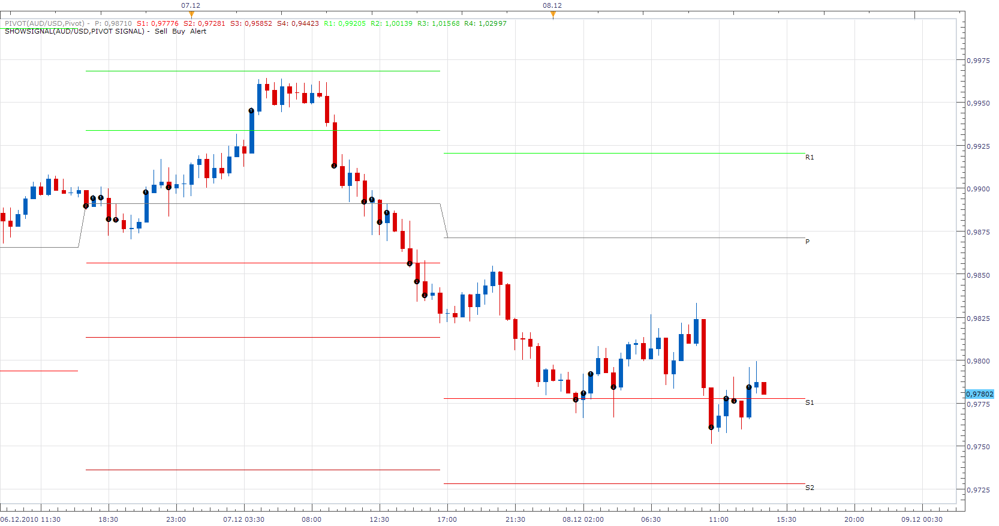
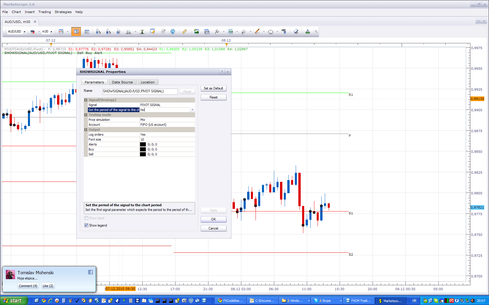

# Pivot Signal

> Source: https://fxcodebase.com/code/viewtopic.php?f=29&t=2908  
> Forum: 29 · Topic 2908 · 15 post(s)

---

## Pivot Signal

**Apprentice** · Wed Dec 08, 2010 2:06 pm

Gives a warning signal when the closing price touched or Cross one of the Pivot Line,
for Selected, Pivot Indicator.

 

To Work, Set, Set The Period of Signal To Chart Period, To**No**

 [Pivot Signal.lua](files/6645/Pivot%20Signal.lua)

MT4/MQ4 version.
[viewtopic.php?f=38&t=69129](https://fxcodebase.com/code/viewtopic.php?f=38&t=69129)

---

## Re: Pivot Signal

**ASTERIA** · Fri Jul 19, 2019 3:20 pm

Hi

can you add the parameters and the pivot point?

Thank you

---

## Re: Pivot Signal

**Apprentice** · Sun Jul 28, 2019 7:28 am

I do not understand your request.
Can you provide more information?

---

## Re: Pivot Signal

**Ronan28** · Sun Nov 03, 2019 5:23 pm

Hello , can you ad middle line signal ?
Thanks

---

## Re: Pivot Signal

**trillionairemac** · Mon Nov 11, 2019 12:18 am

Is there an MQ4 file

---

## Re: Pivot Signal

**Apprentice** · Wed Nov 13, 2019 3:30 pm

Your request is added to the development list.
Development reference 311.

---

## Re: Pivot Signal

**Apprentice** · Thu Nov 14, 2019 11:50 am

MT4/MQ4 version.
[viewtopic.php?f=38&t=69129](https://fxcodebase.com/code/viewtopic.php?f=38&t=69129)

---

## Re: Pivot Signal

**ronanFR** · Mon Apr 13, 2020 12:04 pm

Hello , can you ad middle line signal ?
Thanks for all
Ronan

---

## Re: Pivot Signal

**Apprentice** · Wed Apr 15, 2020 1:20 pm

Your request is added to the development list.
Development reference 1072.

---

## Re: Pivot Signal

**Apprentice** · Wed Apr 15, 2020 4:37 pm

[Pivot With Mid Point Signal.lua](files/132884/Pivot%20With%20Mid%20Point%20Signal.lua)

You will have to install Pivot With Mid Point.lua
[viewtopic.php?f=17&t=69675](https://fxcodebase.com/code/viewtopic.php?f=17&t=69675)

---

## Re: Pivot Signal

**ronanFR** · Sat Apr 18, 2020 8:44 pm

thank you

---

## Re: Pivot Signal

**ronanFR** · Fri Apr 24, 2020 8:26 am

Hello , signal have error.
Can you look at this ?
Thanks

---

## Re: Pivot Signal

**Apprentice** · Sun Apr 26, 2020 6:13 am

Please re-install Pivot With Mid Point.lua

---

## Re: Pivot Signal

**Avignon** · Sun Apr 26, 2020 5:24 pm

Hello,

Unless I am mistaken, in the choices there are the supports and resistances but not the pivot.

Regards.

---

## Re: Pivot Signal

**Apprentice** · Fri Jul 03, 2020 4:30 am

Pivot alert is available, unlike others can not be turned on and off.
