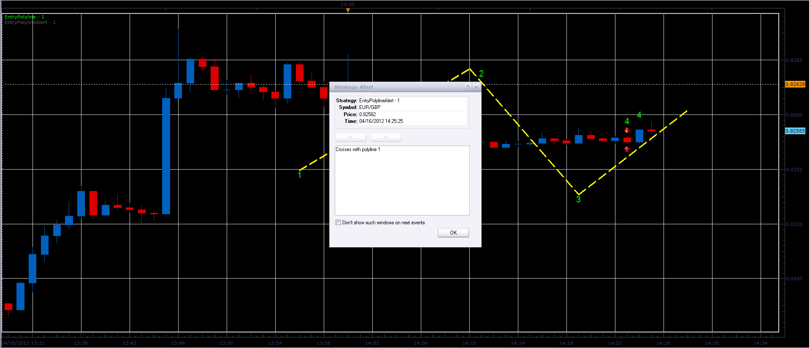

# Polyline crossing signal

> Source: https://fxcodebase.com/code/viewtopic.php?f=29&t=16111  
> Forum: 29 · Topic 16111 · 6 post(s)

---

## Polyline crossing signal

**Alexander.Gettinger** · Mon Apr 16, 2012 1:30 pm

Signal shows a alert at the intersection of the price and polyline ([viewtopic.php?f=17&t=15667](https://fxcodebase.com/code/viewtopic.php?f=17&t=15667)).

 

To use the alarm is necessary:
1. Import "EntryPolyline" indicator,
2. Draw polyline,
3. Use the name of the indicator in the "EntryPolylineAlert" signal.

Download:

 [EntryPolylineAlert.lua](files/30127/EntryPolylineAlert.lua)

---

## Re: Polyline crossing signal

**satejchaudhary** · Mon Aug 20, 2012 11:29 pm

hi Alexander,
Thanks for the signal. Its very helpful.
However, I do have a request that I am sure many others using the signal would also appreciate.

The current signal doesn't play a sound or send an email - so I have to keep coming to the platform every few minutes.

Would it be possible to modify this alert so as to
1. Play a sound (one time / recurrent)
2. Send an email

Upon the following conditions
1. On price touching polyline
2. On price closing on the other side of the polyline

Thanks
Satej

---

## Re: Polyline crossing signal

**Apprentice** · Wed Aug 22, 2012 2:03 am

Your request is added to the development list.

---

## Re: Polyline crossing signal

**satejchaudhary** · Tue Aug 28, 2012 12:21 am

Thanks Apprentice. Really appreciate your help.

Regards
Satej

---

## Re: Polyline crossing signal

**satejchaudhary** · Tue Sep 04, 2012 1:39 pm

hi Alexander, Apprentice,

Would you know around when you would release the feature - to send email alerts on poly line touch/cross.

Am eagerly waiting for it.

Thanks
Satej

---

## Re: Polyline crossing signal

**Apprentice** · Wed Sep 05, 2012 2:34 am

Your request is added to the development list.
