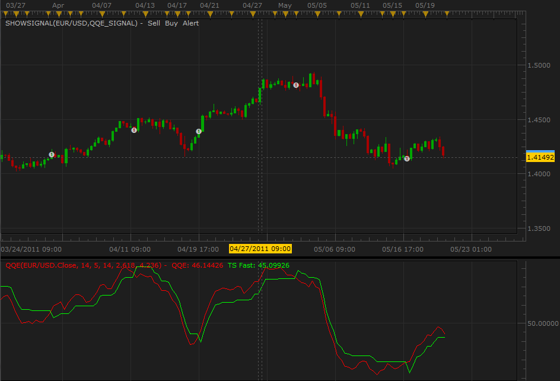
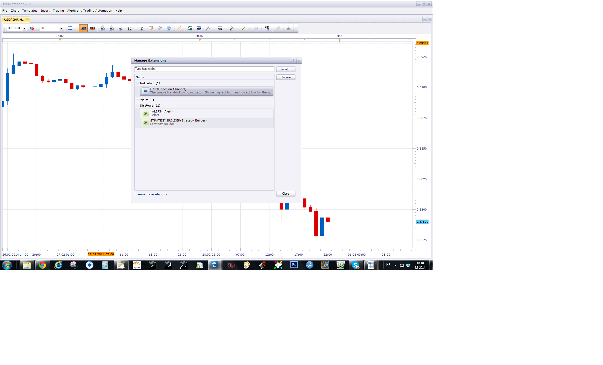

# QQE Signal

> Source: https://fxcodebase.com/code/viewtopic.php?f=29&t=4382  
> Forum: 29 · Topic 4382 · 21 post(s)

---

## QQE Signal

**vstrelnikov** · Fri May 20, 2011 11:10 am

The simple signal based on QQE indicator. Indicator can be downloaded[here](https://fxcodebase.com/code/viewtopic.php?f=17&t=1347).

The signal displays alert when the QQE and the signal cross at the close of the bar.

 

 [QQE_Signal.lua](files/10878/QQE_Signal.lua)

---

## Re: QQE Signal

**fperezdearce** · Tue Jul 26, 2011 11:57 am

Hi,

I'm looking for QQE adv but I can found it for TSII.

thanks

---

## Re: QQE Signal

**sunshine** · Fri Jul 29, 2011 4:44 am

Could you please provide more details on the signal/indicator you are looking for (formula, conditions, etc)

---

## Re: QQE Signal

**Tim123** · Thu Aug 11, 2011 11:55 am

There is currently a QQE and a QQE signal and I use both but I would like to get a change made to the QQE signal.
Here is what I would like it to do.

I would like the QQE to alarm when the QQE crosses a value of 50 at the end of the bar. I would also like to be able to make the alarm sound several times but not continuously. I would like the value the QQE crosses to be a variable input value and the number of times the alert sounds to be a variable input value.

Thank you very much.

Tim

---

## Re: QQE Signal

**MERNISSI** · Mon Dec 05, 2011 11:37 am

can you pleas add auto trade to the signal
 thank you very much brother

---

## Re: QQE Signal

**MERNISSI** · Mon Dec 05, 2011 10:35 pm

hello
can u pleas add to the signal allow strategie to trade

thank you

---

## Re: QQE Signal

**Apprentice** · Tue Dec 06, 2011 3:19 am

Your request is added to the developmental cue.

---

## Re: QQE Signal

**Apprentice** · Thu Dec 08, 2011 7:37 am

Requested can be found here.

[viewtopic.php?f=31&t=9147](https://fxcodebase.com/code/viewtopic.php?f=31&t=9147)

---

## Re: QQE Signal

**jackfx09** · Fri Jul 20, 2012 2:22 pm

Can we please request a MTF MCP heatmap of this indicator. It would be nice to have the PARAMETER OPTION if we could choose from 1. QQE crossover of SLOW trailing stop for entry/exit of positions (this obviously would eliminate FALSE SIGNALS). or 2. Original intent of indicator of QQE crossing over FAST trailing stop to generate signals.

Updating the respective QQE Strategy with parameter option would also be a formal request too please.

Thanks!

sjc

---

## Re: QQE Signal

**Coondawg71** · Sat Sep 08, 2012 6:04 pm

Can we please request a new version of the QQE Strategy. New Version would allow price to be filtered with the Hodrick Prescott Filter in order to smooth the signal crosses and reduce false signals.

Thanks!

sjc

---

## Re: QQE Signal

**Apprentice** · Tue Sep 11, 2012 4:12 am

Your request is added to the development list.

---

## Re: QQE Signal

**Apprentice** · Wed Sep 12, 2012 3:06 pm

Requested can be found here.
[viewtopic.php?f=31&t=9147&p=40174#p40174](https://fxcodebase.com/code/viewtopic.php?f=31&t=9147&p=40174#p40174)

---

## Re: QQE Signal

**Tim123** · Thu Dec 12, 2013 10:53 am

Could I get the QQE alert modified to do the following things for the MT4 platform?
I would like it to give the alert after the QQE goes over 70 or 80 then crosses down
I would also like it to alert if it goes below 20 or 30 then crosses up.
I would also like to be able to adjust all of the QQE settings.
I would like the alert to be both visual and audible.

Thanks

---

## Re: QQE Signal

**Apprentice** · Fri Dec 13, 2013 4:27 am

So, you want QQE Indicator for MQ4 with visual and audible alerts.

---

## Re: QQE Signal

**GERINGA** · Fri Feb 28, 2014 10:28 pm

Hi

How I can uninstall an indicator or a signal in Marketscope?

---

## Re: QQE Signal

**Apprentice** · Sun Mar 02, 2014 4:19 am

Once you are within, manage extensions,
Mark all as you want to remove,
Click Remove button.

---

## Re: QQE Signal

**Xtian56** · Mon Dec 13, 2021 1:16 pm

> **vstrelnikov wrote:**
> The simple signal based on QQE indicator. Indicator can be downloaded[here](https://fxcodebase.com/code/viewtopic.php?f=17&t=1347).
>
> The signal displays alert when the QQE and the signal cross at the close of the bar.
>
>
>
> QQE_Signal.png
>
>
>
>
>
> QQE_Signal.lua

Thanks for this work.
Could you also do this by:

QQE_Alert.lua

please ?
thanks again

---

## Re: QQE Signal

**Apprentice** · Tue Dec 14, 2021 5:18 am

NOT sure what is requested?
Can you elaborate in more detail?

---

## Re: QQE Signal

**Xtian56** · Tue Dec 14, 2021 11:17 am

> **Apprentice wrote:**
> NOT sure what is requested?
> Can you elaborate in more detail?

Hello,
thank you for your reply
I am looking for alerts on ghrahique simply based on crosses with the QQE indicator
Thank you

---

## Re: QQE Signal

**Apprentice** · Thu Dec 16, 2021 2:54 pm

Your request is added to the development list.
Development reference 1023.

---

## Re: QQE Signal

**Apprentice** · Fri Dec 17, 2021 4:34 am

QQE Alert.lua added.
[https://fxcodebase.com/code/viewtopic.php?f=17&t=1347](https://fxcodebase.com/code/viewtopic.php?f=17&t=1347)
