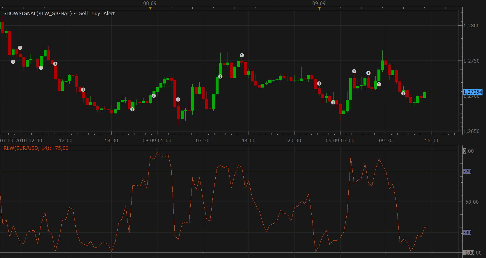

# %R Larry Williams signal

> Source: https://fxcodebase.com/code/viewtopic.php?f=29&t=2115  
> Forum: 29 · Topic 2115 · 2 post(s)

---

## %R Larry Williams signal

**Nikolay.Gekht** · Thu Sep 09, 2010 2:49 pm

The signal alerts when %R Larry Williams (RLW) indicator crosses the specified level.

 

Download:

 [rlw_signal.lua](files/4360/rlw_signal.lua)

---

## Re: %R Larry Williams signal

**novajim** · Mon Sep 19, 2011 7:37 pm

I have been testing this strategy and find that the alert is received 2 interval periods after the actual condition is met. Since the interval has to close before the alert can be sent, it makes sense that it would not be sent out until the next period, but we find that it is delayed consistently one more period.

Can you inform us how to interpret this or if the code needs to be modified so the signal is sent "fresher". ?

Thanks! novajim
