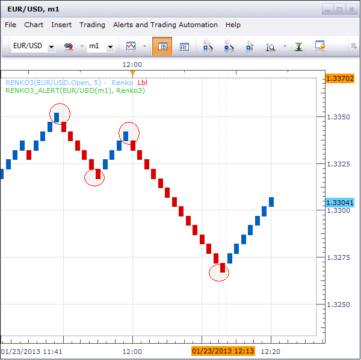

# Renko3 Alert

> Source: https://fxcodebase.com/code/viewtopic.php?f=29&t=31337  
> Forum: 29 · Topic 31337 · 15 post(s)

---

## Renko3 Alert

**vstrelnikov** · Wed Jan 23, 2013 1:42 pm

Signals when [Renko](https://fxcodebase.com/code/viewtopic.php?f=17&t=2360) indicator changes direcion.

 



```lua
function Init()
    strategy:name("Indicator alert");
    strategy:description("Alerts when a Renko3 indicator/oscillator crosses a certain level");

    strategy.parameters:addGroup("Renko3 Parameters");

    strategy.parameters:addString("Period", "Period size", "", "m1");
    strategy.parameters:setFlag("Period", core.FLAG_PERIODS);
   
    strategy.parameters:addString("Type", "Price type", "", "Bid");
    strategy.parameters:addStringAlternative("Type", "Bid", "", "Bid");
    strategy.parameters:addStringAlternative("Type", "Ask", "", "Ask");

    strategy.parameters:addInteger("Step", "Step in pips", "", 100);

    strategy.parameters:addGroup("Notification");

    strategy.parameters:addBoolean("ShowAlert", "Show Alert", "", true);
    strategy.parameters:addBoolean("PlaySound", "Play Sound", "", false);
    strategy.parameters:addFile("SoundFile", "Sound File", "", "");
    strategy.parameters:setFlag("SoundFile", core.FLAG_SOUND);
    strategy.parameters:addBoolean("SendEmail", "Send Email", "", false);
    strategy.parameters:addString("Email", "E-mail address", "Note that to recieve e-mails, SMTP settings must be defined (see Signals Options).", "");
    strategy.parameters:setFlag("Email", core.FLAG_EMAIL);

end

local SoundFile;
local gSource = nil;        -- the source stream
local ZigAndZag
local SendEmail, Email;
local lastSignal = nil

function Prepare()

   gSource = ExtSubscribe(1, nil, instance.parameters.Period, instance.parameters.Type == "Bid", "bar");
   I = core.indicators:create("RENKO3", gSource, instance.parameters.Step)
   tickSource = ExtSubscribe(2, nil, "t1", instance.parameters.Type == "Bid", "bar");

   ShowAlert = instance.parameters.ShowAlert;

   if instance.parameters.PlaySound then
        SoundFile = instance.parameters.SoundFile;
    else
        SoundFile = nil;
    end

    assert(not(PlaySound) or (PlaySound and SoundFile ~= ""), "Sound file must be specified");

    SendEmail = instance.parameters.SendEmail;
    if SendEmail then
        Email = instance.parameters.Email;
    else
        Email = nil;
    end
    assert(not(SendEmail) or (SendEmail and Email ~= ""), "E-mail address must be specified");
 
    local name = profile:id() .. "(" .. instance.bid:instrument()  .. "(" .. instance.parameters.Period  .. ")" .. ", Renko3)";
    instance:name(name);

    ExtSetupSignal("Renko3 Alert: ", ShowAlert);
    ExtSetupSignalMail(name);
end

-- when tick source is updated
function ExtUpdate(id, source, period)
    -- update indicator

    if I ~= nil then
        I:update(core.UpdateLast);
    end
   
   if I.DATA:size() < 2 then
      return;
   end

    local sz = I.open:size() - 1

    if I.open[sz] >= I.close[sz] and I.open[sz - 1] < I.close[sz - 1] and lastSignal ~= "Sell" then
        lastSignal = "Sell"
        ExtSignal(gSource, sz, "Sell", SoundFile, Email);
    elseif I.open[sz] < I.close[sz] and I.open[sz - 1] >= I.close[sz - 1]  and lastSignal ~= "Buy" then
        lastSignal = "Buy"
        ExtSignal(gSource, sz, "Buy", SoundFile, Email);
    end
end

dofile(core.app_path() .. "\\strategies\\standard\\include\\helper.lua");
```

---

## Re: Renko3 Alert

**RunVert** · Wed Jan 23, 2013 1:57 pm

IS there a Renko chart that is fully operational yet?
the following thread has not been updated since September and the renko chart still crashes when trying to change the box size or the time frame.

[http://fxcodebase.com/code/viewtopic.ph ... 0&start=20](https://fxcodebase.com/code/viewtopic.php?f=17&t=2360&start=20)

Alert look nice. Good work!

---

## Re: Renko3 Alert

**beatrice3** · Sun Feb 02, 2014 4:54 pm

Hi,
I downloaded and imported this successfully, but when I try to add it to the marketscope chart I get the following error message:

Renko3_Alert.lua:38: The indicator with id RENKO3 is not found

Can anyone help??

Thanks

---

## Re: Renko3 Alert

**Apprentice** · Mon Feb 03, 2014 5:47 am

Please Download and Install This Indicator.
[download/file.php?id=3130](https://fxcodebase.com/code/download/file.php?id=3130)

---

## Re: Renko3 Alert

**SenseClash** · Fri Feb 26, 2016 12:42 pm

I have some questions. I have my Renkos set on the 1-minute chart for 20 pips.
1) When I hover over a Renko and the time underneath is, say, 05:40 am, is that the time when the Renko candle BEGAN to form or when it STOPPED forming?

2) What's the difference between a setting of "1-minute chart 20 pips" versus "5-minute chart 20 pips"? Does the first one check every minute to see if there's been 20 pips of movement and the second one check every 5 minutes?

I set the alert for several pairs. I got email notifications for EURUSD, GBPUSD, USDJPY and USDCAD, but the "Events" tab only lists the very first signal I got. The other 3 signals from tonight aren't listed.
3) Why is only the first signal I received (EURUSD) listed in the "Events" tab?

Also, one of my pairs didn't signal, but should have (the AUDUSD). The settings for all alerts are exactly the same.
4) Why didn't the AUDUSD give a signal?

For reference, below are the times that appear when I hover under a candle and when my email notification appeared. (The EUR and JPY email notifications seem late.)
EURUSD: 3:31 4:02
GBPUSD: 5:40 5:42
USDJPY 5:06 5:48
USDCAD 7:44 7:44

---

## Re: Renko3 Alert

**SenseClash** · Fri Feb 26, 2016 1:00 pm

Is this tab why I only got a signal for the Euro? The label for this tab makes it sound like it is only about Euro signals.

---

## Re: Renko3 Alert

**MrRiversideDude** · Thu Mar 17, 2016 7:52 am

Can we add one MA to this alert that's based on the Renko3 bars? It should alert buy if above the MA, sell if below the MA.

Thanks in advance!

---

## Re: Renko3 Alert

**MrRiversideDude** · Fri Mar 18, 2016 9:08 am

I'm willing to pay $25 US Dollars via Paypal to whoever gets this done and it works after I test it.

Thanks in advance!

---

## Re: Renko3 Alert

**SenseClash** · Sat Mar 19, 2016 8:58 pm

> **MrRiversideDude wrote:**
> Can we add one MA to this alert that's based on the Renko3 bars? It should alert buy if above the MA, sell if below the MA.
>
> Thanks in advance!

I like this idea, too!

---

## Re: Renko3 Alert

**MrRiversideDude** · Mon Mar 21, 2016 12:44 am

Why can't we get this simple change done? Is it possible? If so, it seems like it would only take five minutes for one of the experts.

Thanks in advance.

---

## Re: Renko3 Alert

**Apprentice** · Mon Mar 21, 2016 4:55 am

Your request is added to the development list.

---

## Re: Renko3 Alert

**SenseClash** · Wed Apr 20, 2016 1:39 am

Would anyone be willing to modify this Renko so that I can have the option of signaling when ANY new Renko candle is formed (even one in the SAME direction)?

The Renkos are enormously useful in detecting when there is market activity in general, not just a change in trend.

---

## Re: Renko3 Alert

**SenseClash** · Wed Apr 20, 2016 1:59 am

I forgot to mention another benefit of having the Renko signal me at every candle, no matter what the color. Let's say I'm long. When I get a signal that's a continuation of a trend that I'm in, I can adjust my stop using a method other than Renkos. Otherwise, I'm waiting until the Renko changes color, and that can force me to give up a big chunk of profits--depending on how big my bricks are.

---

## Re: Renko3 Alert

**SenseClash** · Wed Jun 13, 2018 11:36 am

I get this error message when I install this alert:

C:/Program Files (x86)/CandleWorks/FXTS2/Strategies/Custom/Renko3_Alert.lua:74: attempt to index global 'I' (a nil value)

I'm using Marketscape 2.0.

---

## Re: Renko3 Alert

**Apprentice** · Sun Jul 22, 2018 8:40 am

Please Download and Install Renko3 Indicator.
[download/file.php?id=3130](https://fxcodebase.com/code/download/file.php?id=3130)
