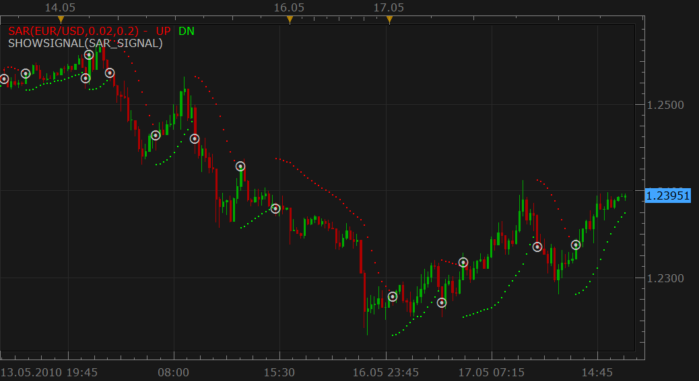
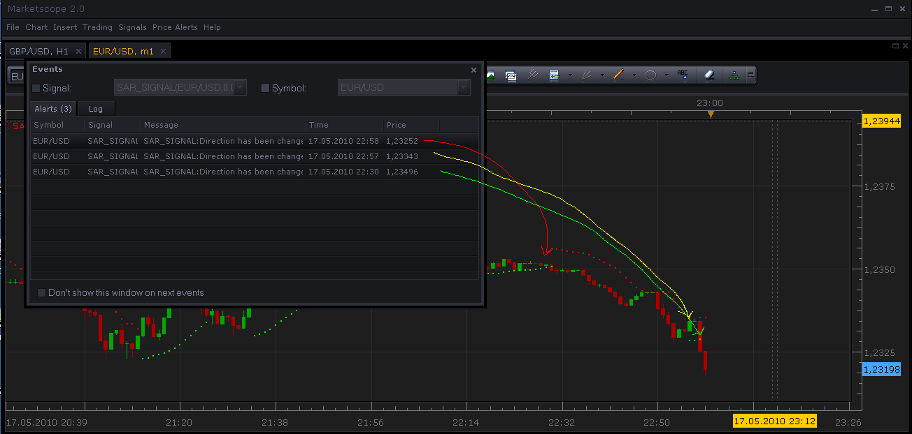

# SAR Signal [Upd Oct, 18]

> Source: https://fxcodebase.com/code/viewtopic.php?f=29&t=1045  
> Forum: 29 · Topic 1045 · 17 post(s)

---

## SAR Signal [Upd Oct, 18]

**Nikolay.Gekht** · Mon May 17, 2010 4:00 pm

Oct, 18 update by NG. The signal is updated to support all new Marketscope features:
a) recurrent sound
b) parameters grouping
c) email notifications

The simple signals which shows alert when the SAR indicator changes it's direction.

 



Download:

 [SAR_signal_1.lua](files/1966/SAR_signal_1.lua)

```lua
-- Indicator profile initialization routine
-- Defines indicator profile properties and indicator parameters
function Init()
    strategy:name("Simple SAR signal");
    strategy:description("Signals when SAR changes the direction");

    strategy.parameters:addGroup("SAR parameters");
    strategy.parameters:addDouble("Step", "Step", "", 0.02, 0.001, 1);
    strategy.parameters:addDouble("Max", "Max", "", 0.2, 0.001, 10);

    strategy.parameters:addGroup("Price parameters");
    strategy.parameters:addString("Period", "Time frame", "", "m1");
    strategy.parameters:setFlag("Period", core.FLAG_PERIODS);

    strategy.parameters:addGroup("Signal parameters");
    strategy.parameters:addBoolean("ShowAlert", "Show Alert", "", true);
    strategy.parameters:addBoolean("PlaySound", "Play Sound", "", false);
    strategy.parameters:addFile("SoundFile", "Sound file", "", "");
    strategy.parameters:setFlag("SoundFile", core.FLAG_SOUND);
    strategy.parameters:addBoolean("Recurrent", "RecurrentSound", "", false);

    strategy.parameters:addGroup("Email Parameters");
    strategy.parameters:addBoolean("SendEmail", "Send email", "", false);
    strategy.parameters:addString("Email", "Email address", "", "");
    strategy.parameters:setFlag("Email", core.FLAG_EMAIL);
end

-- Indicator instance initialization routine
-- Processes indicator parameters and creates output streams
-- Parameters block
local SAR;
local gSource;

local SoundFile;
local RecurrentSound;
local Email;
local ShowAlert;
local name;

-- Routine
function Prepare(onlyName)
    local Step;
    local Max;
    local ExplosionPower;

    Step = instance.parameters.Step;
    Max = instance.parameters.Max;

    ShowAlert = instance.parameters.ShowAlert;
    if instance.parameters.PlaySound then
        SoundFile = instance.parameters.SoundFile;
    else
        SoundFile = nil;
    end

    assert(not(PlaySound) or (PlaySound and SoundFile ~= ""), "Sound file must be specified");

    RecurrentSound = instance.parameters.Recurrent;
    local SendEmail = instance.parameters.SendEmail;
    if SendEmail then
        Email = instance.parameters.Email;
    else
        Email = nil;
    end
    assert(not(SendEmail) or (SendEmail and Email ~= ""), "Email address must be specified");

    name = profile:id() .. "(" .. instance.bid:instrument()  .. "," .. Step .. "," .. Max .. ")";
    instance:name(name);

    if onlyName then
        return ;
    end

    assert(instance.parameters.Period ~= "t1", "Can't be applied on ticks!");

    gSource = ExtSubscribe(1, nil, instance.parameters.Period, true, "bar");
    SAR = core.indicators:create("SAR", gSource, Step, Max);
end

function ExtUpdate(id, source, period)
    if id == 1 then
        SAR:update(core.UpdateLast);
        if period >= SAR.DATA:first() + 1 then
            local message = nil;

            if not(SAR.DN:hasData(period - 1)) and SAR.DN:hasData(period) then
                message = "SAR switched down";
            elseif not(SAR.UP:hasData(period - 1)) and SAR.UP:hasData(period) then
                message = "SAR switched up";
            end

            if message ~= nil then
               if ShowAlert then
                   terminal:alertMessage(instance.bid:instrument(), instance.bid[NOW], message, instance.bid:date(NOW));
               end

               if SoundFile ~= nil then
                   terminal:alertSound(SoundFile, RecurrentSound);
               end

               if Email ~= nil then
                   terminal:alertEmail(Email, name, name .. "(" .. core.formatDate(instance.bid:date(NOW)) .. ") : " .. message);
               end
            end
        end
    end
end

dofile(core.app_path() .. "\\strategies\\standard\\include\\helper.lua");
```

---

## Re: SAR Signal

**maani1972** · Mon May 17, 2010 5:28 pm

Thanks

---

## Re: SAR Signal

**maani1972** · Mon May 17, 2010 7:04 pm

Hi,

Do I need to reset the sar signal after it produced an alert? because it doesn't give me anymore alerts after the first one. is there a way to make it "fix" so I don't need to reset it after an alert?

Thank you very much

---

## Re: SAR Signal

**Nikolay.Gekht** · Mon May 17, 2010 9:16 pm

No, you don't need to reset or restart anything.

Could you please tell me the instrument and timeframe you chosen. I tested it today for a couple of hours on 1 minute EUR/USD only.

Could you please also check whether any records appear on the log tab of the "events" window (except the record about the first SAR signal)?

p.s. Below it is how it looks on my TS:

 



However, I found how to simplify the signal a bit. I updated the code, it will consume a bit less of the processor time.

---

## Re: SAR Signal

**maani1972** · Tue May 18, 2010 4:04 pm

Hi,

Your right is does work well, sorry for that because at one point it didn't but for today every thing worked fine. Thanks. I'm using it on the 15m chart. I look to your update.
Thanks

---

## Re: SAR Signal

**wizardpro** · Wed Oct 13, 2010 12:26 pm

Any update on the result? Do you think it work better with higher time frames such as 1 hours and above?

---

## Re: SAR Signal

**Nikolay.Gekht** · Thu Oct 14, 2010 4:51 pm

Right now you can easily check it by yourself. Just install an autotrading patch and run the signal using "Test Strategy".

BTW, there is a good article about SAR strategies on dailyfx.com:
[http://www.dailyfx.com/forex/technical/ ... ategy.html](http://www.dailyfx.com/forex/technical/article/forex_strategy_corner/2010/09/27/Forex_Strategy_Corner_Using_Parabolic_SAR_as_Trading_Strategy.html)

---

## Re: SAR Signal notification/sound problem.

**akc1991** · Mon Oct 18, 2010 6:31 pm

i downloaded the sar signal.lua, and I like what I see, but I what I do not see is a notification section(email) where I would like to have the signal emailed to me. Also I am not sure if its me, or the this particular file, but I have selected sound to notify me when a new trend is up or down, and it does not seem to work. Can anybody help me with this?

I would really appreciate anybody's help.

alan

---

## Re: SAR Signal

**Nikolay.Gekht** · Mon Oct 18, 2010 8:24 pm

When this signal was developed there is no such function as email notification in for the signals in Marketscope. I updated the signal in the first post of this topic. Please use the new version to get notifications.

---

## Re: SAR Signal [Upd Oct, 18]

**fxjunkie** · Sat Nov 06, 2010 11:35 am

Awesome indicator. I've been bugging fxcm for months to get this one. So they can thank you for making this so I get off their back. lol. One request, any chance of getting it to work on the change of the sar instead of the close of the bar? I trade mostly on 5 or 15 min chart and find sometimes by the close of the bar I miss opportunities. Just a suggestion, either way I love the indicator, ty

---

## Re: SAR Signal [Upd Oct, 18]

**Nikolay.Gekht** · Sun Nov 07, 2010 7:28 pm

Yes, it can be done. Please give me a couple of days to finish all urgent things and I'll do it.

---

## Re: SAR Signal [Upd Oct, 18]

**fxjunkie** · Fri Nov 12, 2010 9:29 am

Awesome Nikolay. Very much appreciated. Best of luck trading. Good things will come to people like you

---

## Re: SAR Signal [Upd Oct, 18]

**subliminal** · Mon Nov 21, 2011 7:42 am

> **fxjunkie wrote:**
> Awesome indicator. I've been bugging fxcm for months to get this one. So they can thank you for making this so I get off their back. lol. One request, any chance of getting it to work on the change of the sar instead of the close of the bar? I trade mostly on 5 or 15 min chart and find sometimes by the close of the bar I miss opportunities. Just a suggestion, either way I love the indicator, ty

I second this request as I also scalp on those timeframes and experience the same missed opportunities. Great signal by the way!

---

## Re: SAR Signal [Upd Oct, 18]

**subliminal** · Tue Nov 22, 2011 7:32 am

I managed to get it to work briefly by manipulating a few values but I never got it to work consistently. Probably because when the dots change, the candle where it changes has entries for both directions (green and red dots simutaneously) before the next candle completes the change.

As you can see the first picture is in realtime where I've observed how the sar changes and the second picture is when I've removed the chart and reattached it fresh to marketscope where there are no longer any conflicting sar entries.

Basically for the signal to alert the user as soon as the direction changes, it needs to signal when the candle has both entries (green and red). The current signal waits for the candle which completes the change in direction (2nd candle) but in reality that is the second red or green dot instead of the first.

Could someone please give me an idea on how to reflect that in the code below?

```lua
function ExtUpdate(id, source, period)
    if id == 1 then
        SAR:update(core.UpdateLast);
        if period >= SAR.DATA:first() + 1 then
            local message = nil;

            if not(SAR.DN:hasData(period - 1)) and SAR.DN:hasData(period) then
                message = "SAR switched down";
            elseif not(SAR.UP:hasData(period - 1)) and SAR.UP:hasData(period) then
                message = "SAR switched up";
            end
```

Thank you!

---

## Re: SAR Signal [Upd Oct, 18]

**Apprentice** · Tue Nov 22, 2011 5:56 pm

Can you post the entire code for this strategy.

---

## Re: SAR Signal [Upd Oct, 18]

**subliminal** · Wed Nov 23, 2011 11:55 am

> **Apprentice wrote:**
> Can you post the entire code for this strategy.

This is the default code

```lua
-- Indicator profile initialization routine
-- Defines indicator profile properties and indicator parameters
function Init()
    strategy:name("Simple SAR signal");
    strategy:description("Signals when SAR changes the direction");

    strategy.parameters:addGroup("SAR parameters");
    strategy.parameters:addDouble("Step", "Step", "", 0.02, 0.001, 1);
    strategy.parameters:addDouble("Max", "Max", "", 0.2, 0.001, 10);

    strategy.parameters:addGroup("Price parameters");
    strategy.parameters:addString("Period", "Time frame", "", "m1");
    strategy.parameters:setFlag("Period", core.FLAG_PERIODS);

    strategy.parameters:addGroup("Signal parameters");
    strategy.parameters:addBoolean("ShowAlert", "Show Alert", "", true);
    strategy.parameters:addBoolean("PlaySound", "Play Sound", "", false);
    strategy.parameters:addFile("SoundFile", "Sound file", "", "");
    strategy.parameters:setFlag("SoundFile", core.FLAG_SOUND);
    strategy.parameters:addBoolean("Recurrent", "RecurrentSound", "", false);

    strategy.parameters:addGroup("Email Parameters");
    strategy.parameters:addBoolean("SendEmail", "Send email", "", false);
    strategy.parameters:addString("Email", "Email address", "", "");
    strategy.parameters:setFlag("Email", core.FLAG_EMAIL);
end

-- Indicator instance initialization routine
-- Processes indicator parameters and creates output streams
-- Parameters block
local SAR;
local gSource;

local SoundFile;
local RecurrentSound;
local Email;
local ShowAlert;
local name;

-- Routine
function Prepare(onlyName)
    local Step;
    local Max;
    local ExplosionPower;

    Step = instance.parameters.Step;
    Max = instance.parameters.Max;

    ShowAlert = instance.parameters.ShowAlert;
    if instance.parameters.PlaySound then
        SoundFile = instance.parameters.SoundFile;
    else
        SoundFile = nil;
    end

    assert(not(PlaySound) or (PlaySound and SoundFile ~= ""), "Sound file must be specified");

    RecurrentSound = instance.parameters.Recurrent;
    local SendEmail = instance.parameters.SendEmail;
    if SendEmail then
        Email = instance.parameters.Email;
    else
        Email = nil;
    end
    assert(not(SendEmail) or (SendEmail and Email ~= ""), "Email address must be specified");

    name = profile:id() .. "(" .. instance.bid:instrument()  .. "," .. Step .. "," .. Max .. ")";
    instance:name(name);

    if onlyName then
        return ;
    end

    assert(instance.parameters.Period ~= "t1", "Can't be applied on ticks!");

    gSource = ExtSubscribe(1, nil, instance.parameters.Period, true, "bar");
    SAR = core.indicators:create("SAR", gSource, Step, Max);
end

function ExtUpdate(id, source, period)
    if id == 1 then
        SAR:update(core.UpdateLast);
        if period >= SAR.DATA:first() + 1 then
            local message = nil;

            if not(SAR.DN:hasData(period - 1)) and SAR.DN:hasData(period) then
                message = "SAR switched down";
            elseif not(SAR.UP:hasData(period - 1)) and SAR.UP:hasData(period) then
                message = "SAR switched up";
            end

            if message ~= nil then
               if ShowAlert then
                   terminal:alertMessage(instance.bid:instrument(), instance.bid[NOW], message, instance.bid:date(NOW));
               end

               if SoundFile ~= nil then
                   terminal:alertSound(SoundFile, RecurrentSound);
               end

               if Email ~= nil then
                   terminal:alertEmail(Email, name, name .. "(" .. core.formatDate(instance.bid:date(NOW)) .. ") : " .. message);
               end
            end
        end
    end
end

dofile(core.app_path() .. "\\strategies\\standard\\include\\helper.lua");
```

This my recent (and unsuccessful) editing of the code but it still changes the code on the second dot instead of the first. I'm also no programmer in any sense of the word.

```lua
-- Indicator profile initialization routine
-- Defines indicator profile properties and indicator parameters
function Init()
    strategy:name("Simple SAR signal");
    strategy:description("Signals when SAR changes the direction");

    strategy.parameters:addGroup("SAR parameters");
    strategy.parameters:addDouble("Step", "Step", "", 0.02, 0.001, 1);
    strategy.parameters:addDouble("Max", "Max", "", 0.2, 0.001, 10);

    strategy.parameters:addGroup("Price parameters");
    strategy.parameters:addString("Period", "Time frame", "", "m1");
    strategy.parameters:setFlag("Period", core.FLAG_PERIODS);

    strategy.parameters:addGroup("Signal parameters");
    strategy.parameters:addBoolean("ShowAlert", "Show Alert", "", true);
    strategy.parameters:addBoolean("PlaySound", "Play Sound", "", false);
    strategy.parameters:addFile("SoundFile", "Sound file", "", "");
    strategy.parameters:setFlag("SoundFile", core.FLAG_SOUND);
    strategy.parameters:addBoolean("Recurrent", "RecurrentSound", "", false);

    strategy.parameters:addGroup("Email Parameters");
    strategy.parameters:addBoolean("SendEmail", "Send email", "", false);
    strategy.parameters:addString("Email", "Email address", "", "");
    strategy.parameters:setFlag("Email", core.FLAG_EMAIL);
end

-- Indicator instance initialization routine
-- Processes indicator parameters and creates output streams
-- Parameters block
local SAR;
local gSource;

local SoundFile;
local RecurrentSound;
local Email;
local ShowAlert;
local name;

-- Routine
function Prepare(onlyName)
    local Step;
    local Max;
    local ExplosionPower;

    Step = instance.parameters.Step;
    Max = instance.parameters.Max;

    ShowAlert = instance.parameters.ShowAlert;
    if instance.parameters.PlaySound then
        SoundFile = instance.parameters.SoundFile;
    else
        SoundFile = nil;
    end

    assert(not(PlaySound) or (PlaySound and SoundFile ~= ""), "Sound file must be specified");

    RecurrentSound = instance.parameters.Recurrent;
    local SendEmail = instance.parameters.SendEmail;
    if SendEmail then
        Email = instance.parameters.Email;
    else
        Email = nil;
    end
    assert(not(SendEmail) or (SendEmail and Email ~= ""), "Email address must be specified");

    name = profile:id() .. "(" .. instance.bid:instrument()  .. "," .. Step .. "," .. Max .. ")";
    instance:name(name);

    if onlyName then
        return ;
    end

    assert(instance.parameters.Period ~= "t1", "Can't be applied on ticks!");

    gSource = ExtSubscribe(1, nil, instance.parameters.Period, true, "bar");
    SAR = core.indicators:create("SAR", gSource, Step, Max);
end

function ExtUpdate(id, source, period)
    if id == 1 then
        SAR:update(core.UpdateLast);
        if period >= SAR.DATA:first() + 1 then
            local message = nil;

            if (SAR.DN:hasData(period)) and (SAR.UP:hasData(period)) then
                message = "SAR switched";
           
            end

            if message ~= nil then
               if ShowAlert then
                   terminal:alertMessage(instance.bid:instrument(), instance.bid[NOW], message, instance.bid:date(NOW));
               end

               if SoundFile ~= nil then
                   terminal:alertSound(SoundFile, RecurrentSound);
               end

               if Email ~= nil then
                   terminal:alertEmail(Email, name, name .. "(" .. core.formatDate(instance.bid:date(NOW)) .. ") : " .. message);
               end
            end
        end
    end
end

dofile(core.app_path() .. "\\strategies\\standard\\include\\helper.lua");
```

---

## Re: SAR Signal [Upd Oct, 18]

**subliminal** · Wed Nov 23, 2011 11:46 pm

Looking at this issue more in depth I don't think what I'm requesting is possible without running on tick data.
