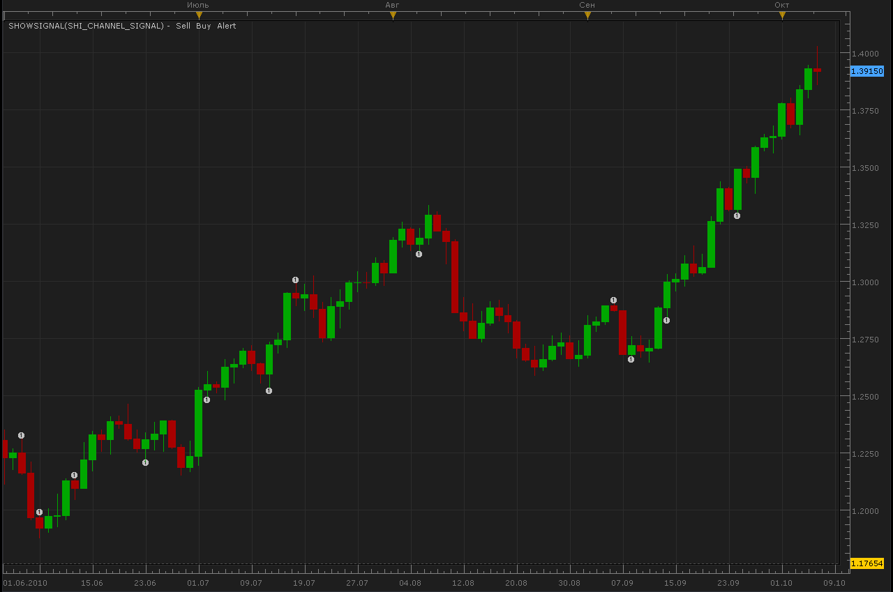

# SHI Channel signal

> Source: https://fxcodebase.com/code/viewtopic.php?f=29&t=2358  
> Forum: 29 · Topic 2358 · 2 post(s)

---

## SHI Channel signal

**Alexander.Gettinger** · Thu Oct 07, 2010 3:34 pm

If price touches the top channel signal advises SELL,
If price touches the bottom channel signal advises BUY.
Strategy can work with direct or reverse signals.

 

Code: [Select all](https://fxcodebase.com/code/)
`function Init()
    strategy:name("SHI Channel Signal");
    strategy:description("SHI Channel Signal");

    strategy.parameters:addGroup("SHI Channel Parameters");
    strategy.parameters:addInteger("BarsForFractal", "Bars for fractal", "", 3);

    strategy.parameters:addGroup("Price Parameters");
    strategy.parameters:addString("TF", "Time Frame", "", "m15");
    strategy.parameters:setFlag("TF", core.FLAG_PERIODS);

    strategy.parameters:addGroup("Signal Parameters");
    strategy.parameters:addString("TypeSignal", "Type of signal", "", "direct");
    strategy.parameters:addStringAlternative("TypeSignal", "direct", "", "direct");
    strategy.parameters:addStringAlternative("TypeSignal", "reverse", "", "reverse");
    strategy.parameters:addBoolean("ShowAlert", "Show Alert", "", true);
    strategy.parameters:addBoolean("PlaySound", "Play Sound", "", false);
    strategy.parameters:addFile("SoundFile", "Sound File", "", "");
    strategy.parameters:setFlag("SoundFile", core.FLAG_SOUND);
    strategy.parameters:addBoolean("Recurrent", "RecurrentSound", "", false);
   
    strategy.parameters:addGroup("Email Parameters");
    strategy.parameters:addBoolean("SendEmail", "Send email", "", false);
    strategy.parameters:addString("Email", "Email address", "", "");
    strategy.parameters:setFlag("Email", core.FLAG_EMAIL);
end

local ShowAlert;
local SoundFile;
local Email;
local RecurrentSound;

function Prepare()
 
    RecurrentSound= instance.parameters.Recurrent;
    local SendEmail = instance.parameters.SendEmail;
    if SendEmail then
        Email = instance.parameters.Email;
    else
        Email = nil;
    end
    assert(not(SendEmail) or (SendEmail and Email ~= ""), "Email address must be specified");

    assert(instance.parameters.TF ~= "t1", "The time frame must not be tick");
    assert(not(instance.parameters.PlaySound) or (instance.parameters.PlaySound and instance.parameters.SoundFile ~= ""), "Sound file must be chosen");
    assert(core.indicators:findIndicator("SHI_CHANNEL") ~= nil, "Please download and install SHI Channel Indicator!");

    local name;
    name = profile:id() .. "(" .. instance.bid:name() .. "." .. instance.parameters.TF ..  ")";
    instance:name(name);

    ShowAlert = instance.parameters.ShowAlert;
    if instance.parameters.PlaySound then
        SoundFile = instance.parameters.SoundFile;
    else
        SoundFile = nil;
    end

    ExtSubscribe(1, nil, "t1", true, "close");
end

local first = true;
local tsource = nil;
local indicator = nil;
local Flag=nil;

function ExtUpdate(id, source, period)
    if id == 1 and first then
        first = false;
        tsource = ExtSubscribe(2, nil, instance.parameters.TF, true, "bar");
        local iprofile = core.indicators:findIndicator("SHI_CHANNEL");
        local iparams = iprofile:parameters();
        iparams:setInteger("BarsForFractal", instance.parameters:getInteger("BarsForFractal"));   
        indicator = iprofile:createInstance(tsource, iparams);
    elseif id == 2 and period > 1 then
        indicator:update(core.UpdateLast);
        -- check whether the signal appears
        if indicator.Buff1:hasData(period - 1) and indicator.Buff1:hasData(period) and indicator.Buff2:hasData(period - 1) and indicator.Buff2:hasData(period) then
          local MinPr=math.min(indicator.Buff1[period],indicator.Buff2[period]);
          local MaxPr=math.max(indicator.Buff1[period],indicator.Buff2[period]);
          local MinPr1=math.min(indicator.Buff1[period-1],indicator.Buff2[period-1]);
          local MaxPr1=math.max(indicator.Buff1[period-1],indicator.Buff2[period-1]);
          if instance.parameters:getString("TypeSignal")=="direct" then
            if tsource.close[period-1]<MaxPr1 and instance.bid[NOW]>=MaxPr and Flag~="Short" then
                Flag="Short";
            -- switch to short
                if ShowAlert then
                    terminal:alertMessage(instance.bid:instrument(), instance.bid[NOW], "Enter Short", instance.bid:date(NOW));
                end

                if SoundFile ~= nil then
                    terminal:alertSound(SoundFile, RecurrentSound);
                end
            
            if Email ~= nil then
            terminal:alertEmail (Email, "Enter Short", "SHI Channel Indicator have give Enter Short signal")
            end
           end
            if tsource.close[period-1]>MinPr1 and instance.bid[NOW]<=MinPr and Flag~="Long" then
                Flag="Long";
            -- switch to long
                if ShowAlert then
                    terminal:alertMessage(instance.bid:instrument(), instance.bid[NOW], "Enter Long", instance.bid:date(NOW));
                end
                if SoundFile ~= nil then
                    terminal:alertSound(SoundFile, RecurrentSound);
                end
            
            if Email ~= nil then
            terminal:alertEmail (Email, "Enter Long", "SHI Channel Indicator have give Enter Long signal")
            end
            
          end
         else
            if tsource.close[period-1]<MaxPr1 and instance.bid[NOW]>=MaxPr and Flag~="Long" then
                Flag="Long";
            -- switch to long
                if ShowAlert then
                    terminal:alertMessage(instance.bid:instrument(), instance.bid[NOW], "Enter Long", instance.bid:date(NOW));
                end

                if SoundFile ~= nil then
                    terminal:alertSound(SoundFile, RecurrentSound);
                end
            
            if Email ~= nil then
            terminal:alertEmail (Email, "Enter Long", "SHI Channel Indicator have give Enter Long signal")
            end
           end
            if tsource.close[period-1]>MinPr1 and instance.bid[NOW]<=MinPr and Flag~="Short" then
                Flag="Short";
            -- switch to short
                if ShowAlert then
                    terminal:alertMessage(instance.bid:instrument(), instance.bid[NOW], "Enter Short", instance.bid:date(NOW));
                end
                if SoundFile ~= nil then
                    terminal:alertSound(SoundFile, RecurrentSound);
                end
            
            if Email ~= nil then
            terminal:alertEmail (Email, "Enter Short", "SHI Channel Indicator have give Enter Short signal")
            end
            
          end
   
    end
      end
    end
end

dofile(core.app_path() .. "\\strategies\\standard\\include\\helper.lua");`

---

## Re: SHI Channel signal

**Alexander.Gettinger** · Thu Oct 07, 2010 3:53 pm

Indicator SHI_Channel ([viewtopic.php?f=17&t=2305&p=4896](https://fxcodebase.com/code/viewtopic.php?f=17&t=2305&p=4896)) must be installed.
