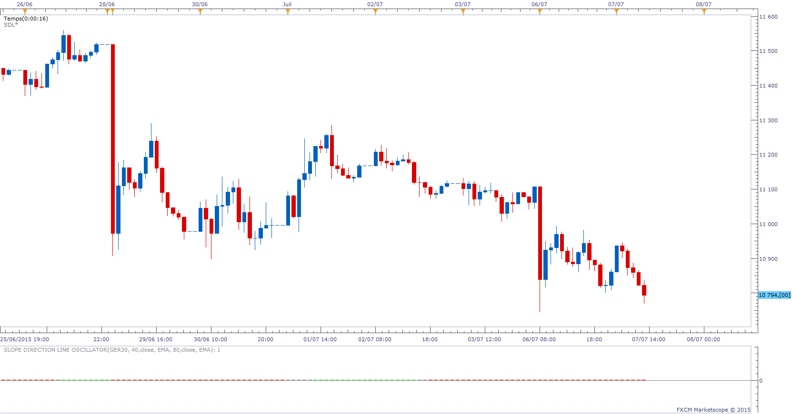

# Slope direction line oscillator signal

> Source: https://fxcodebase.com/code/viewtopic.php?f=29&t=1685  
> Forum: 29 · Topic 1685 · 10 post(s)

---

## Slope direction line oscillator signal

**Apprentice** · Fri Aug 06, 2010 5:32 am

 [SDLO Signal.lua](files/3350/SDLO%20Signal.lua)

To work you need to have Slope direction line oscillator
[http://fxcodebase.com/code/viewtopic.php?f=17&t=1670](https://fxcodebase.com/code/viewtopic.php?f=17&t=1670)

---

## Re: Slope direction line oscillator signal

**fxadam** · Wed May 22, 2013 2:06 am

Would it be possible to create a strategy based on Slope direction line oscillator with email alert?
Thanks.

---

## Re: Slope direction line oscillator signal

**Apprentice** · Fri May 24, 2013 3:10 am

Your request is added to the development list.

---

## Re: Slope direction line oscillator signal

**zohaa3492** · Sat Oct 25, 2014 4:03 am

Excellent, looking foward to trying this, thanks appretice much appreciated

---

## Re: Slope direction line oscillator signal

**Apprentice** · Mon Oct 27, 2014 7:19 am

Requested strategy can be found here.
[viewtopic.php?f=31&t=61382](https://fxcodebase.com/code/viewtopic.php?f=31&t=61382)

---

## Re: Slope direction line oscillator signal

**WardStradlater** · Tue Jul 07, 2015 7:42 am

Hi
Is that possible to update this indicator for stock market (GER30, US30, FRA40...)?
When I try to put on stock market, the bars are very small.

 

Thanks in advance.

---

## Re: Slope direction line oscillator signal

**Apprentice** · Mon Jul 13, 2015 5:06 am

Try it now.

---

## Re: Slope direction line oscillator signal

**WardStradlater** · Mon Jul 13, 2015 5:30 am

Oups! I made a mistake.
I was talking about the Slope direction line oscillator indicator (and not the signal one). So wrong topic
[http://fxcodebase.com/code/viewtopic.php?f=17&t=1670](https://fxcodebase.com/code/viewtopic.php?f=17&t=1670)

---

## Re: Slope direction line oscillator signal

**Apprentice** · Thu Jul 16, 2015 3:52 am

I was aware of that fact.
So I have update this indicator accordingly.

---

## Re: Slope direction line oscillator signal

**WardStradlater** · Thu Jul 16, 2015 4:51 am

Thanks a lot, works perfectly
