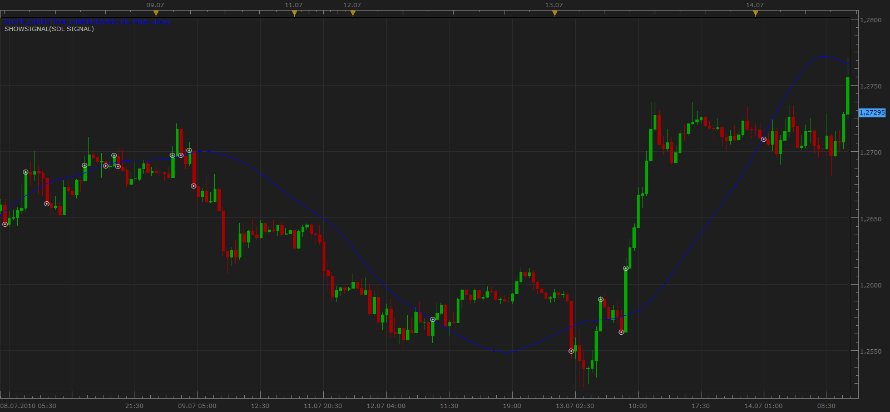

# Slope direction line Signal

> Source: https://fxcodebase.com/code/viewtopic.php?f=29&t=1515  
> Forum: 29 · Topic 1515 · 5 post(s)

---

## Slope direction line Signal

**Apprentice** · Wed Jul 14, 2010 1:32 pm

 [SDL Signal.lua](files/2965/SDL%20Signal.lua)

To use this signal you need to download the updated slope direction line indicator.

[http://fxcodebase.com/code/viewtopic.php?f=17&t=949&start=0](https://fxcodebase.com/code/viewtopic.php?f=17&t=949&start=0)

---

## Re: Slope direction line Signal

**sunshine** · Sun Nov 14, 2010 6:00 am

Hello Apprentice,

When adding this signal, I've get the error "The indicator with id SMA is not found."
It seems there is an error in these strings in the code:

Code: [Select all](https://fxcodebase.com/code/)
`strategy.parameters:addString("Method", "Method", "", "SMA");
    strategy.parameters:addStringAlternative("Method", "SMA", "", "SMA");`

I suppose, "SMA" should be replaced with "MVA". Could you please update the signal in the first post?

---

## Re: Slope direction line Signal

**Apprentice** · Sun Nov 14, 2010 7:13 am

This is the question of compatibility.
I changed the indicator, but I forgot to changed signal.

It should work now.

---

## Re: Slope direction line Signal

**jackfx09** · Wed Sep 14, 2011 8:22 am

Tuning notes for SDLine and Oscillator.

I would suggest the following to enhance the signal, and therefore producing a Strategy, if possible:

1. Parameter setting for signal that would paint the VERTICAL LINE corresponding with an up trend (green)/down trend (red) when indicators are in harmony, such as I have shown on this chart.

2. Allow the user to select the "sensitivity" of the above said signal. For example, Autotrade function would trade on the premise: 1)SDL Oscillator bar used ALL in harmony 2)SD Lines ALL in harmony or 3)All SD Lines and Oscillator Bar in Harmony.

Thanks!

sjc

---

## Re: Slope direction line Signal

**Coondawg71** · Tue Sep 20, 2011 12:17 pm

any thoughts on this?
