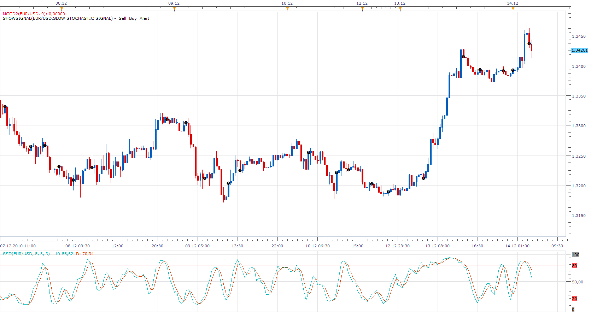

# Slow Stochastic Signal

> Source: https://fxcodebase.com/code/viewtopic.php?f=29&t=2951  
> Forum: 29 · Topic 2951 · 8 post(s)

---

## Slow Stochastic Signal

**Apprentice** · Tue Dec 14, 2010 4:29 am

There are three types of signals.

Buy
K% or D% Rise above Oversold.
Sell
K% or D% Falls below Overbought.

Two additional features.
Buy
Simple K% - D% Crossover
K% - D% Crossover in Oversold.
Sell
K% - D% Crossover in Overbought.
Simple K% - D% Crossover

The signals generated while the market is in Oversold / Overbought From my experience are more reliable.

 [Slow Stochastic Signal.lua](files/6754/Slow%20Stochastic%20Signal.lua)

---

## Re: Slow Stochastic Signal

**rick99602010** · Tue Dec 14, 2010 5:38 am

Thank you....I am in the process of learning. Is there anyway to remove the overbought or oversold? I want to compare both for my own knowledge.

---

## Re: Slow Stochastic Signal

**Apprentice** · Tue Dec 14, 2010 6:30 am

If I understood well.
You want choice, Show OS, Show OB, Show Both.
True?

---

## Re: Slow Stochastic Signal

**rick99602010** · Wed Dec 15, 2010 8:17 pm

Showing them are fine. I am looking for an alert that would signal no matter if overbought or oversold.
If K intersects D even if its in between overbought or oversold.

---

## Re: Slow Stochastic Signal

**Apprentice** · Thu Dec 16, 2010 1:38 am

Signal Type parameter option, %K / %D Cross, Allows you to you to do just that.

---

## Re: Slow Stochastic Signal

**rick99602010** · Thu Dec 16, 2010 9:52 pm

Thank you once again

---

## Re: Slow Stochastic Signal

**foreveryoung** · Mon Jul 24, 2017 7:13 am

Dear Apprentice

I am using subject signal with my strategy in %K/%D cross in overbought/oversold mode, however, it gives also notification when %K has been overbought/oversold and crossing %D, without %D being overbought/oversold.

Please advise

Thanks

Regards
Nik

---

## Re: Slow Stochastic Signal

**Apprentice** · Sun Aug 06, 2017 3:48 am

Try it now.
