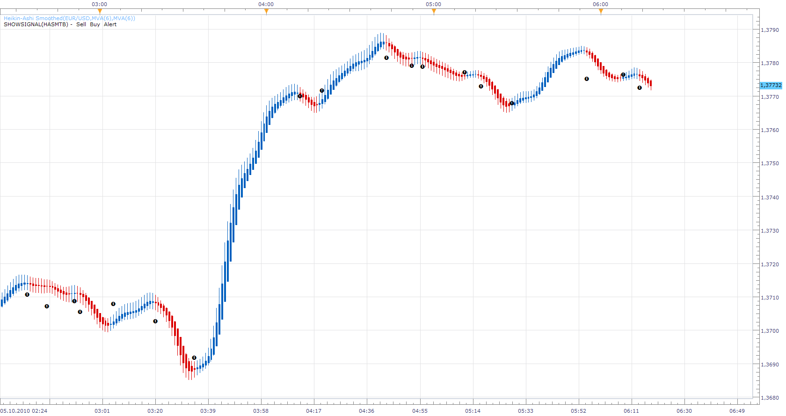

# Smothed Heikin-Ashi Top/Bottom

> Source: https://fxcodebase.com/code/viewtopic.php?f=29&t=2344  
> Forum: 29 · Topic 2344 · 15 post(s)

---

## Smothed Heikin-Ashi Top/Bottom

**Apprentice** · Tue Oct 05, 2010 5:17 am

Can be used to generate the top and bottom signal.

 [HASMTB.lua](files/5013/HASMTB.lua)

---

## Re: Smothed Heikin-Ashi Top/Bottom

**Apprentice** · Tue Oct 05, 2010 6:53 am

Update

---

## Re: Smothed Heikin-Ashi Top/Bottom

**DayTraderTed** · Wed Jan 18, 2012 4:07 pm

**ADMINISTRATOR PLEASE FIX INDICATOR.** I tried to upload the indicator and it gave me an error. The version of FXCM Micro Trading Station II is 01.11.111.711. I am assuming the indicator is not compatible with the new platform version. Thanks.

---

## Re: Smothed Heikin-Ashi Top/Bottom

**Apprentice** · Sun Jan 22, 2012 5:45 pm

This is not Indicator, try to load it as Signal or Strategy.

---

## Re: Smothed Heikin-Ashi Top/Bottom

**brunettesrule** · Thu Mar 15, 2012 7:48 pm

Hi, I new at trading so please bear with me.

I successfully loaded the Heikin-Ashi candlesticks under "new strategy". When I went to implement it, I got an error code: [string "HASMTB (1).lua"]:68: Please download and install HASM Indicator!

Where can I please find this?

Cheers, Jane

---

## Re: Smothed Heikin-Ashi Top/Bottom

**sunshine** · Fri Mar 16, 2012 12:25 am

Please download and install the indicator attached to this [post](https://fxcodebase.com/code/viewtopic.php?f=17&t=606#p10600).

You can find step-by-step instruction on how to download and install the indicator [here](https://fxcodebase.com/code/viewtopic.php?f=17&t=17).

---

## Re: Smothed Heikin-Ashi Top/Bottom

**pechou** · Sat Mar 17, 2012 5:51 pm

Hi Apprentice !
It's possible to create with this signal, a strategy with "Trading Parameters" also : Trade Amounts in Lots, Limit Order in Pips, Stop Order in Pips, and Trailing Stop Order with "Vrai" or "Faux"?
Thanks for your very good works,
Cheers,
Thierry

---

## Re: Smothed Heikin-Ashi Top/Bottom

**Apprentice** · Sun Mar 18, 2012 2:48 am

I'm not sure what this mean, "Vrai" and "Faux".

---

## Re: Smothed Heikin-Ashi Top/Bottom

**pechou** · Sun Mar 18, 2012 6:33 am

Hi Apprentice,
I misspoke in my request, my English is not very good.
So, I have an example with the "MA and VTDMI simultaneous crossover Strategy" that you created.
In the Trading parameters, there is "Allow strategy to trade:" and two possibility: "Vrai" or "Faux" like "Yes" or "No". Below, "Allow multiple" and "Vrai" or "Faux"...
That's what I meant.
I hope your understand me,
Best regards,
Thierry

---

## Re: Smothed Heikin-Ashi Top/Bottom

**briansummy** · Tue Mar 20, 2012 10:57 pm

> **Apprentice wrote:**
>
>
> HASMTB.png
>
>
>
> Can be used to generate the top and bottom signal.
>
>
> HASMTB.lua

Can you create a simple auto trading EA from this signal?

---

## Re: Smothed Heikin-Ashi Top/Bottom

**Apprentice** · Wed Mar 21, 2012 6:12 am

Your request is added to the development list.

---

## Re: Smothed Heikin-Ashi Top/Bottom

**Coondawg71** · Tue Apr 16, 2013 4:32 pm

Email notification does not contain important detail of currency pair...only "Top" or "Bottom" but no indication of which instrument. Please amend.

Thanks,

sjc

---

## Re: Smothed Heikin-Ashi Top/Bottom

**Apprentice** · Wed Apr 17, 2013 2:10 am

Instrument and Time Frame Info Added.

---

## Re: Smothed Heikin-Ashi Top/Bottom

**SavvyStrategist** · Mon Aug 28, 2017 10:37 am

An option to utilize custom time frames, say m10, would be most welcome.
Thanks in advance.

---

## Re: Smothed Heikin-Ashi Top/Bottom

**Apprentice** · Thu Oct 12, 2017 3:47 am

[HASMTB.lua](files/115397/HASMTB.lua)

Try this version.
