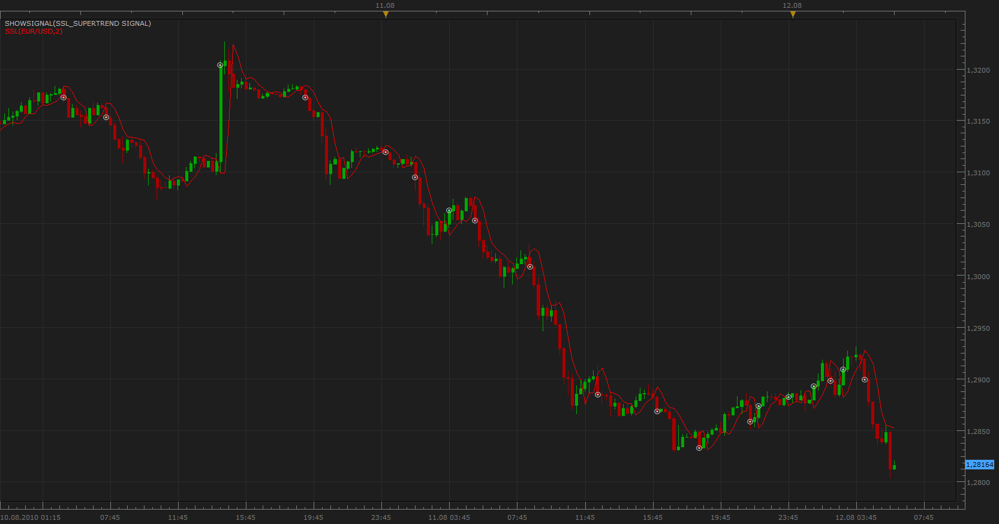
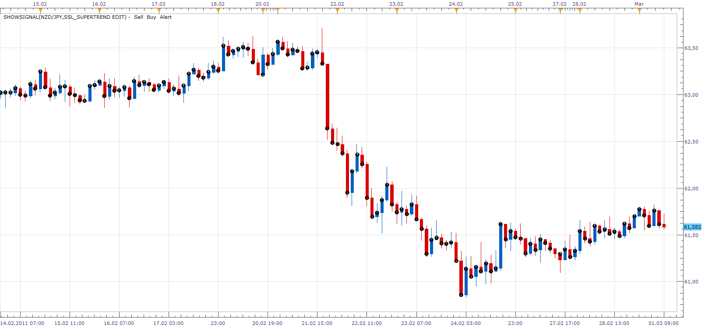

# SSL SuperTrend Signal

> Source: https://fxcodebase.com/code/viewtopic.php?f=29&t=1752  
> Forum: 29 · Topic 1752 · 11 post(s)

---

## SSL SuperTrend Signal

**Apprentice** · Thu Aug 12, 2010 5:13 am

Signals are generated when closing price cross over SSL line,
but only if it is confirmed by SuperTrend indicators.

If you use wider definition options, the signal is generated when both conditions are positive, regardless of the sequence of positive indications.

 I plan to write and the corresponding indicator.

 [SSL_SuperTrend Signal.lua](files/3525/SSL_SuperTrend%20Signal.lua)

If you do not have them you need the following indicators.

SSL INDICATOR:
 [viewtopic.php?f=17&t=139&p=200&hilit=ssl#p200](https://fxcodebase.com/code/viewtopic.php?f=17&t=139&p=200&hilit=ssl#p200)
--
SUPERTREND INDICATOR:
 [viewtopic.php?f=17&t=605](https://fxcodebase.com/code/viewtopic.php?f=17&t=605)

---

## Re: SSL SuperTrend Signal

**ak_nomiss** · Mon Feb 14, 2011 3:09 am

I get an error when I insert it with showsignal
An error occurred during the calculation of the indicator 'SHOWSIGNAL'. The error details: [string "showsignal.lua"]:121: [string "C:\Program Files\Candleworks\FXTS2\strategi..."]:121: attempt to index field 'DN' (a nil value).
can you tell me how to fix it ?

---

## Re: SSL SuperTrend Signal

**Apprentice** · Mon Feb 14, 2011 3:29 am

I tested this signal.

Unfortunately I can not reproduce this error.

Can you share the parameters you use.
And send both indicators that you use to my private mail.

---

## Re: SSL SuperTrend Signal

**ak_nomiss** · Mon Feb 28, 2011 10:44 pm

I try to edit this signal so it only show signal when supertrend change color, what I did is delete the core.crossesover(barsource.close, ssl.data, period on line 119, but after that it give me an error : [string "SSL_SuperTrend Signa Editl.lua"]:119: attempt to index field 'UP' (a nil value)
can you help me up please.

---

## Re: SSL SuperTrend Signal

**Apprentice** · Tue Mar 01, 2011 4:13 am

It is Difficult to say with this info.
Can you send me your code on my private mail.
Together with the SSL indicator, and SUPERTREND INDICATOR that you are using.

---

## Re: SSL SuperTrend Signal

**Apprentice** · Tue Mar 01, 2011 10:18 am

I have tested your version.
It seems that you did not load the required indicators.

SSL INDICATOR:
 [viewtopic.php?f=17&t=139&p=200&hilit=ssl#p200](https://fxcodebase.com/code/viewtopic.php?f=17&t=139&p=200&hilit=ssl#p200)
--
SUPERTREND INDICATOR:
 [viewtopic.php?f=17&t=605](https://fxcodebase.com/code/viewtopic.php?f=17&t=605)

---

## Re: SSL SuperTrend Signal

**superleo** · Tue May 01, 2012 4:09 pm

sir,

i got following error while using this signal

"[string "SSL_SuperTrend Signal.lua"]:121: attempt to index field 'DN' (a nil value)"

how it can be solved

---

## Re: SSL SuperTrend Signal

**Apprentice** · Wed May 02, 2012 3:39 am

Probably, you do not have one of the required indicators
that these strategies need to work properly.
Also, be sure to re-download the signal,
I have made ​​several improvements.

---

## Re: SSL SuperTrend Signal

**rtsayers** · Wed May 02, 2012 12:48 pm

Hi Apprentice

I am getting the same error code and I have downloaded all the necessary indicators??

[string "SSL_SuperTrend Signal.lua"]:121: attempt to index field 'DN' (a nil value

---

## Re: SSL SuperTrend Signal

**Apprentice** · Sun May 06, 2012 4:37 am

I fix, one, logic error.
I hope this will help.

---

## SSL SuperTrend Signal

**Olivio** · Sat Jun 09, 2012 2:41 pm

Please PM me your mail address and Ill send it to you,
Frank
