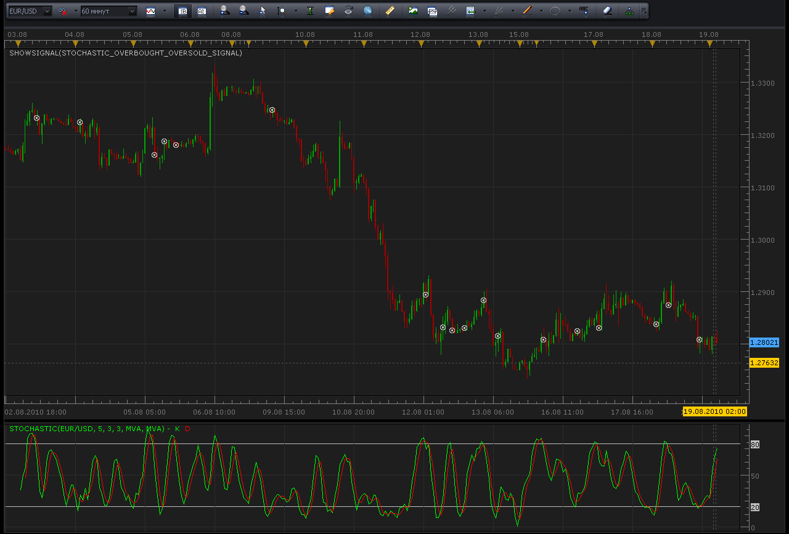
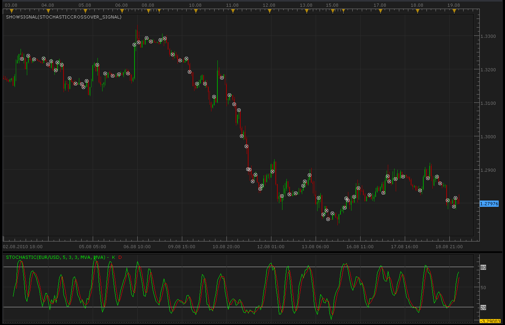
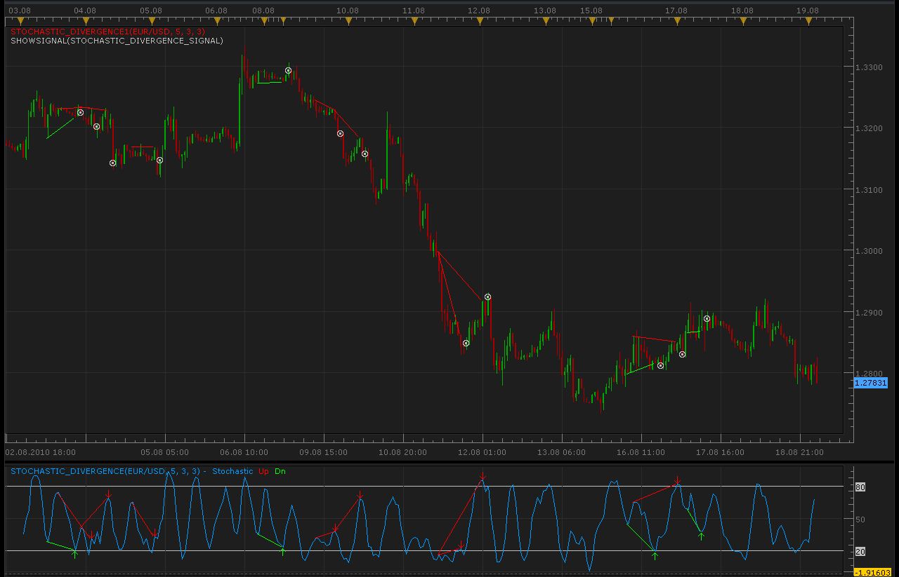
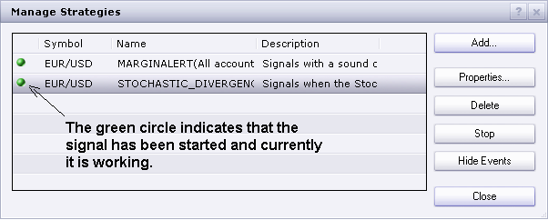
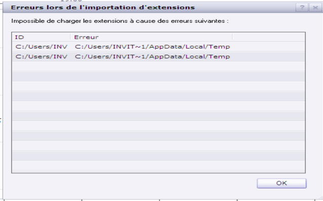
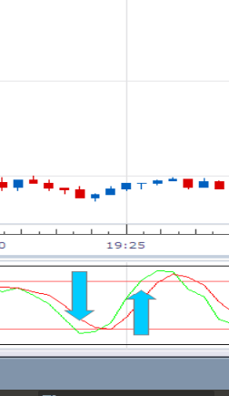

# Stochastic signals

> Source: https://fxcodebase.com/code/viewtopic.php?f=29&t=1864  
> Forum: 29 · Topic 1864 · 54 post(s)

---

## Stochastic signals

**Alexander.Gettinger** · Thu Aug 19, 2010 2:54 am

There are several ways to interpretation a Stochastic Oscillator. Three popular methods include:

1. Overbought / Oversold
Buy when the Oscillator %K falls below a specific level (e.g., 20) and then rises above that level. Sell when the Oscillator rises above a specific level (e.g., 80) and then falls below that level.

 



```lua
function Init()
    strategy:name("Stochastic Overbought/Oversold signal");
    strategy:description("");

    strategy.parameters:addGroup("Parameters");
   
    strategy.parameters:addString("Period", "Timeframe", "", "m5");
    strategy.parameters:setFlag("Period", core.FLAG_PERIODS);
   
    strategy.parameters:addInteger("K", "K", "Parameter of stochastic", 5);
    strategy.parameters:addInteger("SD", "SD", "Parameter of stochastic", 3);
    strategy.parameters:addInteger("D", "D", "Parameter of stochastic", 3);
   
    strategy.parameters:addInteger("DownLevel", "DownLevel", "", 20);
    strategy.parameters:addInteger("UpLevel", "UpLevel", "", 80);

    strategy.parameters:addString("TypeSignal", "Type of signal", "", "direct");
    strategy.parameters:addStringAlternative("TypeSignal", "direct", "", "direct");
    strategy.parameters:addStringAlternative("TypeSignal", "reverse", "", "reverse");

    strategy.parameters:addGroup("Signals");
    strategy.parameters:addBoolean("ShowAlert", "Show Alert", "", true);
    strategy.parameters:addBoolean("PlaySound", "Play Sound", "", false);
    strategy.parameters:addFile("SoundFile", "Sound File", "", "");
end

local SoundFile;
local gSourceBid = nil;
local gSourceAsk = nil;
local first;

local BidFinished = false;
local AskFinished = false;
local LastBidCandle = nil;

local Stochastic;
local EMA8;

function Prepare()
    ShowAlert = instance.parameters.ShowAlert;
    if instance.parameters.PlaySound then
        SoundFile = instance.parameters.SoundFile;
    else
        SoundFile = nil;
    end
   
    assert(not(PlaySound) or (PlaySound and SoundFile ~= ""), "Sound file must be specified");
    assert(instance.parameters.Period ~= "t1", "Signal cannot be applied on ticks");

    ExtSetupSignal("Altr Trend signal:", ShowAlert);

    gSourceBid = core.host:execute("getHistory", 1, instance.bid:instrument(), instance.parameters.Period, 0, 0, true);
    gSourceAsk = core.host:execute("getHistory", 2, instance.bid:instrument(), instance.parameters.Period, 0, 0, false);

    Stochastic = core.indicators:create("STOCHASTIC", gSourceBid, instance.parameters.K, instance.parameters.SD, instance.parameters.D);

    first = Stochastic.DATA:first();

    local name = profile:id() .. "(" .. instance.bid:instrument() .. "(" .. instance.parameters.Period  .. instance.parameters.K  .. instance.parameters.SD  .. instance.parameters.D  .. instance.parameters.TypeSignal  .. instance.parameters.DownLevel  .. instance.parameters.UpLevel  .. ")";
    instance:name(name);
end

local LastDirection=nil;

-- when tick source is updated
function Update()
    if not(BidFinished) or not(AskFinished) then
        return ;
    end

    local period;

    -- update moving average
    Stochastic:update(core.UpdateLast);

    -- calculate enter logic
    if LastBidCandle == nil or LastBidCandle ~= gSourceBid:serial(gSourceBid:size() - 1) then
        LastBidCandle = gSourceBid:serial(gSourceBid:size() - 1);

        period = gSourceBid:size() - 1;
        if period > first then
         if Stochastic.K[period-1]>instance.parameters.UpLevel and Stochastic.K[period]<instance.parameters.UpLevel and instance.parameters.TypeSignal=="direct" and LastDirection~=-1 then
          ExtSignal(gSourceBid, period, "Sell", SoundFile);
          LastDirection=-1;
         end
         if Stochastic.K[period-1]<instance.parameters.DownLevel and Stochastic.K[period]>instance.parameters.DownLevel and instance.parameters.TypeSignal=="direct" and LastDirection~=1 then
          ExtSignal(gSourceAsk, period, "Buy", SoundFile);
          LastDirection=1;
         end

         if Stochastic.K[period-1]<instance.parameters.DownLevel and Stochastic.K[period]>instance.parameters.DownLevel and instance.parameters.TypeSignal=="reverse" and LastDirection~=-1 then
          ExtSignal(gSourceBid, period, "Sell", SoundFile);
          LastDirection=-1;
         end
         if Stochastic.K[period-1]>instance.parameters.UpLevel and Stochastic.K[period]<instance.parameters.UpLevel and instance.parameters.TypeSignal=="reverse" and LastDirection~=1 then
          ExtSignal(gSourceAsk, period, "Buy", SoundFile);
          LastDirection=1;
         end
       
        end
    end
end

function AsyncOperationFinished(cookie)
    if cookie == 1 then
        BidFinished = true;
    elseif cookie == 2 then
        AskFinished = true;
    end
end

local gSignalBase = "";     -- the base part of the signal message
local gShowAlert = false;   -- the flag indicating whether the text alert must be shown

-- ---------------------------------------------------------
-- Sets the base message for the signal
-- @param base      The base message of the signals
-- ---------------------------------------------------------
function ExtSetupSignal(base, showAlert)
    gSignalBase = base;
    gShowAlert = showAlert;
    return ;
end

-- ---------------------------------------------------------
-- Signals the message
-- @param message   The rest of the message to be added to the signal
-- @param period    The number of the period
-- @param sound     The sound or nil to silent signal
-- ---------------------------------------------------------
function ExtSignal(source, period, message, soundFile)
    if source:isBar() then
        source = source.close;
    end
    if gShowAlert then
        terminal:alertMessage(source:instrument(), source[period], gSignalBase .. message, source:date(period));
    end
    if soundFile ~= nil then
        terminal:alertSound(soundFile, false);
    end
end
```

---

## Re: Stochastic signals

**Alexander.Gettinger** · Thu Aug 19, 2010 2:56 am

2. Crossover

Buy when the %K line rises above the %D line and sell when the %K line falls below the %D line.

 



```lua
function Init()
    strategy:name("Stochastic Crossover signal");
    strategy:description("");

    strategy.parameters:addGroup("Parameters");
   
    strategy.parameters:addString("Period", "Timeframe", "", "m5");
    strategy.parameters:setFlag("Period", core.FLAG_PERIODS);
   
    strategy.parameters:addInteger("K", "K", "Parameter of stochastic", 5);
    strategy.parameters:addInteger("SD", "SD", "Parameter of stochastic", 3);
    strategy.parameters:addInteger("D", "D", "Parameter of stochastic", 3);

    strategy.parameters:addString("TypeSignal", "Type of signal", "", "direct");
    strategy.parameters:addStringAlternative("TypeSignal", "direct", "", "direct");
    strategy.parameters:addStringAlternative("TypeSignal", "reverse", "", "reverse");

    strategy.parameters:addGroup("Signals");
    strategy.parameters:addBoolean("ShowAlert", "Show Alert", "", true);
    strategy.parameters:addBoolean("PlaySound", "Play Sound", "", false);
    strategy.parameters:addFile("SoundFile", "Sound File", "", "");
end

local SoundFile;
local gSourceBid = nil;
local gSourceAsk = nil;
local first;

local BidFinished = false;
local AskFinished = false;
local LastBidCandle = nil;

local Stochastic;
local EMA8;

function Prepare()
    ShowAlert = instance.parameters.ShowAlert;
    if instance.parameters.PlaySound then
        SoundFile = instance.parameters.SoundFile;
    else
        SoundFile = nil;
    end
   
    assert(not(PlaySound) or (PlaySound and SoundFile ~= ""), "Sound file must be specified");
    assert(instance.parameters.Period ~= "t1", "Signal cannot be applied on ticks");

    ExtSetupSignal("Altr Trend signal:", ShowAlert);

    gSourceBid = core.host:execute("getHistory", 1, instance.bid:instrument(), instance.parameters.Period, 0, 0, true);
    gSourceAsk = core.host:execute("getHistory", 2, instance.bid:instrument(), instance.parameters.Period, 0, 0, false);

    Stochastic = core.indicators:create("STOCHASTIC", gSourceBid, instance.parameters.K, instance.parameters.SD, instance.parameters.D);

    first = Stochastic.DATA:first();

    local name = profile:id() .. "(" .. instance.bid:instrument() .. "(" .. instance.parameters.Period  .. instance.parameters.K  .. instance.parameters.SD  .. instance.parameters.D  .. instance.parameters.TypeSignal  .. ")";
    instance:name(name);
end

local LastDirection=nil;

-- when tick source is updated
function Update()
    if not(BidFinished) or not(AskFinished) then
        return ;
    end

    local period;

    -- update moving average
    Stochastic:update(core.UpdateLast);

    -- calculate enter logic
    if LastBidCandle == nil or LastBidCandle ~= gSourceBid:serial(gSourceBid:size() - 1) then
        LastBidCandle = gSourceBid:serial(gSourceBid:size() - 1);

        period = gSourceBid:size() - 1;
        if period > first then
         if Stochastic.K[period-1]>Stochastic.D[period-1] and Stochastic.K[period]<Stochastic.D[period] and instance.parameters.TypeSignal=="direct" and LastDirection~=-1 then
          ExtSignal(gSourceBid, period, "Sell", SoundFile);
          LastDirection=-1;
         end
         if Stochastic.K[period-1]<Stochastic.D[period-1] and Stochastic.K[period]>Stochastic.D[period] and instance.parameters.TypeSignal=="direct" and LastDirection~=1 then
          ExtSignal(gSourceAsk, period, "Buy", SoundFile);
          LastDirection=1;
         end

         if Stochastic.K[period-1]<Stochastic.D[period-1] and Stochastic.K[period]>Stochastic.D[period] and instance.parameters.TypeSignal=="reverse" and LastDirection~=-1 then
          ExtSignal(gSourceBid, period, "Sell", SoundFile);
          LastDirection=-1;
         end
         if Stochastic.K[period-1]>Stochastic.D[period-1] and Stochastic.K[period]<Stochastic.D[period] and instance.parameters.TypeSignal=="reverse" and LastDirection~=1 then
          ExtSignal(gSourceAsk, period, "Buy", SoundFile);
          LastDirection=1;
         end
       
        end
    end
end

function AsyncOperationFinished(cookie)
    if cookie == 1 then
        BidFinished = true;
    elseif cookie == 2 then
        AskFinished = true;
    end
end

local gSignalBase = "";     -- the base part of the signal message
local gShowAlert = false;   -- the flag indicating whether the text alert must be shown

-- ---------------------------------------------------------
-- Sets the base message for the signal
-- @param base      The base message of the signals
-- ---------------------------------------------------------
function ExtSetupSignal(base, showAlert)
    gSignalBase = base;
    gShowAlert = showAlert;
    return ;
end

-- ---------------------------------------------------------
-- Signals the message
-- @param message   The rest of the message to be added to the signal
-- @param period    The number of the period
-- @param sound     The sound or nil to silent signal
-- ---------------------------------------------------------
function ExtSignal(source, period, message, soundFile)
    if source:isBar() then
        source = source.close;
    end
    if gShowAlert then
        terminal:alertMessage(source:instrument(), source[period], gSignalBase .. message, source:date(period));
    end
    if soundFile ~= nil then
        terminal:alertSound(soundFile, false);
    end
end
```

---

## Re: Stochastic signals

**Alexander.Gettinger** · Thu Aug 19, 2010 3:11 am

3. Divergences between the stochastic lines and the price

 



Indicators for find divergence:

```lua
-- Indicator profile initialization routine
-- Defines indicator profile properties and indicator parameters
function Init()
    indicator:name("Stochastic Divergence");
    indicator:description("");
    indicator:requiredSource(core.Bar);
    indicator:type(core.Oscillator);

    indicator.parameters:addInteger("K", "K", "Parameter of stochastic", 5);
    indicator.parameters:addInteger("SD", "SD", "Parameter of stochastic", 3);
    indicator.parameters:addInteger("D", "D", "Parameter of stochastic", 3);
    indicator.parameters:addBoolean("I", "Indicator mode", "Keep true value to display labels and lines. Set this parameter to false when the indicator is used in another indicator.", true);
    indicator.parameters:addColor("D_color", "Color of Divergence line", "", core.rgb(0, 155, 255));
    indicator.parameters:addColor("UP_color", "Color of Uptrend", "", core.rgb(255, 0, 0));
    indicator.parameters:addColor("DN_color", "Color of Downtend", "", core.rgb(0, 255, 0));
end

-- Indicator instance initialization routine
-- Processes indicator parameters and creates output streams
-- Parameters block
local I;
local DD;
local UP_color;
local DN_color;

local first;
local source = nil;

-- Streams block
local D = nil;
local UP = nil;
local DN = nil;
local Stochastic = nil;
local lineid = nil;

-- Routine
function Prepare()
    I = instance.parameters.I;
    DD = instance.parameters.DD;
    UP_color = instance.parameters.UP_color;
    DN_color = instance.parameters.DN_color;
    source = instance.source;
    Stochastic = core.indicators:create("STOCHASTIC", source, instance.parameters.K,instance.parameters.SD,instance.parameters.D);
    first = Stochastic.DATA:first();

    local name = profile:id() .. "(" .. source:name() .. ", " .. instance.parameters.K .. ", " .. instance.parameters.SD .. ", " .. instance.parameters.D .. ")";
    instance:name(name);
    D = instance:addStream("Stochastic", core.Line, name .. ".Stochastic", "Stochastic", instance.parameters.D_color, first, -1);
    D:addLevel(20);
    D:addLevel(80);
    if I then
        UP = instance:createTextOutput ("Up", "Up", "Wingdings", 10, core.H_Center, core.V_Top, instance.parameters.UP_color, -1);
        DN = instance:createTextOutput ("Dn", "Dn", "Wingdings", 10, core.H_Center, core.V_Bottom, instance.parameters.DN_color, -1);
    else
        UP = instance:addStream("UP", core.Bar, name .. ".UP", "UP", instance.parameters.D_color, first, -1);
        DN = instance:addStream("DN", core.Bar, name .. ".DN", "DN", instance.parameters.D_color, first, -1);
    end
end

local pperiod = nil;
local pperiod1 = nil;
local line_id = 0;

-- Indicator calculation routine
function Update(period, mode)
    -- if recaclulation started - remove all
    if pperiod ~= nil and pperiod > period then
        core.host:execute("removeAll");
    end
    pperiod = period;
    -- process only candles which are already closed closed.
    if pperiod1 ~= nil and pperiod1 == source:serial(period) then
        return ;
    end
    pperiod1 = source:serial(period)
    period = period - 1;

    Stochastic:update(mode);
    if period >= first then
        D[period] = Stochastic.K[period];
        if period >= first + 2 then
            processBullish(period - 2);
            processBearish(period - 2);
        end
    end
end

function processBullish(period)
    if isTrough(period) then
        local curr, prev;
        curr = period;
        prev = prevTrough(period);
        if prev ~= nil then
            if Stochastic.K[curr] > Stochastic.K[prev] and source.low[curr] < source.low[prev] then
                if I then
                    DN:set(curr, Stochastic.K[curr], "\225", "Classic bullish");
                    line_id = line_id + 1;
                    core.host:execute("drawLine", line_id, source:date(prev), Stochastic.K[prev], source:date(curr), Stochastic.K[curr], DN_color);
                else
                    DN[period] = curr - prev;
                end
            elseif Stochastic.K[curr] < Stochastic.K[prev] and source.low[curr] > source.low[prev] then
                if I then
                    DN:set(curr, Stochastic.K[curr], "\225", "Reversal bullish");
                    line_id = line_id + 1;
                    core.host:execute("drawLine", line_id, source:date(prev), Stochastic.K[prev], source:date(curr), Stochastic.K[curr], DN_color);
                else
                    DN[period] = -(curr - prev);
                end
            end
        end

    end
end

function isTrough(period)
    local i;
    if Stochastic.K[period] < Stochastic.K[period - 1] and Stochastic.K[period] < Stochastic.K[period + 1] then
        for i = period - 1, first, -1 do
            if Stochastic.K[i] > 80 then
                return true;
            elseif Stochastic.K[period] > Stochastic.K[i] then
                return false;
            end
        end
    end
    return false;
end

function prevTrough(period)
    local i;
    for i = period - 5, first, -1 do
        if Stochastic.K[i] <= Stochastic.K[i - 1] and Stochastic.K[i] < Stochastic.K[i - 2] and
           Stochastic.K[i] <= Stochastic.K[i + 1] and Stochastic.K[i] < Stochastic.K[i + 2] then
           return i;
        end
    end
    return nil;
end

function processBearish(period)
    if isPeak(period) then
        local curr, prev;
        curr = period;
        prev = prevPeak(period);
        if prev ~= nil then
            if Stochastic.K[curr] < Stochastic.K[prev] and source.high[curr] > source.high[prev] then
                if I then
                    UP:set(curr, Stochastic.K[curr], "\226", "Classic bearish");
                    line_id = line_id + 1;
                    core.host:execute("drawLine", line_id, source:date(prev), Stochastic.K[prev], source:date(curr), Stochastic.K[curr], UP_color);
                else
                    UP[period] = curr - prev;
                end
            elseif Stochastic.K[curr] > Stochastic.K[prev] and source.high[curr] < source.high[prev] then
                if I then
                    UP:set(curr, Stochastic.K[curr], "\226", "Reversal bearish");
                    line_id = line_id + 1;
                    core.host:execute("drawLine", line_id, source:date(prev), Stochastic.K[prev], source:date(curr), Stochastic.K[curr], UP_color);
                else
                    UP[period] = -(curr - prev);
                end
            end
        end

    end
end

function isPeak(period)
    local i;
    if Stochastic.K[period] > Stochastic.K[period - 1] and Stochastic.K[period] > Stochastic.K[period + 1] then
        for i = period - 1, first, -1 do
            if Stochastic.K[i] < 20 then
                return true;
            elseif Stochastic.K[period] < Stochastic.K[i] then
                return false;
            end
        end
    end
    return false;
end

function prevPeak(period)
    local i;
    for i = period - 5, first, -1 do
        if Stochastic.K[i] >= Stochastic.K[i - 1] and Stochastic.K[i] > Stochastic.K[i - 2] and
           Stochastic.K[i] >= Stochastic.K[i + 1] and Stochastic.K[i] > Stochastic.K[i + 2] then
           return i;
        end
    end
    return nil;
end
```

and

```lua
-- Indicator profile initialization routine
-- Defines indicator profile properties and indicator parameters
function Init()
    indicator:name("Stochastic Divergence");
    indicator:description("Shows Stochastic Divergence");
    indicator:requiredSource(core.Bar);
    indicator:type(core.Indicator);

    indicator.parameters:addInteger("K", "K", "Parameter of stochastic", 5);
    indicator.parameters:addInteger("SD", "SD", "Parameter of stochastic", 3);
    indicator.parameters:addInteger("D", "D", "Parameter of stochastic", 3);
    indicator.parameters:addColor("UP_color", "Color of Uptrend", "", core.rgb(255, 0, 0));
    indicator.parameters:addColor("DN_color", "Color of Downtend", "", core.rgb(0, 255, 0));
end

-- Indicator instance initialization routine
-- Processes indicator parameters and creates output streams
-- Parameters block
local first;
local source = nil;

-- Streams block
local lineid = nil;
local dummy;

-- Routine
function Prepare()
    UP_color = instance.parameters.UP_color;
    DN_color = instance.parameters.DN_color;
    source = instance.source;
    Stochastic = core.indicators:create("STOCHASTIC_DIVERGENCE", source, instance.parameters.K,instance.parameters.SD,instance.parameters.D, false);
    first = Stochastic.DATA:first();

    local name = profile:id() .. "(" .. source:name() .. ", " .. instance.parameters.K .. ", " .. instance.parameters.SD .. ", " .. instance.parameters.D .. ")";
    instance:name(name);
    dummy = instance:addStream("D", core.Line, name .. ".D", "D", UP_color, 0);
end

local pperiod = nil;
local pperiod1 = nil;
local line_id = 0;

-- Indicator calculation routine
function Update(period, mode)
    local l;
    -- if recaclulation started - remove all
    if pperiod ~= nil and pperiod > period then
        core.host:execute("removeAll");
    end
    pperiod = period;
    -- process only candles which are already closed closed.
    if pperiod1 ~= nil and pperiod1 == source:serial(period) then
        return ;
    end
    pperiod1 = source:serial(period)
    period = period - 1;

    Stochastic:update(mode);

    if Stochastic:getStream(1):hasData(period - 2) then
        l = math.abs(Stochastic:getStream(1)[period - 2]);
        local prev = period - 2 - l;
        line_id = line_id + 1;
        core.host:execute("drawLine", line_id, source:date(prev), source.high[prev], source:date(period - 2), source.high[period - 2], UP_color);
    end
    if Stochastic:getStream(2):hasData(period - 2) then
        l = math.abs(Stochastic:getStream(2)[period - 2]);
        local prev = period - 2 - l;
        line_id = line_id + 1;
        core.host:execute("drawLine", line_id, source:date(prev), source.low[prev], source:date(period - 2), source.low[period - 2], DN_color);
    end
end
```

For work Stochastic_Divergence1.lua must be installed Stochastic_Divergence.lua

---

## Re: Stochastic signals

**Alexander.Gettinger** · Thu Aug 19, 2010 3:24 am

Stochastic divergence signal:

```lua
function Init()
    strategy:name("Stochastic Divergence");
    strategy:description("Signals when the Stochastic Divergence detected");

    strategy.parameters:addInteger("K", "K", "Parameter of stochastic", 5);
    strategy.parameters:addInteger("SD", "SD", "Parameter of stochastic", 3);
    strategy.parameters:addInteger("D", "D", "Parameter of stochastic", 3);

    strategy.parameters:addString("Period", "Time frame", "", "m1");
    strategy.parameters:setFlag("Period", core.FLAG_PERIODS);

    strategy.parameters:addBoolean("ShowAlert", "Show Alert", "", true);
    strategy.parameters:addBoolean("PlaySound", "Play Sound", "", false);
    strategy.parameters:addFile("SoundFile", "Sound file", "", "");
end

local SoundFile;
local gSource = nil;        -- the source stream

function Prepare()

    ShowAlert = instance.parameters.ShowAlert;

    if instance.parameters.PlaySound then
        SoundFile = instance.parameters.SoundFile;
    else
        SoundFile = nil;
    end

    assert(not(PlaySound) or (PlaySound and SoundFile ~= ""), "Sound file must be specified");

    ExtSetupSignal(profile:id() .. ":", ShowAlert);

    assert(instance.parameters.Period ~= "t1", "Can't be applied on ticks!");

    gSource = ExtSubscribe(1, nil, instance.parameters.Period, true, "bar");

    local name = profile:id() .. "(" .. instance.bid:instrument()  .. "(" .. instance.parameters.Period  .. ")" .. "," .. instance.parameters.K .. "," .. instance.parameters.SD .. "," .. instance.parameters.D .. ")";
    instance:name(name);
end

local Stochastic = nil;

-- when tick source is updated
function ExtUpdate(id, source, period)
    if Stochastic == nil then
        Stochastic = core.indicators:create("STOCHASTIC_DIVERGENCE", gSource, instance.parameters.K,instance.parameters.SD,instance.parameters.D, false);
    end

    Stochastic:update(core.UpdateLast);

    if period <= instance.parameters.K + 10 then
        return ;
    end

    local v;

    if Stochastic:getStream(1):hasData(period - 2) then
        v = Stochastic:getStream(1)[period - 2];
        if v ~= 0 then
            ExtSignal(gSource, period, "Bearish", SoundFile);
        end
    end
    if Stochastic:getStream(2):hasData(period - 2) then
        v = Stochastic:getStream(2)[period - 2];
        if v ~= 0 then
            ExtSignal(gSource, period, "Bullish", SoundFile);
        end
    end
end

dofile(core.app_path() .. "\\strategies\\standard\\include\\helper.lua");
```

For work Stochastic_Divergence_Signal.lua must be installed indicator Stochastic_Divergence.lua

---

## Re: Stochastic signals

**thetruth** · Mon Sep 12, 2011 8:52 am

can you develop an strategy for this indicator? (stochastic divergence.lua)
thanks

---

## Re: Stochastic signals

**Apprentice** · Tue Sep 13, 2011 4:36 am

First, it is not indicators it is a signal.
Can you tell me for which signal you want strategy to be developed.

---

## Re: Stochastic signals

**thetruth** · Wed Oct 05, 2011 4:42 pm

> **Apprentice wrote:**
> First, it is not indicators it is a signal.
> Can you tell me for which signal you want strategy to be developed.

Sorry for mistake, is for signal stochastic_divergence_signal thanks!

---

## Re: Stochastic signals

**Alexander.Gettinger** · Fri Oct 07, 2011 10:28 am

OK.
I shall write the strategy for you.

---

## Re: Stochastic signals

**Alexander.Gettinger** · Sat Oct 08, 2011 11:30 am

Strategies:

 [Stochastic_Overbought_Oversold_Strategy.lua](files/15954/Stochastic_Overbought_Oversold_Strategy.lua)

 [StochasticCrossover_Strategy.lua](files/15954/StochasticCrossover_Strategy.lua)

 [Stochastic_Divergence_Strategy.lua](files/15954/Stochastic_Divergence_Strategy.lua)

---

## Re: Stochastic signals

**germano** · Sun Oct 09, 2011 1:04 pm

Sirs,

I work with the Stochastic indicator. On the graph of Marketscope2 I have mounted "Stochastic_Divergence.lua" and "Stochastic_Divergence1.lua" and all is OK.
Then I followed the steps indicated in "How to Download and Install a Custom Signal/Strategy" to mount “Stochastic_Divergence_Signal.lua.” in “Menage custom strategy” and in "Add Panel Strategy" I have select "Stochastic_Divergence_Signal.lua.", I have set the parameters and I have click OK, but I can't place it on the chart.
Why this? Can someone help me?

Thanks
Germano

---

## Re: Stochastic signals

**sunshine** · Mon Oct 10, 2011 1:04 am

Could you please provide more details about the issue

1) Did you get a error message? If so, please provide the text of the message. Please also check whether there are errors in the Events log (you can open it by choosing Show Events in the Strategies menu).

2) Please check whether the signal is in the list of available signals. For that, open the Add Strategy dialog (Strategies menu -> Add Strategy). You will see the list of signals. Scroll the list down and check if your signal is in the list. If must be in the Other group. To start the signal, you should add it by clicking the Add button in the Add Strategy dialog. Note that the signal won't be shown on the chart. You can see it in the list of started strategies (Strategies -> Manage Strategies):

 



I hope this will help.

---

## Re: Stochastic signals

**germano** · Mon Oct 10, 2011 3:05 am

Thanks for the reply.

Then:

1) I do not receive any error message. In "log Events" is everything OK. Indicates no error.

2) Yes, the signal is in the list of available signals (1 in Recent list + 1 in Others list) and in the "Menage strategy" panel I see "stochastic divergence signal" with the little green circle. However, on the chart does not appear the words "Showsignal (stochastic divergence signal)" and not appear the white circles with the dot inside.

This is the first time that I have a problem in Marketscope.

Germano

Note: Please excuse any errors, but English is not my mother tongue.

---

## Re: Stochastic signals

**Apprentice** · Mon Oct 10, 2011 3:15 am

If you use "Menage custom strategy" window then the strategy will not generate on chart display.
For this you can use ShowSignal Indiktor or test strategy functionality.

---

## Re: Stochastic signals

**germano** · Mon Oct 10, 2011 4:05 am

Sorry, I did not understand.
How do I use "ShowSignal Indicator"?

Thank you
Germano

---

## Re: Stochastic signals

**Apprentice** · Mon Oct 10, 2011 5:42 am

Add ShowSignal Indicator on chart, and then select Strategy or Signal of your choice, within the ShowSignal Indicator.

---

## Re: Stochastic signals

**sunshine** · Tue Oct 11, 2011 5:16 am

> **germano wrote:**
> Sorry, I did not understand.
> How do I use "ShowSignal Indicator"?
>
> Thank you
> Germano

Please read this section which describes how to view alerts of a signal on the chart: [Show Signal on Chart](http://www.fxcorporate.com/help/MS/NOTFIFO/web-content.html?key=http://www.fxcorporate.com/help/MS/NOTFIFO/Show_Signal_onChart.html)

---

## Re: Stochastic signals

**germano** · Tue Oct 11, 2011 8:14 am

Now everything is very clear

Thank you
Germano

---

## Re: Stochastic signals

**mosesnobleraj** · Tue Oct 11, 2011 1:35 pm

sir,
can you add following option in this golden strategy.
stochastic divergence to buy/sell in oversold/overbought region

---

## Re: Stochastic signals

**Apprentice** · Tue Oct 11, 2011 4:44 pm

Your request is added to the developmental cue.

---

## Re: Stochastic signals

**thetruth** · Wed Oct 12, 2011 7:01 am

> **Alexander.Gettinger wrote:**
> OK.
> I shall write the strategy for you.

Thanks, and great job!!

---

## Re: Stochastic signals

**TraderKen** · Sat Oct 22, 2011 4:04 pm

Hi,
Can you write signal and strategy of a combined Stochastic like this: Buy/Sell when crossover appears only in Oversold/Overbought Area.
Thanks alot,
Ken

---

## Re: Stochastic signals

**Apprentice** · Sat Oct 22, 2011 4:37 pm

Such a strategy already exists.
You can find it here.
[viewtopic.php?f=31&t=2533&hilit=Stochastic](https://fxcodebase.com/code/viewtopic.php?f=31&t=2533&hilit=Stochastic)

---

## Re: Stochastic signals

**DAVIDR** · Fri Oct 28, 2011 5:45 am

Hi,

I would like a Stochastic signal to alert me when the signal line touches or crosses the 20 and 80 level, (not when it croses back over the line again).

Can you help?

All the best.

Raaammy

---

## Re: Stochastic signals

**Apprentice** · Sat Nov 19, 2011 3:55 am

Your request is added to the development queue.

---

## Re: Stochastic signals

**TraderKen** · Sat Dec 17, 2011 2:48 am

Hi FXcodebase team,

Thanks a lot for your good work.

Can you write signal and strategy of a combined Stochastic strategy like this:

Buy when crossover appears in Oversold Area and the candlestick touches the lower band of the Bollinger Band
Sell when the crossover appears in Overbought Area and the candlestick touches the upper band of the Bollinger Band.
(It means that the candlesticks must touch the BB just before the crossover for this strategy to be valid).

Thanks alot,
Ken

---

## Re: Stochastic signals

**Apprentice** · Mon Dec 19, 2011 4:56 am

Your request is added to the developmental cue.

---

## Re: Stochastic signals

**Alexander.Gettinger** · Mon Dec 19, 2011 10:05 pm

> **TraderKen wrote:**
> Hi FXcodebase team,
>
> Buy when crossover appears in Oversold Area and the candlestick touches the lower band of the Bollinger Band
> Sell when the crossover appears in Overbought Area and the candlestick touches the upper band of the Bollinger Band.
> (It means that the candlesticks must touch the BB just before the crossover for this strategy to be valid).

Please, see this strategy: [viewtopic.php?f=31&t=10157](https://fxcodebase.com/code/viewtopic.php?f=31&t=10157)

---

## Re: Stochastic signals-crossover

**mozelly** · Wed Sep 12, 2012 11:02 am

I'm trying to get the signal crossovers to show on the chart as shown but to no avail.
I understand it is a signal, but you do mention it can be shown on the chart, however if you could send a simplified method it would be appreciated,
Regards
Peter

---

## Re: Stochastic signals

**Apprentice** · Wed Sep 12, 2012 11:42 am

Unfortunately, this functionality is excluded from current version.
The development team has promised to return in the next update.
Currently we can only add signal functionality within indicators?

---

## Re: Stochastic signals

**mozelly** · Wed Sep 12, 2012 1:17 pm

> **Apprentice wrote:**
> Unfortunately, this functionality is excluded from current version.
> The development team has promised to return in the next update.
> Currently we can only add signal functionality within indicators?

What is the "showsignal " then as shown in the chart?
Peter

---

## Re: Stochastic signals

**Apprentice** · Wed Sep 12, 2012 1:43 pm

Showsignal is indicator helper tool, which has existed in previous versions of Trade station.

---

## Re: Stochastic signals

**mozelly** · Thu Sep 13, 2012 1:16 am

Is it possible then just to show a dot on the candlestick chart when the stochastic K & D lines cross?
regards
Peter

---

## Re: Stochastic signals

**mozelly** · Thu Sep 13, 2012 4:36 am

Well it seems that "showsignal" is proving a problem.
I have contacted fxcm re marketscope to enable how to find it and they are confused.
Could you just clarify if the stochastic crossover K & D can be shown on a candlestick chart and if this is via "showsignal". If so,exactly how do you find it? I can inform you that I cannot find the signal menu either.
Regards
Peter

---

## Re: Stochastic signals

**Apprentice** · Thu Sep 13, 2012 4:51 am

for the time being showsignal not exist as such, anywhere.
hopefully it will be available in the next version of TS.

---

## Re: Stochastic signals

**haveforexfun** · Fri Jan 31, 2014 10:14 am

Hello Alexander,

I tried to test the Stochastic Divergence Indicator, but for me it seems that not all divergences are selected. Instead, Divergences are marked wich are from my point of view are not so good.

For me a normal divergence is:

Higher prices (or higher highs) but lower stochastic signals for short.
Lower prices (or lower lows) but higher stochastic signals for long.

I have attached a picture to compare the divergences found by the indicator and some divergences wich were not selected (dotted dark blue lines).
Whats the problem?
Is it possible to code this and if yes, could you also change the strategy?

Have a nice day and thank you for all the work you are doing here for us

haveforexfun

---

## Re: Stochastic signals

**cipoforex** · Wed Mar 18, 2015 7:20 pm

Hi,

I would like a Stochastic signal to alert me when the signal line touches or crosses the 20 and 80 level, (not when it croses back over the line again).

Can you help?

All the best.

Simone

---

## Re: Stochastic signals

**SenseClash** · Thu Apr 02, 2015 6:23 am

Would it be possible to modify these (or at least the StochasticCrossover_Signal.lua) so that I could can get an email when the event occurs?

---

## Re: Stochastic signals

**SenseClash** · Thu Apr 02, 2015 6:32 am

Also, would it be possible to modify it so that I can choose to get 1) only buy signals 2) only sell signals or 3) both?

---

## Re: Stochastic signals

**johnnyrocket** · Fri Nov 06, 2015 1:25 pm

I am not seeing the dots on my chart. I dont understand what i could be doing wrong here. It installed the bottom part.

---

## Re: Stochastic signals

**Apprentice** · Fri Nov 13, 2015 6:30 am

Stochastic_Overbought_Oversold_Signal.lua is NOT indicator.
You can only add it as signal /strategy.

---

## Re: Stochastic signals

**juancrevuelta** · Tue Nov 17, 2015 10:03 pm

> **Alexander.Gettinger wrote:**
> Strategies:
>
>
>
> The attachment **Stochastic_Overbought_Oversold_Strategy.lua** is no longer available
>
>
>
>
>
> The attachment **Stochastic_Overbought_Oversold_Strategy.lua** is no longer available
>
>
>
>
>
> The attachment **Stochastic_Overbought_Oversold_Strategy.lua** is no longer available

Hello,

I am making a little change to this strategy in order to add a confirmation in a TF lower the stochastic has to be on the same direction that the actual stochastic but the I am getting this error: "Index is out of range" I have been looking for this error but I do not find any clue about it.

Could any body help me with this?

Many thanks in advanced,

JCR

---

## Re: Stochastic signals

**Apprentice** · Tue Nov 24, 2015 7:36 am

You can not use same period index, for multiple time frame data sources.
Try to use core.findDate or methods used for MTF strategies.
[viewtopic.php?f=28&t=2712](https://fxcodebase.com/code/viewtopic.php?f=28&t=2712)

---

## Re: Stochastic signals

**juancrevuelta** · Tue Nov 24, 2015 9:03 pm

Many thanks apprentice, I will look into this info.

Best Regards,

JCR

---

## Re: Stochastic signals

**Avignon** · Thu May 21, 2020 3:00 pm

Bug with [Stochastic_Overbought_Oversold_Strategy.lua](http://www.fxcodebase.com/code/viewtopic.php?f=29&t=1864#p15954)

 



I haven't tested the others.

---

## Re: Stochastic signals

**Apprentice** · Mon May 25, 2020 6:23 am

Your request is added to the development list.
Development reference 1351.

---

## Re: Stochastic signals

**Apprentice** · Tue May 26, 2020 9:17 am

Fixed.

---

## Re: Stochastic signals

**Avignon** · Tue May 26, 2020 5:22 pm

I keep getting the same error message.

I tried the other 2 indicators, I also have the same error message for each one.

---

## Re: Stochastic signals

**Apprentice** · Wed May 27, 2020 5:22 am

[Stochastic_Overbought_Oversold_Signal.lua](files/134359/Stochastic_Overbought_Oversold_Signal.lua)

Try this version.

---

## Re: Stochastic signals

**Avignon** · Thu May 28, 2020 6:07 am

This one works. Thank you.

Is it possible to have the signal in the input of the oversold/overbought area instead of the output as at present?

---

## Re: Stochastic signals

**Apprentice** · Fri May 29, 2020 4:30 am

I'm not sure I understand,
can you elaborate with an example?

---

## Re: Stochastic signals

**Avignon** · Mon Jun 01, 2020 3:55 pm

I want signal here (and end of turn).

 



Thanks.

---

## Re: Stochastic signals

**Apprentice** · Tue Jun 02, 2020 6:04 am

Shifted by one candle back in time?
Not sure we can do it for signals/strategies.
We can have this on indicators.

---

## Re: Stochastic signals

**Avignon** · Tue Jun 02, 2020 2:36 pm

Right now the signal is there:

 


I want him there:

 


---

## Re: Stochastic signals

**Apprentice** · Fri Jul 03, 2020 4:33 am

For K/D line cross, this is simply not possible.
We can do it for indicators, still, the arrow will be placed "post festum".
