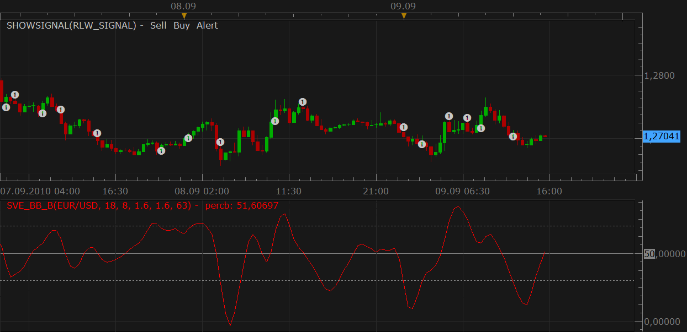

# SVE_BB% indicator's signal

> Source: https://fxcodebase.com/code/viewtopic.php?f=29&t=2114  
> Forum: 29 · Topic 2114 · 1 post(s)

---

## SVE_BB% indicator's signal

**Nikolay.Gekht** · Thu Sep 09, 2010 2:48 pm

The signal alerts when ['Smoothing The Bollinger %b' by Sylvain Vervoort](https://fxcodebase.com/code/viewtopic.php?f=17&t=1342) indicator crosses any of two chosen levels (oversold/overbought).

 

Download signal:

 [sve_bb_signal.lua](files/4359/sve_bb_signal.lua)

Please also download and install SVE_BB_B indicator and TEMA1 indicators:
[viewtopic.php?f=17&t=1342](https://fxcodebase.com/code/viewtopic.php?f=17&t=1342) (SVE_BB_1)
[viewtopic.php?f=17&t=1052&p=2357#p2357](https://fxcodebase.com/code/viewtopic.php?f=17&t=1052&p=2357#p2357) (TEMA1)
