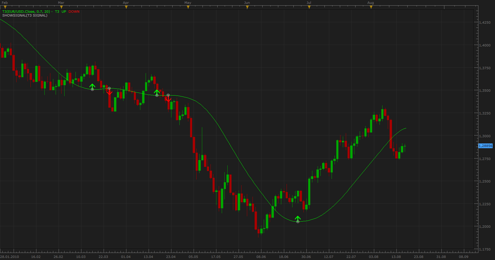

# T3 MA signal

> Source: https://fxcodebase.com/code/viewtopic.php?f=29&t=1853  
> Forum: 29 · Topic 1853 · 1 post(s)

---

## T3 MA signal

**Apprentice** · Wed Aug 18, 2010 5:49 am

 [T3 Signal.lua](files/3703/T3%20Signal.lua)

To work you need to have Generalized DEMA (GD)
[viewtopic.php?f=17&t=1302](https://fxcodebase.com/code/viewtopic.php?f=17&t=1302)

The signal indicates the two types of events.
Option Turning - A change in the trend of T3 MA.
Option Cross - Cross of closing price and T3 moving average.

Each of these options can be turned off.
