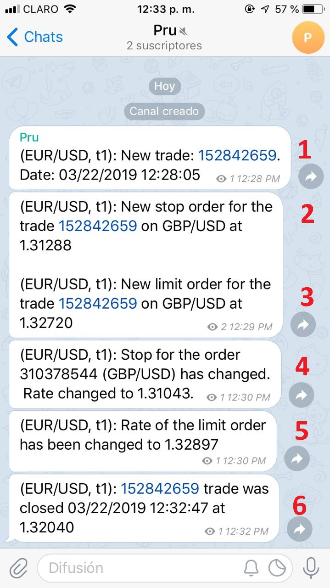
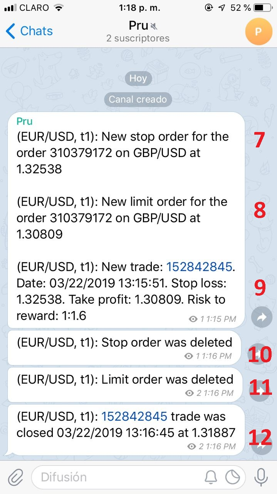
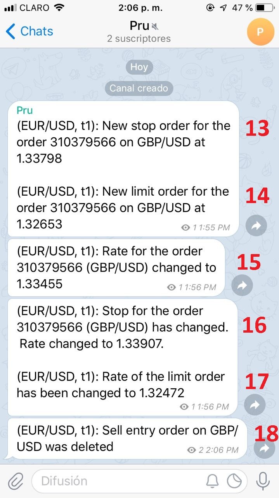
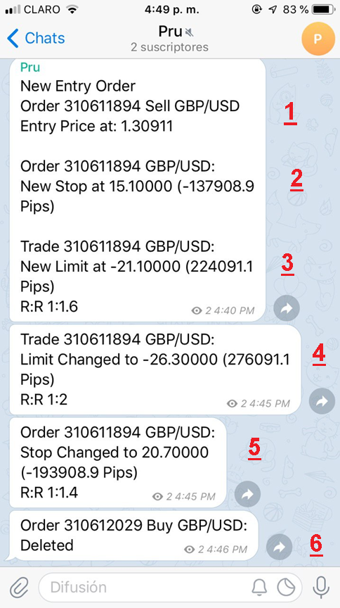
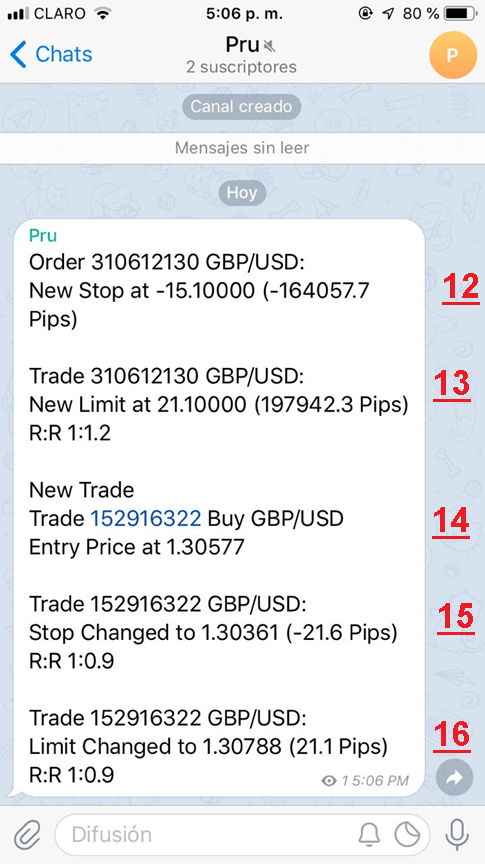
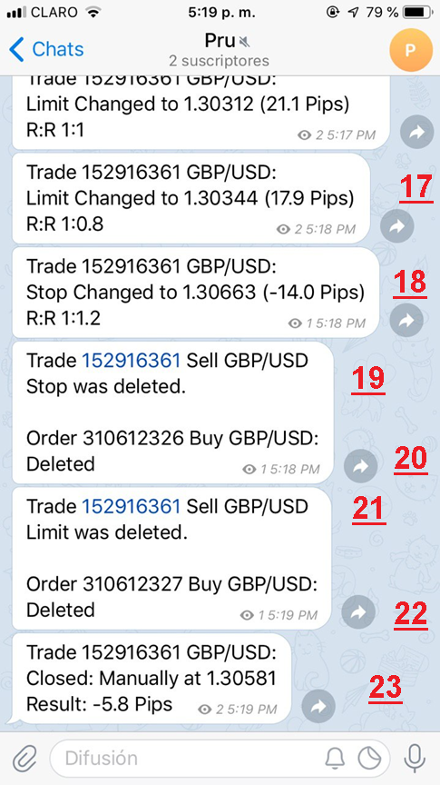
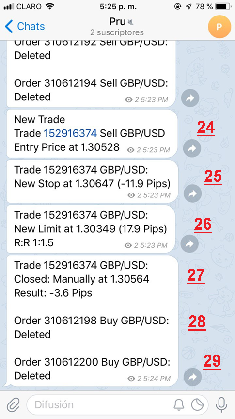
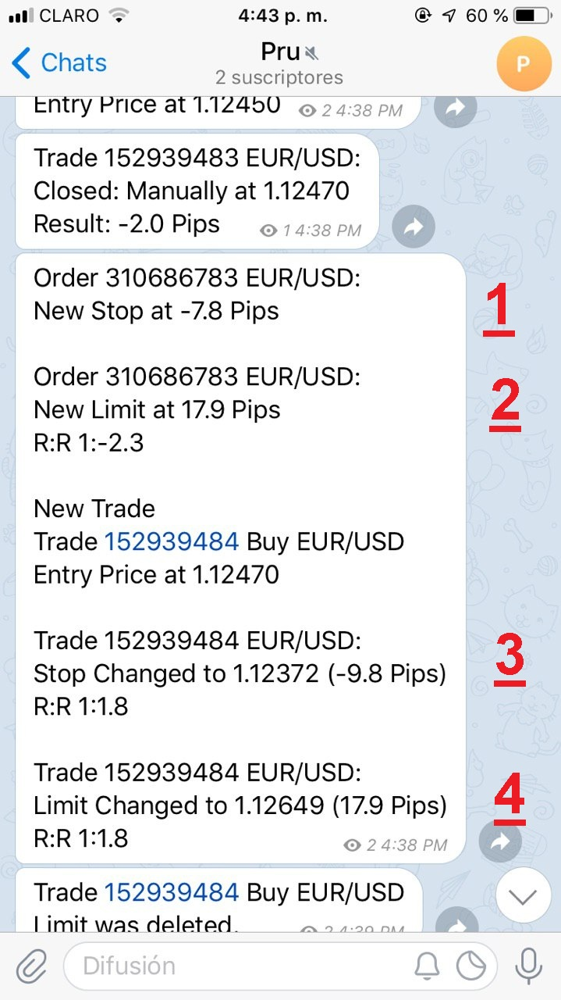
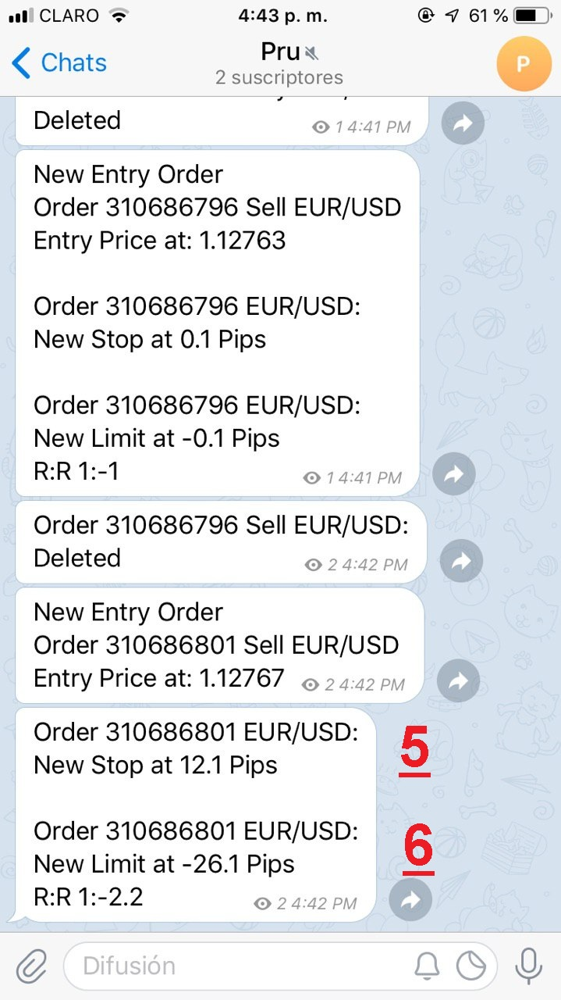

# Trade Alert

> Source: https://fxcodebase.com/code/viewtopic.php?f=29&t=67762  
> Forum: 29 · Topic 67762 · 19 post(s)

---

## Trade Alert

**Apprentice** · Thu Mar 21, 2019 3:51 pm

Based on request.
[viewtopic.php?f=27&t=67455](https://fxcodebase.com/code/viewtopic.php?f=27&t=67455)

 [Trade Alert.lua](files/124842/Trade%20Alert.lua)

Telegram How To...
[viewtopic.php?f=17&t=67443](https://fxcodebase.com/code/viewtopic.php?f=17&t=67443)

---

## Re: Trade Alert

**Reymondpolanco** · Fri Mar 22, 2019 3:04 pm

There is some errors:

1- The trade there was in GBP/USD not in EUR/USD and the alert don't put the entry price of the trade and don't say if the trade is sell or buy
Can you use the follow format for the number 1:

New Trade
Trade 152842659 Buy GBP/USD
Entry Price at 1.32104

2- This works perfect but again the trade is GBP/USD not EUR/USD
3- This works perfect but again the trade is GBP/USD not EUR/USD
For number 2 and 3 can you put in this form:

Trade 152842659 GBP/USD:
New Stop at 1.31288 (-74.2 Pips)
R:R 1:09

Trade 152842659 GBP/USD:
New Limit at 1.32720 (70.8 Pips)
R:R 1:09

4- When I change the stop it say: Stop for the order 310378544 (GBP/USD) has changed. This is not the ticket for this order and is not at order is a trade and it say again EUR/USD.
5- Dont say the ticket of the trade or the pair.
For number 4 and 5 can you put in this format:

Trade 152842659 GBP/USD:
Stop Changed to: 1.31043 (-104.1 Pips)
R:R 1:076

Trade 152842659 GBP/USD:
Limit Changed to 1.32897 (79.3 Pips)
R:R 1:09

6- The ticket is correct but can you use the follow format:

Trade 152842659 GBP/USD:
Closed: Stop Hit or Limit Hit or Manually at 1.32040
Result: -6.4 Pips

 

7- The trade is no EUR/USD is GBP/USD, the ticket is not correct, the entry price is not correct and dont say if the trade is sell or buy.
8- The ticket is not correct.
9- The ticket is not correct.
Fore the 7,8 and 9 use the follow format:

New Trade
Trade 152842845 Sell GBP/USD
Entry Price at: 1.31874
Stop at: 1.32538 (-64.7 Pips)
Limit at: 1.30809 (106.5 Pips)
R:R 1:1.6

10- Dont say the ticket and is not EUR/USD
11- Dont say the ticket and is not EUR/USD
For the 10 and 11 use the follow format:

Trade 152842845 Sell GBP/USD
Stop was deleted.

Trade 152842845 Sell GBP/USD
Limit was deleted.

12- Use the following format

Trade 152842845 Sell GBP/USD
Closed: Stop Hit or Limit Hit or Manually at 1.31887
Result: -1.3 Pips

 

When I put an entry order the alert did't send to the telegram but when I delete the order they send to the telegram.

13- Use the following format.
14- Use the following format.

New Entry Order
Order 310379566 Sell GBP/USD
Entry Price at: 1.33455
Stop at: 1.33798 (-32.4 Pips)
Limit at: 1.32653 (80.2 Pips)
R:R 1:2.4

15: Use the following format

Order 310379566 Sell GBP/USD
Entry Price Changed to: 1.33455

16- Use the following format.
17- Use the following format.

Order 310379566 Sell GBP/USD
Stop Changed to: 1.33907 (-44 Pips)
R:R 1:2.2

Order 310379566 Sell GBP/USD
Limit Changed to: 1.32470 (98.3 Pips)
R:R 1:2.2

18- Use the following format

Order 310379566 Sell GBP/USD
Deleted

---

## Re: Trade Alert

**Reymondpolanco** · Wed Mar 27, 2019 1:46 pm

Any news about the corrections ?

---

## Re: Trade Alert

**Apprentice** · Mon Apr 01, 2019 10:02 am

Your request is added to the development list under Id Number 4577

---

## Re: Trade Alert

**Reymondpolanco** · Thu Apr 11, 2019 2:08 pm

> **Apprentice wrote:**
> Your request is added to the development list under Id Number 4577

Any news about this one ?

---

## Re: Trade Alert

**Apprentice** · Thu Apr 11, 2019 2:35 pm

Try it now.

---

## Re: Trade Alert

**Reymondpolanco** · Thu Apr 11, 2019 6:46 pm

> **Apprentice wrote:**
> Try it now.

 

1-	Correct information but not follow the format
2-	Wrong information and not follow the format
3-	Wrong information and not follow the format

Please use the follow format for entry orders:
New Entry Order
Order 310379566 Sell GBP/USD
Entry Price at: 1.33455
Stop at: 1.33798 (-32.4 Pips)
Limit at: 1.32653 (80.2 Pips)
R:R 1:2.4

4-	Correct format but wrong information and it say Trade and this is not a trade is an Order
5-	Correct format but wrong information.
6-	I get this message when I delete the stop or the limit and this is not correct

Follow this format:

Order 152842845 Sell GBP/USD
Stop was deleted.

or

Order 152842845 Sell GBP/USD
Limit was deleted.

 

7-	Correct format and information
8-	Correct format and information
9-	I get this message when I delete the stop and this is not correct
10-	I get this message when I delete the limit and this is not correct
11-	I get this message when I delete the entry order and this is correct

 

I get this when I made a buy trade, there is a lot of wrong information and don’t follow the format.
12-	This is not a order is a trade, wrong price and wrong pips
13-	Wrong information
14-	Correct information
15-	correct information but im not changing the stop and it say stop changed
16-	correct information but im not changing the limit and it say limit changed

The errors are the same for sell and buy trades. Please use the follow format this is the correct information, order of the information and format:

New Trade
Trade 152842845 Sell GBP/USD
Entry Price at: 1.31874
Stop at: 1.32538 (-64.7 Pips)
Limit at: 1.30809 (106.5 Pips)
R:R 1:1.6

 

17-	correct information when I change the limit
18-	correct information when I change the stop
19-	correct information
20-	incorrect information and unnecessary
21-	correct information
22-	incorrect information and unnecessary
23-	correct information

 

24-	correct information and format
25-	correct information and format
26-	correct information and format
27-	correct information and format
28-	unnecessary information
29-	unnecessary information

Please follow this formats for the corrections:

For new trades:

New Trade
Trade 152842845 Sell GBP/USD
Entry Price at: 1.31874
Stop at: 1.32538 (-64.7 Pips)
Limit at: 1.30809 (106.5 Pips)
R:R 1:1.6

For new orders:

New Entry Order
Order 310379566 Sell GBP/USD
Entry Price at: 1.33455
Stop at: 1.33798 (-32.4 Pips)
Limit at: 1.32653 (80.2 Pips)
R:R 1:2.4

For Change stop or limit on entry order:

Order 310379566 Sell GBP/USD
Stop Changed to: 1.33907 (-44 Pips)
R:R 1:2.2

Order 310379566 Sell GBP/USD
Limit Changed to: 1.32470 (98.3 Pips)
R:R 1:2.2

For delete stop or limit on entry orders:

Order 152842659 GBP/USD:
Stop Deleted

Order 152842659 GBP/USD:
Limit Deleted

For change stop or limit on new trades:

Trade 152842659 GBP/USD:
Stop Changed to: 1.31043 (-104.1 Pips)
R:R 1:076

Trade 152842659 GBP/USD:
Limit Changed to 1.32897 (79.3 Pips)
R:R 1:09

For add new stop or limit on trades:

Trade 152842659 GBP/USD:
New Stop at 1.31288 (-74.2 Pips)
R:R 1:09

Trade 152842659 GBP/USD:
New Limit at 1.32720 (70.8 Pips)
R:R 1:09

For delete stop or limit on new trade:

Trade 152842659 GBP/USD:
Stop Deleted

Trade 152842659 GBP/USD:
Limit Deleted

---

## Re: Trade Alert

**Reymondpolanco** · Tue Apr 16, 2019 9:56 am

Any news about this ?

---

## Re: Trade Alert

**Apprentice** · Thu Apr 18, 2019 5:26 am

Your request is added to the development list under Id Number 4601

---

## Re: Trade Alert

**Apprentice** · Fri Apr 19, 2019 4:52 am

1) The format is exactly the same as requested. Table could be filled
in stages. When the order is detected it doesn't have stop/limit at
that moment. At first we have an order without stop/limit and then the
stop and limit are set. There will be 3 alerts. Deletion of orders
could be the same: there will be three alers - remove of stop, remove
of limit and remove of order.
2) It's a correct information, but badly formatted. Fixed. Note:
stop/limit could have no absolute value.
3) Wrong formatting, fixed.
4) Fixed.
5) Correct info. Fixed formatting.
6) Fixed
7-11) wrong screenshot
12) It's an order.
13) Fixed formatting
15-16,20,22,28-29) Fixed

---

## Re: Trade Alert

**Reymondpolanco** · Fri Apr 19, 2019 5:55 pm

> **Apprentice wrote:**
> 1) The format is exactly the same as requested. Table could be filled
> in stages. When the order is detected it doesn't have stop/limit at
> that moment. At first we have an order without stop/limit and then the
> stop and limit are set. There will be 3 alerts. Deletion of orders
> could be the same: there will be three alers - remove of stop, remove
> of limit and remove of order.
> 2) It's a correct information, but badly formatted. Fixed. Note:
> stop/limit could have no absolute value.
> 3) Wrong formatting, fixed.
> 4) Fixed.
> 5) Correct info. Fixed formatting.
> 6) Fixed
> 7-11) wrong screenshot
> 12) It's an order.
> 13) Fixed formatting
> 15-16,20,22,28-29) Fixed

 

1- Unecesaary information, please delete it
2- Unecessary information, please delete it
The format could be:

New Trade
Trade 152842845 Sell GBP/USD
Entry Price at: 1.31874
Stop at: 1.32538 (-64.7 Pips)
Limit at: 1.30809 (106.5 Pips)
R:R 1:1.6

3- Is a new trade why it say Stop Changed if is not an stop changed is only Stop
4- Is a new trade why it say Limit Changed if is not an limit changed is only Limit

 

5- Why the limit is in negative, this is imposible
6- Why the stop is in positive, this is imposible

---

## Re: Trade Alert

**Reymondpolanco** · Fri Apr 26, 2019 10:35 am

> **Reymondpolanco wrote:**
>
>
> > **Apprentice wrote:**
> > 1) The format is exactly the same as requested. Table could be filled
> > in stages. When the order is detected it doesn't have stop/limit at
> > that moment. At first we have an order without stop/limit and then the
> > stop and limit are set. There will be 3 alerts. Deletion of orders
> > could be the same: there will be three alers - remove of stop, remove
> > of limit and remove of order.
> > 2) It's a correct information, but badly formatted. Fixed. Note:
> > stop/limit could have no absolute value.
> > 3) Wrong formatting, fixed.
> > 4) Fixed.
> > 5) Correct info. Fixed formatting.
> > 6) Fixed
> > 7-11) wrong screenshot
> > 12) It's an order.
> > 13) Fixed formatting
> > 15-16,20,22,28-29) Fixed
>
>
>
>
>
> photo5030556161874700305.jpg
>
>
>
> 1- Unecesaary information, please delete it
> 2- Unecessary information, please delete it
> The format could be:
>
> New Trade
> Trade 152842845 Sell GBP/USD
> Entry Price at: 1.31874
> Stop at: 1.32538 (-64.7 Pips)
> Limit at: 1.30809 (106.5 Pips)
> R:R 1:1.6
>
> 3- Is a new trade why it say Stop Changed if is not an stop changed is only Stop
> 4- Is a new trade why it say Limit Changed if is not an limit changed is only Limit
>
>
>
> photo5030556161874700306.jpg
>
>
>
> 5- Why the limit is in negative, this is imposible
> 6- Why the stop is in positive, this is imposible

Any news about this ?

---

## Re: Trade Alert

**Reymondpolanco** · Sat May 04, 2019 11:07 am

Hello, is there any news with the corrections?

---

## Re: Trade Alert

**Apprentice** · Wed May 22, 2019 2:27 am

Didn't manage to repeat 1-2. Added a possible fix.
Fixed 5-6
3-4 will stay as it is. It's the way how the order works in FXTS2. There
is nothing we can do about it.

---

## Re: Trade Alert

**Apprentice** · Wed Aug 12, 2020 7:41 am

File updated.

---

## Re: Trade Alert

**flbrgz** · Mon Feb 21, 2022 4:21 pm

Hello, I was wondering if there is a version of this that is stripped back to just opened and closed trades. I would also like the latest account balance and equity to be included. Something really brief as I am getting the email alerts on my Garmin watch, something like:

 FXCM
Closed Trade
@ 1.5700
Pips 10.1
Gross P 20.0
Balance - 10000
Equity -9500

I am having a look at the code now and I code probably get rid of the orders parts but I have no idea how to get the balance and equity. Any help would he fantastic

Regards Paul

---

## Re: Trade Alert

**flbrgz** · Mon Feb 21, 2022 5:22 pm

Hello,

I was wondering if you have a stripped back version of this.
I only want notifications for opened and closed trades.
I do not need to see if stops or limits have changed as I do this through trading station

I am getting the alerts via email on my garmin watch so space is a premium.

I would like to see the actual profit taken in the closed trade and the balance and equity of the account, something like below.

FXCM EUR/AUD
Closed 1.5700
Profit $20.00
Balance $10000
Equity $9600

and for opened

FXCM EUR/AUD
Opened 1.5700
Balance $10000
Equity $9600

All other information is available to me in trading station and just clogs up my garmin screen. I can log in on my phone to check any other events or data.

PS. I have had a rough time with trading through covid, much like most traders I guess. But I still use the trade repeater that you developed for me years ago. Works like a charm.

Thanks for any reply in advance. Regards Paul.

---

## Re: Trade Alert

**Apprentice** · Tue Feb 22, 2022 3:51 am

Your request is added to the development list.
Development reference 109.

---

## Re: Trade Alert

**flbrgz** · Sun Aug 07, 2022 10:26 pm

Hi there,

Any updates on the more basic version for a watch face. Development 109. I am not sure how to search for it here.

Regards
Paul.
