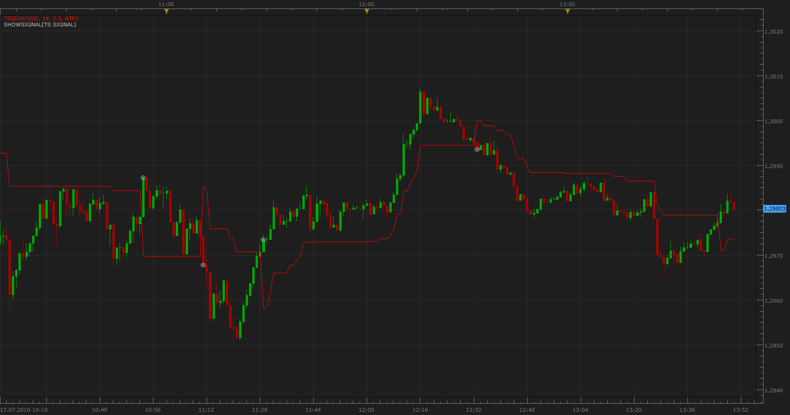

# Trailing Stop Signal

> Source: https://fxcodebase.com/code/viewtopic.php?f=29&t=1598  
> Forum: 29 · Topic 1598 · 3 post(s)

---

## Trailing Stop Signal

**Apprentice** · Tue Jul 27, 2010 12:53 pm

 [TS Signal.lua](files/3151/TS%20Signal.lua)

To work, you must have a TS indicator which is available here.
[http://fxcodebase.com/code/viewtopic.php?f=17&t=1434](https://fxcodebase.com/code/viewtopic.php?f=17&t=1434)

---

## Re: Trailing Stop Signal

**mma2010** · Mon Aug 15, 2011 2:05 pm

Hi,

Thanks for the signal but I can't install it in Marketscope 2.0.
I installed the TS, PTS and ATRTS to see if it will work with any of these but I keep getting error whenever I try to add the Trailing Stop Signal to my strategies.

I'll be glad if someone helps

Thanks

---

## Re: Trailing Stop Signal

**sunshine** · Tue Aug 16, 2011 3:53 am

Please let me know which error message do you get.
