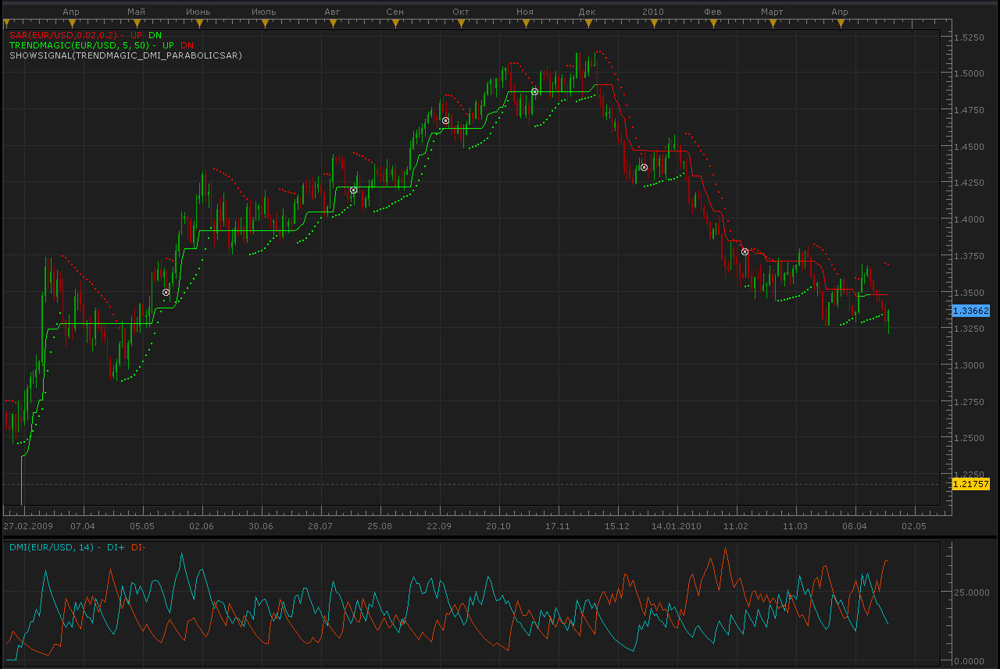

# trendmagic, DMI, parabolic SAR signal

> Source: https://fxcodebase.com/code/viewtopic.php?f=29&t=758  
> Forum: 29 · Topic 758 · 6 post(s)

---

## trendmagic, DMI, parabolic SAR signal

**Alexander.Gettinger** · Fri Apr 23, 2010 11:39 am

Buy:
First bullish parabolic sar signal is given since bearish parabolic signals were given.
DMI (14) is bullish (DMI+ line is above DMI- line).
Trendmagic indicator is bullish.

Sell:
First bearish parabolic sar signal is given since bullish parabolic signals were given.
DMI (14) is bearish (DMI- line is above DMI+ line).
Trendmagic indicator is bearish.

 



```lua
function Init()
    strategy:name("Trend magic/DMI/Parabolic SAR signal");
    strategy:description("The parabolic sar signal is used; the trendmagic and DMI are used as filters.");

    strategy.parameters:addGroup("Parameters");

    strategy.parameters:addInteger("DMI", "DMI Parameter", "", 14);
    strategy.parameters:addInteger("TM_CCI", "Parameter CCI for Trend magic", "", 50);
    strategy.parameters:addInteger("TM_ATR", "Parameter ATR for Trend magic", "", 5);
    strategy.parameters:addDouble("SAR_Step", "Parameter Step for Parabolic SAR", "", 0.02);
    strategy.parameters:addDouble("SAR_Max", "Parameter Maximum for Parabolic SAR", "", 0.2);

    strategy.parameters:addString("Period", "Timeframe", "", "m5");
    strategy.parameters:setFlag("Period", core.FLAG_PERIODS);

    strategy.parameters:addGroup("Signals");
    strategy.parameters:addBoolean("ShowAlert", "Show Alert", "", true);
    strategy.parameters:addBoolean("PlaySound", "Play Sound", "", false);
    strategy.parameters:addFile("SoundFile", "Sound File", "", "");
end

local SoundFile;
local gSourceBid = nil;
local gSourceAsk = nil;
local first;

local BidFinished = false;
local AskFinished = false;
local LastBidCandle = nil;

local DMI;
local TM;
local SAR;

function Prepare()
    local FastN, SlowN;

    ShowAlert = instance.parameters.ShowAlert;
    if instance.parameters.PlaySound then
        SoundFile = instance.parameters.SoundFile;
    else
        SoundFile = nil;
    end
   
    assert(not(PlaySound) or (PlaySound and SoundFile ~= ""), "Sound file must be specified");
    assert(instance.parameters.Period ~= "t1", "Signal cannot be applied on ticks");

    ExtSetupSignal("Trend magic/DMI/Parabolic SAR signal:", ShowAlert);

    gSourceBid = core.host:execute("getHistory", 1, instance.bid:instrument(), instance.parameters.Period, 0, 0, true);
    gSourceAsk = core.host:execute("getHistory", 2, instance.bid:instrument(), instance.parameters.Period, 0, 0, false);

    DMI = core.indicators:create("DMI", gSourceBid, instance.parameters.DMI);
    TM = core.indicators:create("TRENDMAGIC", gSourceBid, instance.parameters.TM_CCI,instance.parameters.TM_ATR);
    SAR = core.indicators:create("SAR", gSourceBid, instance.parameters.SAR_Step,instance.parameters.SAR_Max);

    first = math.max(DMI.DATA:first(), TM.DATA:first(), SAR.DATA:first()) + 2;

    local name = profile:id() .. "(" .. instance.bid:instrument() .. "(" .. instance.parameters.Period  .. ")" .. instance.parameters.DMI .. "," .. instance.parameters.TM_CCI .. "," .. instance.parameters.TM_ATR .. "," .. instance.parameters.SAR_Step .. "," .. instance.parameters.SAR_Max .. ")";
    instance:name(name);
end

local LastDirection=nil;

-- when tick source is updated
function Update()
    if not(BidFinished) or not(AskFinished) then
        return ;
    end

    local period;

    -- update moving average
    DMI:update(core.UpdateLast);
    SAR:update(core.UpdateLast);
    TM:update(core.UpdateLast);

    -- calculate enter logic
    if LastBidCandle == nil or LastBidCandle ~= gSourceBid:serial(gSourceBid:size() - 1) then
        LastBidCandle = gSourceBid:serial(gSourceBid:size() - 1);

        period = gSourceBid:size() - 1;
        if period > first then
         if SAR.DN[period-1]<gSourceBid.low[period-1] and SAR.DN[period-1]>gSourceBid.low[period-1]*0.5 and SAR.UP[period]>gSourceBid.high[period] and
            DMI.DIP[period]>DMI.DIM[period] and TM.UP[period]~=nil then
                ExtSignal(gSourceAsk, period, "Buy", SoundFile);
                LastDirection=1;
         elseif SAR.UP[period-1]>gSourceBid.high[period-1] and SAR.DN[period]<gSourceBid.low[period] and SAR.DN[period]>gSourceBid.low[period]*0.5 and
            DMI.DIM[period]>DMI.DIP[period] and TM.DN[period]~=nil then
                ExtSignal(gSourceBid, period, "Sell", SoundFile);
                LastDirection=-1;
         end   

        end
    end
end

function AsyncOperationFinished(cookie)
    if cookie == 1 then
        BidFinished = true;
    elseif cookie == 2 then
        AskFinished = true;
    end
end

local gSignalBase = "";     -- the base part of the signal message
local gShowAlert = false;   -- the flag indicating whether the text alert must be shown

-- ---------------------------------------------------------
-- Sets the base message for the signal
-- @param base      The base message of the signals
-- ---------------------------------------------------------
function ExtSetupSignal(base, showAlert)
    gSignalBase = base;
    gShowAlert = showAlert;
    return ;
end

-- ---------------------------------------------------------
-- Signals the message
-- @param message   The rest of the message to be added to the signal
-- @param period    The number of the period
-- @param sound     The sound or nil to silent signal
-- ---------------------------------------------------------
function ExtSignal(source, period, message, soundFile)
    if source:isBar() then
        source = source.close;
    end
    if gShowAlert then
        terminal:alertMessage(source:instrument(), source[period], gSignalBase .. message, source:date(period));
    end
    if soundFile ~= nil then
        terminal:alertSound(soundFile, false);
    end
end
```

The signal requires the custom indicator TrendMagic: [viewtopic.php?f=17&t=563](https://fxcodebase.com/code/viewtopic.php?f=17&t=563)

---

## Re: trendmagic, DMI, parabolic SAR signal

**chadalexander** · Tue Apr 27, 2010 10:00 am

Hi, thanks.
I'm having a few problems with it the signal. Could you do me a favour and remove the directional movement script (it isn't a great filter).
The indicator is giving buy signals when it should give sell and sell signals when it should give buy (parabolic dots: the ones above are sell signals and the ones below buy- i probably should have said that before- sorry ). Would you be able to change buy signals to sell, and sell signals to buy?
thanks

---

## Re: trendmagic, DMI, parabolic SAR signal

**shona155** · Mon Dec 29, 2014 6:22 am

First bearish parabolic sar signal is given since bullish parabolic signals were given.

---

## Re: trendmagic, DMI, parabolic SAR signal

**Apprentice** · Fri Jan 02, 2015 3:01 am

Can you clarify your comment.
Is any action is needed?

---

## Re: trendmagic, DMI, parabolic SAR signal

**jupiter ange** · Mon Nov 07, 2016 4:33 pm

I programmer
can you make me a strategy but remove trend magic
I just want sar and dmi like this please
buy
price> sar
di+>di-
Exit buy when price <=sar

Sell
price <sar
di->di+
Exit sell when price >=sar

Many thanks

---

## Re: trendmagic, DMI, parabolic SAR signal

**Apprentice** · Sun Nov 13, 2016 6:47 am

Try this version.
[viewtopic.php?f=31&t=64094](https://fxcodebase.com/code/viewtopic.php?f=31&t=64094)
