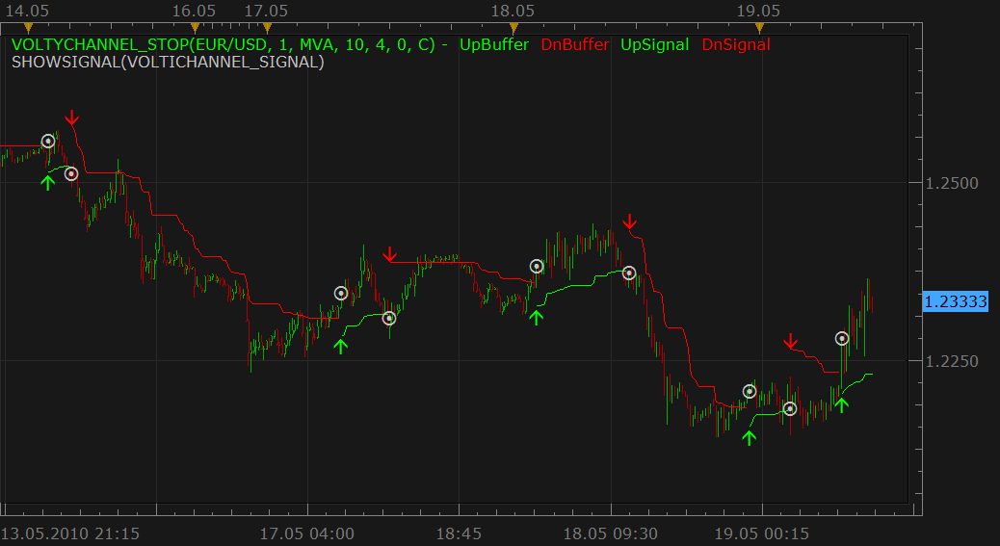

# Volty Channel Stop Signal

> Source: https://fxcodebase.com/code/viewtopic.php?f=29&t=1061  
> Forum: 29 · Topic 1061 · 13 post(s)

---

## Volty Channel Stop Signal

**Nikolay.Gekht** · Wed May 19, 2010 10:14 am

The signal shows alert when the [Volti Channel Stop](https://fxcodebase.com/code/viewtopic.php?f=17&t=893) indicator changes it's direction.
Please note that the indicator must also be installed.

 



Download:

Indicator:

 [VoltyChannel_Stop.lua](files/2014/VoltyChannel_Stop.lua)

Signal:

 [VoltyChannel_Stop_Signal.lua](files/2014/VoltyChannel_Stop_Signal.lua)

```lua
function Init()
    strategy:name("Volty Channel Stop");
    strategy:description("");

    strategy.parameters:addInteger("MA_N", "Moving Average Period", "", 1);
    strategy.parameters:addString("MA_M", "Moving Average Method", "The methods marked by an asterisk (*) require the appropriate strategys to be loaded.", "MVA");
    strategy.parameters:addStringAlternative("MA_M", "MVA", "", "MVA");
    strategy.parameters:addStringAlternative("MA_M", "EMA", "", "EMA");
    strategy.parameters:addStringAlternative("MA_M", "LWMA", "", "LWMA");
    strategy.parameters:addStringAlternative("MA_M", "SMMA*", "", "SMMA");
    strategy.parameters:addStringAlternative("MA_M", "Vidya (1995)*", "", "VIDYA");
    strategy.parameters:addStringAlternative("MA_M", "Vidya (1992)*", "", "VIDYA92");
    strategy.parameters:addStringAlternative("MA_M", "Wilders*", "", "WMA");
    strategy.parameters:addInteger("ATR_N", "ATR period", "", 10);
    strategy.parameters:addDouble("VF", "Volatility's Factor or Multiplier", "", 4);
    strategy.parameters:addInteger("OF", "Offset factor", "", 0);
    strategy.parameters:addString("P", "Price", "The price to the strategy apply to", "C");
    strategy.parameters:addStringAlternative("P", "Open", "", "O");
    strategy.parameters:addStringAlternative("P", "High", "", "H");
    strategy.parameters:addStringAlternative("P", "Low", "", "L");
    strategy.parameters:addStringAlternative("P", "Close", "", "C");
    strategy.parameters:addStringAlternative("P", "Median", "", "M");
    strategy.parameters:addStringAlternative("P", "Typical", "", "T");
    strategy.parameters:addStringAlternative("P", "Weighted", "", "W");
    strategy.parameters:addBoolean("HiLoE", "Use High/Low envelope", "", false);
    strategy.parameters:addBoolean("HiLoB", "Hi/Lo Break", "", true);

    strategy.parameters:addString("Period", "Time frame", "", "m1");
    strategy.parameters:setFlag("Period", core.FLAG_PERIODS);

    strategy.parameters:addBoolean("ShowAlert", "Show Alert", "", true);
    strategy.parameters:addBoolean("PlaySound", "Play Sound", "", false);
    strategy.parameters:addFile("SoundFile", "Sound file", "", "");
   
   
   strategy.parameters:addGroup("Email Parameters");
   strategy.parameters:addBoolean("SendEmail", "Send email", "", false);
    strategy.parameters:addString("Email", "Email address", "", "");
    strategy.parameters:setFlag("Email", core.FLAG_EMAIL);
end

local Email;

local gSource;
local VC, VCU, VCD;

function Prepare()

    local SendEmail = instance.parameters.SendEmail;
    if SendEmail then
        Email = instance.parameters.Email;
    else
        Email = nil;
    end
   
    assert(not(SendEmail) or (SendEmail and Email ~= ""), "Email address must be specified");

    local ShowAlert;

    ShowAlert = instance.parameters.ShowAlert;
    if instance.parameters.PlaySound then
        SoundFile = instance.parameters.SoundFile;
    else
        SoundFile = nil;
    end
    assert(not(PlaySound) or (PlaySound and SoundFile ~= ""), "Sound file must be specified");
    ExtSetupSignal(profile:id() .. ":", ShowAlert);
    assert(instance.parameters.Period ~= "t1", "Can't be applied on ticks!");
    gSource = ExtSubscribe(1, nil, instance.parameters.Period, true, "bar");

    local iprofile = core.indicators:findIndicator("VOLTYCHANNEL_STOP");
    assert(iprofile ~= nil, "VOLTYCHANNEL_STOP indicator is not installed");
    local iparams = iprofile:parameters();
    iparams:setInteger("MA_N", instance.parameters.MA_N);
    iparams:setString("MA_M", instance.parameters.MA_M);
    iparams:setInteger("ATR_N", instance.parameters.ATR_N);
    iparams:setDouble("VF", instance.parameters.VF);
    iparams:setInteger("OF", instance.parameters.OF);
    iparams:setString("P", instance.parameters.P);
    iparams:setBoolean("HiLoE", instance.parameters.HiLoE);
    iparams:setBoolean("HiLoB", instance.parameters.HiLoB);
    VC = iprofile:createInstance(gSource, iparams);
    VCU = VC:getStream(0);
    VCD = VC:getStream(1);
    local name = profile:id() .. "(" .. gSource:name() .. ", " .. instance.parameters.MA_N .. ", " .. instance.parameters.MA_M .. ", " .. instance.parameters.ATR_N .. ", " .. instance.parameters.VF .. ", " .. instance.parameters.OF .. ", " .. instance.parameters.P .. ")";
    instance:name(name);
end

function ExtUpdate(id, source, period)
    if id == 1 and period > 1 then
        VC:update(core.UpdateLast);
        if not(VCU:hasData(period - 1)) and VCU:hasData(period) then
            ExtSignal(gSource, period, "VoltiChannel Switched", SoundFile);
         
         if Email ~= nil then
            terminal:alertEmail (Email, "Open Short Position ", "Volty Channel Stop Open Short Position")
         end
         
        elseif not(VCD:hasData(period - 1)) and VCD:hasData(period) then
            ExtSignal(gSource, period, "VoltiChannel Switched", SoundFile);
         
         if Email ~= nil then
            terminal:alertEmail (Email, "Open Long Position ", "Volty Channel Stop Open Long Position")
         end
         
         
        end
    end
end

dofile(core.app_path() .. "\\strategies\\standard\\include\\helper.lua");
```

---

## Re: Volty Channel Stop Signal

**jeffjeffz** · Sat May 22, 2010 3:08 pm

Hello,
I found your signal intresting.

Is it possible to add a sound alert when a signal change its status?

It would be great

Thanks
Jeff

---

## Re: Volty Channel Stop Signal

**Nikolay.Gekht** · Sun May 23, 2010 3:16 pm

To play the sound when signal appears just specify true in the parameter Play Sound (the parameter before the last parameter of the signal, false (do not play sound by default)) and choose a wav file to play in the Sound File parameter (this last parameter).

---

## Re: Volty Channel Stop Signal

**oktoeight** · Mon Sep 27, 2010 5:47 am

Hello Nikolay,

i use the VoltyChannel Stop Signal on higher timeframes to confirm TREND CHANGE - would it be possible to add an EMAIL ALERT function to the signal - this would be very helpful !

Thank You very much

Oktoeight

---

## Re: Volty Channel Stop Signal

**Apprentice** · Mon Sep 27, 2010 5:57 am

Added to development cue.

---

## Re: Volty Channel Stop Signal

**Apprentice** · Tue Sep 28, 2010 5:28 am

Email functionality is added.

---

## Re: Volty Channel Stop Signal

**Nikolay.Gekht** · Tue Sep 28, 2010 1:04 pm

BTW, I don't think that we should support it anymore. VoltiChannelStop strategy does exactly the same in case 'trading mode' is off.

---

## Re: Volty Channel Stop Signal

**oktoeight** · Tue Sep 28, 2010 3:17 pm

Thank You very much !!

- i just saw the Volty Channel Stop Strateegy today - will use this for sure..

Great Work !

---

## Re: Volty Channel Stop Signal

**luigipg** · Fri Apr 29, 2011 1:45 am

Hi Nikolay, this is not an indicator but a signal, in fact the trading station gives me the error loading, please can you develop for this indicator the corresponding signal? I would be grateful. Thanks for everything. Luigi!!!

---

## Re: Volty Channel Stop Signal

**sunshine** · Fri Apr 29, 2011 6:13 am

> **luigipg wrote:**
> Hi Nikolay, this is not an indicator but a signal, in fact the trading station gives me the error loading, please can you develop for this indicator the corresponding signal? I would be grateful. Thanks for everything. Luigi!!!

I've found the Volty Channel Stop indicator on fxcodebase:
[viewtopic.php?f=17&t=893](https://fxcodebase.com/code/viewtopic.php?f=17&t=893)

---

## Re: Volty Channel Stop Signal

**RJH501** · Mon Jul 23, 2012 1:56 pm

Gentlemen;

The download on this page is for the indicator, NOT the SIGNAL.

Would you please give us a link to the Volty Channel signal.

Thank you!

RJH

---

## Re: Volty Channel Stop Signal

**sunshine** · Mon Jul 23, 2012 3:31 pm

I have attached the signal file (VoltyChannel_Stop_Signal.lua) to the top post in this topic.

---

## Re: Volty Channel Stop Signal

**RJH501** · Mon Jul 23, 2012 3:37 pm

Thank you & regards from PA / USA.

RJH
