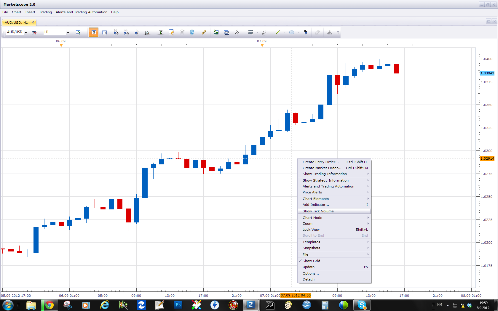
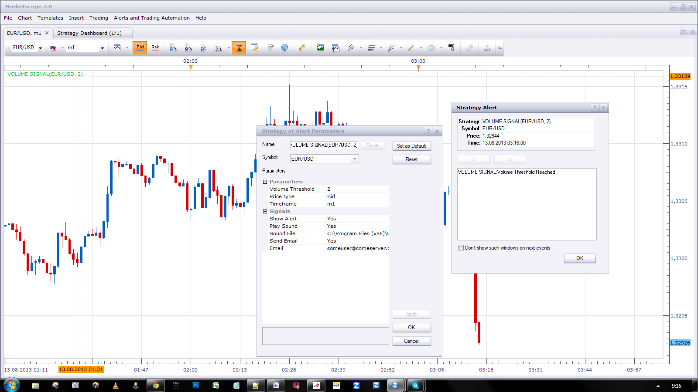

# Volume Signal

> Source: https://fxcodebase.com/code/viewtopic.php?f=29&t=15042  
> Forum: 29 · Topic 15042 · 14 post(s)

---

## Volume Signal

**Apprentice** · Thu Mar 22, 2012 10:24 am

[Volume Signal.lua](files/28487/Volume%20Signal.lua)

This simple signal provides an alarm if volume rises or falls above or below Threshold.
Threshold can not be zero.

---

## Re: Volume Signal

**satejchaudhary** · Fri Sep 07, 2012 2:59 pm

hi Apprentice,

Where can I find a simple volume indicator. The standard indicators in TS2 have
Accumulation Distribution, OBV, etc. but there is no volume indicator.

Its difficult to use this signal if there is no indicator to see what we are going to trigger

Thanks
Satej

---

## Re: Volume Signal

**Apprentice** · Sat Sep 08, 2012 12:56 pm

Please use "Show Tick Volume" manu option.

---

## Re: Volume Signal

**speakinmymind** · Fri Aug 02, 2013 11:45 am

Can this be modified so that is could have the same functionality and ease of use as the price alert has?

---

## Re: Volume Signal

**speakinmymind** · Sat Aug 03, 2013 10:03 am

can you make a strategy that will trade on this?

---

## Re: Volume Signal

**speakinmymind** · Sun Aug 04, 2013 2:26 pm

Does this send a signal when volume falls below the threshold as well? If not, can it be developed so that it can?

Thanks!

---

## Re: Volume Signal

**Apprentice** · Mon Aug 05, 2013 2:33 am

by definition volume can only increase.
it falls, start at zero, only at the beginning of the next period.

---

## Re: Volume Signal

**speakinmymind** · Mon Aug 05, 2013 4:55 am

I meant send a signal if a period closes with a total volume lower than the specified threshold.

---

## Re: Volume Signal

**Apprentice** · Thu Aug 08, 2013 2:51 am

Your request is added to the development list.

---

## Re: Volume Signal

**Apprentice** · Mon Aug 12, 2013 7:24 am

Try Updated Version.

---

## Re: Volume Signal

**Gnarly** · Mon Aug 12, 2013 1:42 pm

Hi Apprentice, I`m having issues with this signal. Volume crosses over the specified parameters but alert wont show or sound.

Any thouthgs on why this is happening?

Many thanks

---

## Re: Volume Signal

**Apprentice** · Tue Aug 13, 2013 2:20 am

everything works as expected for me.
Check your settings.
Check your speakers.

---

## Re: Volume Signal

**BTrade** · Wed Jun 18, 2014 4:56 pm

Hi Apprentice,

Is it possible to make this signal works when a high volume candle crosses a specific MVA, EMA, etc.?

Thanks!

---

## Re: Volume Signal

**Apprentice** · Sat Jun 21, 2014 8:48 am

U can use this strategy for this purpose.
[viewtopic.php?f=31&t=60836](https://fxcodebase.com/code/viewtopic.php?f=31&t=60836)
