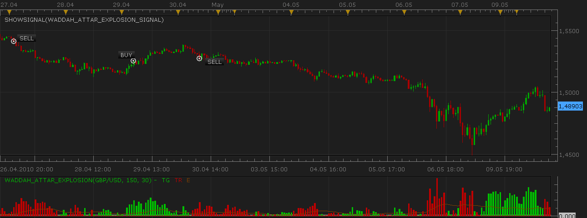
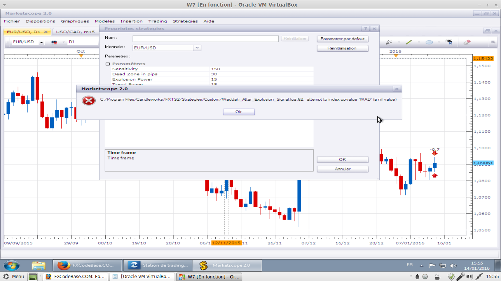

# Waddah Attar's Explosion Signal

> Source: https://fxcodebase.com/code/viewtopic.php?f=29&t=1012  
> Forum: 29 · Topic 1012 · 20 post(s)

---

## Waddah Attar's Explosion Signal

**Nikolay.Gekht** · Tue May 11, 2010 9:35 pm

The signal is built on the base of [Waddah Attar's Explosion oscillator](https://fxcodebase.com/code/viewtopic.php?f=17&t=1011).

I removed the exit signals of the original calculator since they are pretty noisy on the latest 2-3 months data. However, the enter signals looks pretty good and, being used with careful money management, could really help.

 

 [Waddah_Attar_Explosion.lua](files/1893/Waddah_Attar_Explosion.lua)

 [Waddah_Attar_Explosion_Signal.lua](files/1893/Waddah_Attar_Explosion_Signal.lua)

Please, note that the signal uses the Waddah Attar's Explosion Oscillator. So, do not forget to download and install the indicator.

---

## Re: Waddah Attar's Explosion Signal

**NID007** · Thu Mar 03, 2011 6:02 pm

Hi there can you tell me where can get the waddah Atter Explosion stratergy anywhere if it exists thanks ....

---

## Re: Waddah Attar's Explosion Signal

**sunshine** · Mon Mar 14, 2011 7:59 am

Hi,
The strategy can be found here: [viewtopic.php?f=31&t=3601](https://fxcodebase.com/code/viewtopic.php?f=31&t=3601)

---

## Re: Waddah Attar's Explosion Signal

**BS_biggie** · Tue Mar 13, 2012 11:40 pm

Please advise how I can get the Buy and Sell signal displayed as per your chart above. I've already installed Waddah_Attar_Explosion_Signal and Waddah_Attar_Explosion.

---

## Re: Waddah Attar's Explosion Signal

**Apprentice** · Thu Mar 15, 2012 7:33 pm

Signal Helper is not available for now.
You can use backtester, for testing on historical data.

---

## Re: Waddah Attar's Explosion Signal

**SuperTrader** · Wed Aug 01, 2012 11:00 am

Hi guys ! I don't think this signal works to be honest. I've downloaded both its indicators from the other topic, installed them both, setup the signal on 2 major FX pairs (EU, GU) on the 1-min chart (just for initial testing purposes), I even applied those two indicators on all my open charts and I never got a single signal in a 24-hour period ! Of course this can't be possible, since I was watching the indicators and they were supposed to give many signals (we're talking about the 1-min chart). Anybody got any signals out of it ? Could please Nikolay or another developer take a look at it ? I think the indicator is pretty good, works well, it's visually easy to read and it would be just GREAT to have signals. Many thanks in advance you guys !

---

## Re: Waddah Attar's Explosion Signal

**Apprentice** · Wed Aug 08, 2012 2:37 am

As far as I can see, the signal works as expected.
However, it uses a complex algorithm, which uses filtering.
If you set DeadZonePip, ExplosionPower, TrendPower to zero,
You will get more signal, this is especially true for smaller time frames.

Furthermore this is a signal, not a strategy.
Atempt to define conditions that would like to use,
and someone will write a proper strategy.

---

## Re: Waddah Attar's Explosion Signal

**SuperTrader** · Fri Aug 10, 2012 3:54 am

Hi Apprentice. You're right. I had tested the signal with its default settings (pretty heavy filtering) as I wasn't yet very familiar with this particular indicator. Now that I read in detail the theory behind it, I've lowered some of its filters and I get way more frequent signals. By the way I'm taking this opportunity to personally thank you for your GREAT development work and critical contribution in this Forum and on TradingStation/MarketScope all these years. I've incorporated a large number of your indicators/signals/strategies in my own trading style (scalping) and they're helping me a lot every single day !

---

## Re: Waddah Attar's Explosion Signal

**wulfman** · Mon Dec 21, 2015 11:32 am

Hi, just downloaded and added [download/file.php?id=14163](https://fxcodebase.com/code/download/file.php?id=14163) to my tradestation platform and it does nothing. Is this a finished version or is there something else I need to get this thing to work. change settings, etc.... It is the Waddah attar explosion indicator.

thanks

---

## Re: Waddah Attar's Explosion Signal

**Apprentice** · Mon Dec 28, 2015 5:51 am

Please set appropriate Entry / Exit levels.
0 and 0,25 in this example.

---

## Re: Waddah Attar's Explosion Signal

**OTAForex** · Mon Jan 04, 2016 4:18 pm

Hello,

Where can I find the Waddah Attar Explosion Oscillator?

Thanks in advance.

---

## Re: Waddah Attar's Explosion Signal

**Apprentice** · Fri Jan 08, 2016 4:57 am

Waddah Attar Explosion Oscillator Is available here.
[viewtopic.php?f=17&t=1011](https://fxcodebase.com/code/viewtopic.php?f=17&t=1011)

---

## Re: Waddah Attar's Explosion Signal

**OTAForex** · Fri Jan 08, 2016 2:36 pm

> **Apprentice wrote:**
> Waddah Attar Explosion Oscillator Is available here.
> [viewtopic.php?f=17&t=1011](https://fxcodebase.com/code/viewtopic.php?f=17&t=1011)

Sorry, I think something is wrong? When I click the link you provided all I get is the message "You are not authorised to read this forum."

Any help you can provide would be greatly appreciated. Thank you in advance.

---

## Re: Waddah Attar's Explosion Signal

**Avignon** · Fri Jan 08, 2016 3:57 pm

> **Apprentice wrote:**
> Waddah Attar Explosion Oscillator Is available here.
> [http://fxcodebase.com/code/viewtopic.php?f=17&t=1011](https://fxcodebase.com/code/viewtopic.php?f=17&t=1011)

We are not authorised to read this forum.

---

## Re: Waddah Attar's Explosion Signal

**Apprentice** · Sun Jan 10, 2016 6:15 am

Waddah_Attar_Explosion.lua added.

---

## Re: Waddah Attar's Explosion Signal

**Avignon** · Thu Jan 14, 2016 10:34 am

There is an error message.

 

---

## Re: Waddah Attar's Explosion Signal

**Apprentice** · Wed Jan 20, 2016 6:36 am

Please, note that the signal uses the Waddah Attar's Explosion Oscillator.
So, do not forget to download and install the indicator.
[download/file.php?id=15246](https://fxcodebase.com/code/download/file.php?id=15246)

---

## Re: Waddah Attar's Explosion Signal

**Avignon** · Wed Jan 20, 2016 4:12 pm

Oh yes of course... I knew it !

---

## Re: Waddah Attar's Explosion Signal

**BigFOX** · Thu Feb 25, 2016 5:48 am

Hi Apprentice,
I want to download "Waddah Attar Explosion Oscillator" and link "viewtopic.php?f=17&t=1011" does not work. (You are not authorised to read this forum).
It is possible to get permission.

Cordially BigFOX.

---

## Re: Waddah Attar's Explosion Signal

**Apprentice** · Thu Feb 25, 2016 2:19 pm

Try it now.
