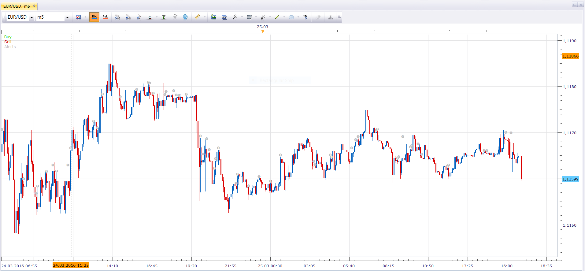

# WPR_FO indicator Signal

> Source: https://fxcodebase.com/code/viewtopic.php?f=29&t=63334  
> Forum: 29 · Topic 63334 · 1 post(s)

---

## WPR_FO indicator Signal

**Apprentice** · Fri Apr 01, 2016 3:34 am

Signal is given on WPR_FO indicator line color Alternation.

 [WPR_FO indicator Signal.lua](files/105596/WPR_FO%20indicator%20Signal.lua)

Averages indicator is required.
[viewtopic.php?f=17&t=2430](https://fxcodebase.com/code/viewtopic.php?f=17&t=2430)
WPR_FO indicator is required.
[viewtopic.php?f=17&t=7633](https://fxcodebase.com/code/viewtopic.php?f=17&t=7633)
