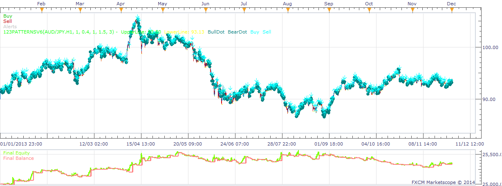

# 123Pattern Strategy

> Source: https://fxcodebase.com/code/viewtopic.php?f=31&t=60232  
> Forum: 31 · Topic 60232 · 19 post(s)

---

## 123Pattern Strategy

**moomoofx** · Thu Jan 23, 2014 4:30 am

As requested on here: [viewtopic.php?f=17&t=10444&start=10#p55409](https://fxcodebase.com/code/viewtopic.php?f=17&t=10444&start=10#p55409)

A strategy based off the 123Pattern Indicator. Can also be used for signals only, just disable trading.

It also has a parameter to choose Instant Execution or Wait for Bar to close. This is because the price may cross the breakout and then close back behind it.

 

Cheers,
MooMooFX

---

## Re: 123Pattern Strategy

**automan** · Wed Mar 05, 2014 6:06 am

This strategy works fine, good job

Would it be possible to add an option to check that last signal was oppsosite to current?

For example if i am long and want to take profit after 30 pips then the strategy would wait for the sell signal before it open any new buy

now when using take profit (specially breakout strategys) it open a new buy if the buy signal is valid

hope you understand what i mean on bad english

---

## Re: 123Pattern Strategy

**moomoofx** · Thu Mar 06, 2014 4:13 am

Requirements are understood, and your request has been added to the to-do list.

Cheers,
MooMooFX

---

## Re: 123Pattern Strategy

**moomoofx** · Sun Jun 01, 2014 3:00 am

Hi,

> Would it be possible to add an option to check that last signal was oppsosite to current?
The strategy has been updated with a parameter called 'In turns' that can be used to control this behavior.

Cheers,
MooMooFX

---

## Re: 123Pattern Strategy

**Miguelator** · Thu Jun 05, 2014 4:16 am

Thanks for sharing your knowledge

Sounds like a good strategy, but I would like to use with Renko charts
It is possible to adapt?
Example: Run after brick closed after break?

Thank you very much in advance
regards

---

## Re: 123Pattern Strategy

**Apprentice** · Thu Jun 05, 2014 7:51 am

Your request is added to the development list.

---

## Re: 123Pattern Strategy

**rhianna** · Fri Apr 17, 2015 5:02 am

Thank you for the strategy. I tested it in small time-frames and it works great. I will let you know if i find any issues in bigger time-frames especially on daily charts.

---

## Re: 123Pattern Strategy

**Atmotrader** · Thu Feb 04, 2016 4:27 pm

Hello,

when I start the strategie the following error message comes up:
"attempt to call field 'autoBuffer' (a nil value)"

Can you please fix this?

Thank you!

---

## Re: 123Pattern Strategy

**Apprentice** · Wed Dec 14, 2016 6:29 am

Strategy was revised and updated.

---

## Re: 123Pattern Strategy

**ANTONIO** · Thu Nov 16, 2017 1:34 pm

hi,
when I start the strategie the following error message comes up:
"attempt to call field 'autoBuffer' (a nil value)"

Can you please fix this?

Thank you!

---

## Re: 123Pattern Strategy

**ANTONIO** · Thu Nov 16, 2017 1:36 pm

hi,
when I start the strategie the following error message comes up:
"attempt to call field 'autoBuffer' (a nil value)"

Can you please fix this?

Thank you!

---

## Re: 123Pattern Strategy

**Apprentice** · Tue Nov 21, 2017 7:02 am

Have reported this to the development team.

---

## Re: 123Pattern Strategy

**Apprentice** · Fri Nov 24, 2017 8:50 am

Try it now.

---

## Re: 123Pattern Strategy

**ANTONIO** · Tue Nov 28, 2017 3:30 pm

Again appears the same message: "attempt to call field 'autoBuffer' (a nil value)"

Thank you

---

## Re: 123Pattern Strategy

**Apprentice** · Sun Dec 03, 2017 5:16 am

You probably have an old file version in your browser cash.
Try refreshing your browser, use another browser or computer.
Re-Download your strategy.

---

## Re: 123Pattern Strategy

**ANTONIO** · Sun Dec 03, 2017 7:35 am

it's ok
Thank you

---

## Re: 123Pattern Strategy

**Apprentice** · Sun Feb 04, 2018 1:27 pm

[123PatternsV6Strategy.dell123.lua](files/117475/123PatternsV6Strategy.dell123.lua)

Based on the request.
[viewtopic.php?f=27&t=8816&start=10](https://fxcodebase.com/code/viewtopic.php?f=27&t=8816&start=10)

---

## Re: 123Pattern Strategy

**dell123** · Fri Feb 16, 2018 1:15 am

Thank you for updated strategy. Strategy is opening 2 positions with 2 targets functioning correctly. Stop move to break-even or X amount of pips unable to test do to the following message."C:/Program Files (x86)/Candleworks/FXTS2/Strategies/Custom/123PatternsV6Strategy.dell123.lua:1231: attempt to index local 'command1' (a boolean value)" then strategy shuts down.

Need clarification under strategy parameters "Breakeven to" if set to default 0.0, then would it move stop to breakeven after target 1 is hit, and if I place any number in its place then it would be breakeven plus the number? Also for it to function do I need to have trailing stop order on?

Thanks

---

## Re: 123Pattern Strategy

**Apprentice** · Mon Feb 19, 2018 6:57 am

Fixed.
