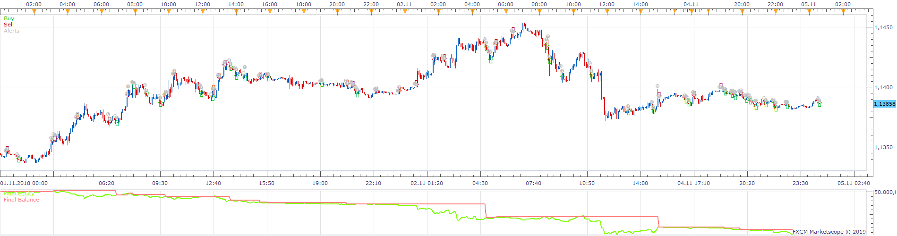
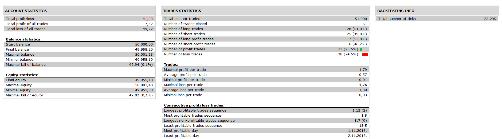

# 2 bar supply and demand strategy

> Source: https://fxcodebase.com/code/viewtopic.php?f=31&t=67300  
> Forum: 31 · Topic 67300 · 7 post(s)

---

## 2 bar supply and demand strategy

**Apprentice** · Fri Jan 25, 2019 6:52 am

 

 [2 bar supply and demand strategy.lua](files/123527/2%20bar%20supply%20and%20demand%20strategy.lua)

Based on 2 bar supply and demand.lua
[viewtopic.php?f=17&t=67299](https://fxcodebase.com/code/viewtopic.php?f=17&t=67299)

---

## Re: 2 bar supply and demand strategy

**kankatrader** · Fri Jan 25, 2019 8:58 am

Hello

the following error is displayed

C:/Program Files (x86)/Candleworks/FXTS2/Strategies/Custom/2 bar supply and demand strategy.lua:70: C:/Program Files (x86)/Candleworks/FXTS2/Indicators/Custom/2 bar supply and demand.lua (-1, -1) : E19 - nil

---

## Re: 2 bar supply and demand strategy

**Apprentice** · Fri Jan 25, 2019 11:34 am

I forgot to mention, you have to install 2 bar supply and demand.lua

---

## Re: 2 bar supply and demand strategy

**kankatrader** · Fri Jan 25, 2019 12:39 pm

I have already installed the indicator

The strategy only works with the backtest tester. as soon as I activate the strategy in trading mode the error message comes up after some time

---

## Re: 2 bar supply and demand strategy

**Apprentice** · Mon Jan 28, 2019 6:50 am

Fixed.

---

## Re: 2 bar supply and demand strategy

**kankatrader** · Mon Jan 28, 2019 12:28 pm

it must have gone something wrong. That's no strategy anymore. Look at the content of the code

---

## Re: 2 bar supply and demand strategy

**Apprentice** · Mon Jan 28, 2019 1:47 pm

Try it now.
Make sure to re-download both files.
