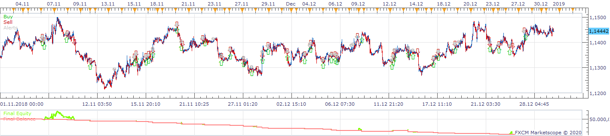
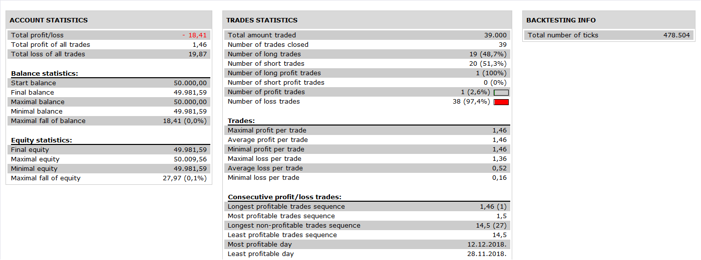

# 2_BB_Price_RSI Strategy

> Source: https://fxcodebase.com/code/viewtopic.php?f=31&t=69333  
> Forum: 31 · Topic 69333 · 4 post(s)

---

## 2_BB_Price_RSI Strategy

**Apprentice** · Mon Jan 20, 2020 9:52 am

 

Based on request.
[viewtopic.php?f=27&t=69325](https://fxcodebase.com/code/viewtopic.php?f=27&t=69325)

 [2_BB_Price_RSI.lua](files/130814/2_BB_Price_RSI.lua)

---

## Re: 2_BB_Price_RSI Strategy

**axeas69** · Mon Jan 20, 2020 2:29 pm

Hi,
Super, thank you.
Little pb when I use breakeven:

lua 1567: attempt to perform arithmetic on field '_close_percent' a nil value

Please can you check
Brgds
Axeas

---

## Re: 2_BB_Price_RSI Strategy

**Apprentice** · Mon Jan 20, 2020 4:18 pm

Your request is added to the development list.
Development reference 574.

---

## Re: 2_BB_Price_RSI Strategy

**Apprentice** · Tue Jan 21, 2020 1:45 pm

Try it now.
