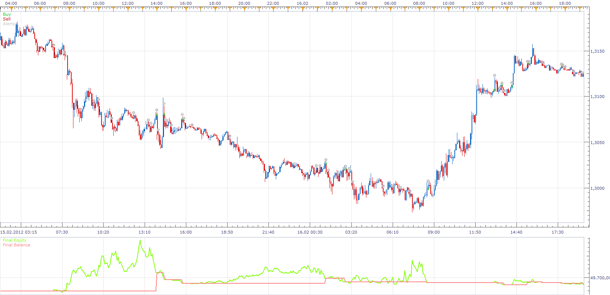

# 2 CCI 2 EMA STRATEGY

> Source: https://fxcodebase.com/code/viewtopic.php?f=31&t=8144  
> Forum: 31 · Topic 8144 · 6 post(s)

---

## 2 CCI 2 EMA STRATEGY

**Apprentice** · Wed Nov 16, 2011 12:50 pm

buy when:
1.price > ema [period 34][applied to high] and
2.cci 50 > buy level and
3.cci 14 > buy level

sell when
1. price < ema[period 34][applied to low] and
2.cci 50 < sell level and
3.cci 14 < sell level

exit buy when:
1.price cross under ema 34[ applied to high] or
2.cci 14 cross under sell level or
3. cci 50 cross under sell level

exit sell when:
1. price crossover ema 34[ applied to low] or
2.cci 14 cross over buy level or
3. cci 50 cross over buy level

 [2 CCI 2 EMA STRATEGY.lua](files/17993/2%20CCI%202%20EMA%20STRATEGY.lua)

---

## Re: 2 CCI 2 EMA STRATEGY

**taypot** · Thu Nov 17, 2011 12:12 pm

This gives me the message that there is an error in the file when I try to load it in Marketcope 2. Would love to use it. Exactly what i am looking for.

---

## Re: 2 CCI 2 EMA STRATEGY

**Apprentice** · Thu Nov 17, 2011 2:20 pm

You probably are using the old version or Marketskope.
I advise you to download and install a new version of TS.
From FXCM website.

---

## Re: 2 CCI 2 EMA STRATEGY

**taypot** · Thu Nov 17, 2011 6:57 pm

Yes working fine now thanks

---

## Re: 2 CCI 2 EMA STRATEGY

**Apprentice** · Fri Mar 23, 2012 4:52 am

This is a modification of the original strategy.

buy when:
1.cci 14 crossover buy level {and}
2.cci 50>buy level{and}
3.price > ema [period 34][applied to high]

sell when
1.cci 14 cross under sell level{and}
2.cci 50 < sell level{and}
3. price < ema[period 34][applied to low]

exit rules are same as in first strategy

 [CCI_EMA_STRATEGY.lua](files/28543/CCI_EMA_STRATEGY.lua)

---

## Re: 2 CCI 2 EMA STRATEGY

**Apprentice** · Sun Dec 04, 2016 10:26 am

Bump up.
