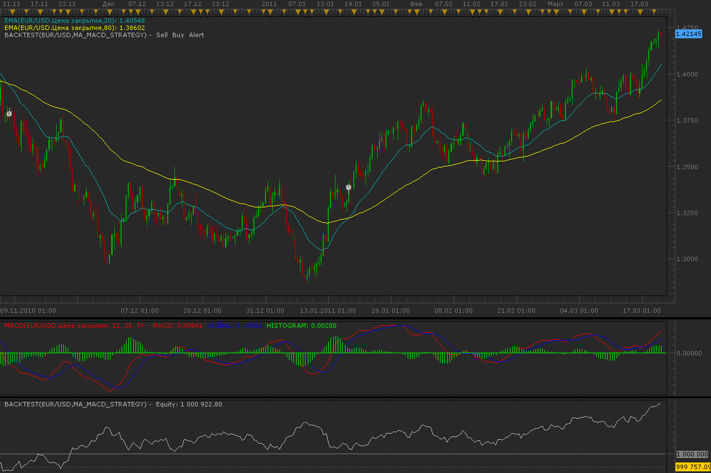

# 2 MA & MACD strategy

> Source: https://fxcodebase.com/code/viewtopic.php?f=31&t=3698  
> Forum: 31 · Topic 3698 · 5 post(s)

---

## 2 MA & MACD strategy

**Alexander.Gettinger** · Tue Mar 22, 2011 1:24 am

Strategy based on 2 MA and MACD indicators.

BUY conditions:
MA1 crosses above or touches the MA2 and MACD > 0

SELL conditions:
MA1 crosses down or touches the MA2 and MACD < 0

 

Download:

 [MA_MACD_Strategy.lua](files/8953/MA_MACD_Strategy.lua)

For this strategy must be installed AVERAGES indicator ([viewtopic.php?f=17&t=2430](https://fxcodebase.com/code/viewtopic.php?f=17&t=2430)).

The Strategy was revised and updated on December 10, 2018.

---

## Re: 2 MA & MACD strategy

**TraderBob** · Mon Feb 11, 2013 12:43 pm

Hi there I was wondering if anyboady couls add trading times for this strategy please.

As in only trade if time is between say 9am and 6pm, would be good if user can selet the times...

thanks folks

---

## Re: 2 MA & MACD strategy

**Apprentice** · Mon Feb 11, 2013 6:25 pm

Your request is added to the development list.

---

## Re: 2 MA & MACD strategy

**TraderBob** · Fri Feb 15, 2013 12:47 pm

> **Apprentice wrote:**
> Your request is added to the development list.

thanks

---

## Re: 2 MA & MACD strategy

**Apprentice** · Fri Dec 09, 2016 4:47 am

Strategy was revised and updated.
