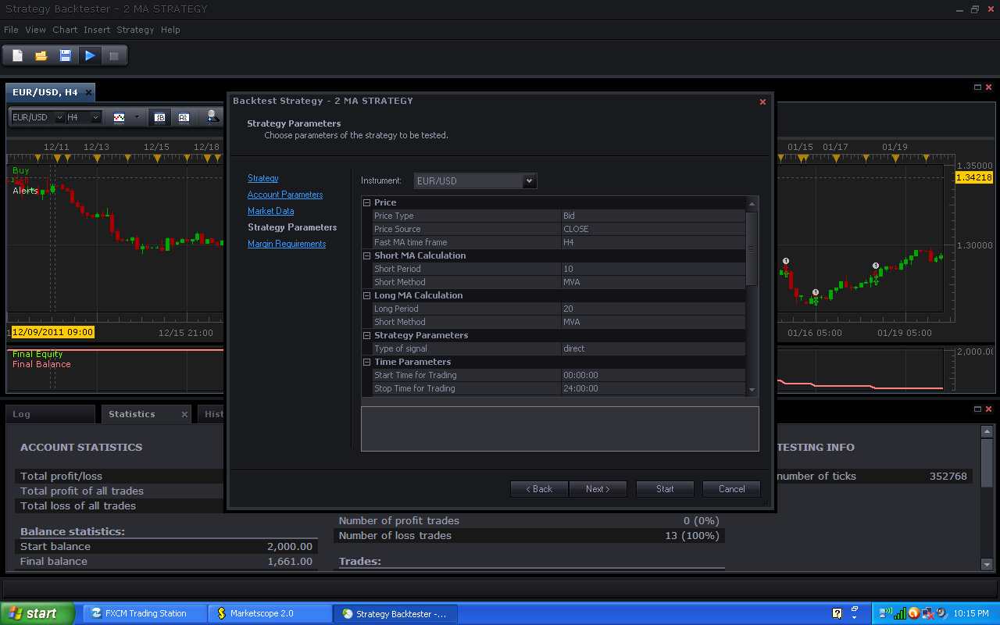
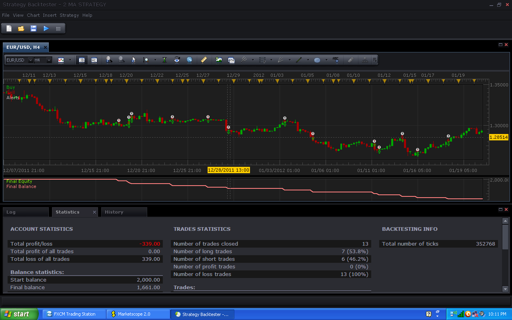
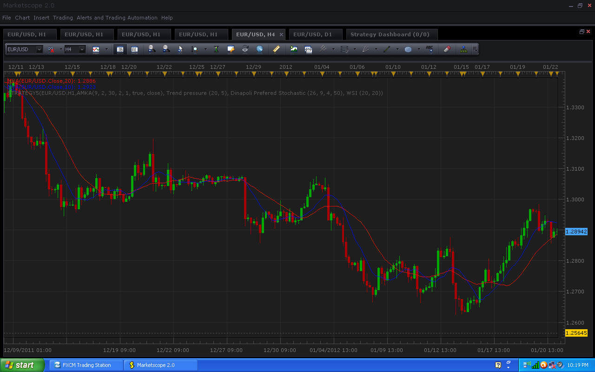
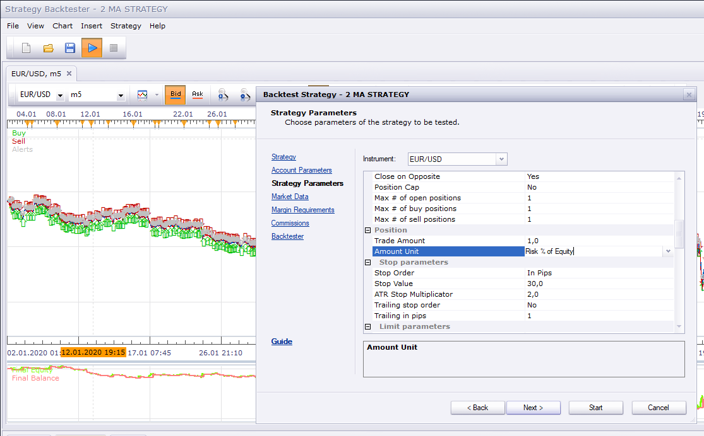

# 2 MA Strategy

> Source: https://fxcodebase.com/code/viewtopic.php?f=31&t=11075  
> Forum: 31 · Topic 11075 · 34 post(s)

---

## 2 MA Strategy

**Apprentice** · Fri Jan 06, 2012 4:56 am

Signals are generated by simple two MA (moving average) cross.
Second MA, is MA, of First MA.

 [2 MA Strategy.lua](files/22599/2%20MA%20Strategy.lua)

The Strategy was revised and updated on December 10, 2018.

---

## Re: 2 MA Strategy

**arindam89** · Wed Jan 11, 2012 5:58 am

> **Apprentice wrote:**
>
>
> 2 ma.png
>
>
>
> Signals are generated by simple two MA (moving average) cross.
> Second MA, is MA, of First MA.
>
>
>
> 2 MA Strategy.lua

hi
can you add profit/loss care to yhis strategy link [search.php?t=1985](https://fxcodebase.com/code/search.php?t=1985)
plz add that parameter to this straegy
thanks
by

---

## Re: 2 MA Strategy

**Apprentice** · Wed Jan 11, 2012 4:44 pm

The attached link is not valid.

---

## Re: 2 MA Strategy

**arindam89** · Thu Jan 12, 2012 7:54 am

> **Apprentice wrote:**
> The attached link is not valid.

sorry the link is
[viewtopic.php?f=31&t=1985&p=8548&hilit=profit%2Floss+care#p8548](https://fxcodebase.com/code/viewtopic.php?f=31&t=1985&p=8548&hilit=profit%2Floss+care#p8548)
plzzz add risk management also
thnaks

---

## Re: 2 MA Strategy

**arindam89** · Tue Jan 17, 2012 2:20 am

> **arindam89 wrote:**
>
>
> > **Apprentice wrote:**
> > The attached link is not valid.
>
>
> sorry the link is
> [viewtopic.php?f=31&t=1985&p=8548&hilit=profit%2Floss+care#p8548](https://fxcodebase.com/code/viewtopic.php?f=31&t=1985&p=8548&hilit=profit%2Floss+care#p8548)
> plzzz add risk management also
> thnaks

hi
can you please add these parameters to the 2 ma strategy
thanks
by

---

## Re: 2 MA Strategy

**kgsmith69** · Wed Jan 18, 2012 4:31 pm

What is "Valid interval for operation in second" ?

 

---

## Re: 2 MA Strategy

**dimfil** · Sat Jan 21, 2012 10:37 pm

This strategy does opposite, sells when it should be buying and buys when it should be selling.

---

## Re: 2 MA Strategy

**Apprentice** · Sun Jan 22, 2012 5:37 pm

1.
 "Valid interval for operation in second" is time after end of trading hours
in which all positions are closed if you use Mandatory Closing option.

2.
My tests were not found error.
Try this use Revers -Type of signal .

---

## Re: 2 MA Strategy

**kgsmith69** · Sun Jan 22, 2012 9:26 pm

Thanks Apprentice.

---

## Re: 2 MA Strategy

**kgsmith69** · Sun Jan 22, 2012 11:37 pm

I'm not sure whats going on?

Settings

 

Result

 

Chart

 

Maybe its something after update. Trading Station/Market Scope is a little glitchy after update on my computer. Or its just something I'm doing wrong with settings.

---

## Re: 2 MA Strategy

**kgsmith69** · Mon Jan 23, 2012 12:01 am

Please disregard last post. These aren't moving average crosses are they? I'M SORRY!

---

## Re: 2 MA Strategy

**kgsmith69** · Mon Jan 23, 2012 9:07 pm

I've been running this on a demo account and it does trade correctly. It was my fault. Many thanks for the great indicators and strategies.

---

## Re: 2 MA Strategy

**waelsaleem** · Fri Jan 27, 2012 3:48 pm

Hello,

I have a request for a strategy: 2MA-FIBO strategy,

The strategy would be identical to the 2MA strategy. The only difference is that the trade is triggered only if confirmed by the fibo candle indicator. If the fibo candle indicator is in the same direction, then the trade is triggered. Exit strategy is similar to the 2MA strategy. It would be nice if the fibo portion of the strategy is also customizable, just like the fibo candle indicator. This will help in optimizing the strategy for best performance. The purpose of this combination is to try to eliminate some of the losing trades that are triggered against the overal trend. I hope it will be a good strategy.

Thank you again for your great work.

---

## Re: 2 MA Strategy

**Apprentice** · Fri Jan 27, 2012 6:21 pm

Your request is added to the developmental cue.

---

## Re: 2 MA Strategy

**amorgos89** · Thu Nov 15, 2012 1:11 pm

with this strategy, I have an error message : (string average lua)62 the method KAMA is unknown
impossible to use average KAMA
Thanks

---

## Re: 2 MA Strategy

**Apprentice** · Thu Nov 15, 2012 2:30 pm

What strategy do you use.
Are you using this, original or modified strategy.
If u are using modified version Can you send the code to my private email.

---

## Re: 2 MA Strategy

**amorgos89** · Fri Nov 16, 2012 11:42 am

I use the original version

---

## Re: 2 MA Strategy

**Apprentice** · Sat Nov 17, 2012 4:18 am

We have a problem here.
This strategy not to use Averages Indicator.
Can you post this strategy here, or send it by e-mail.

---

## Re: 2 MA Strategy

**amorgos89** · Mon Nov 19, 2012 5:46 am

This is the file, impossible to use averages Kama
Thanks

---

## Re: 2 MA Strategy

**Apprentice** · Tue Nov 20, 2012 6:45 am

The issue of compatibility.
KAMA was not supported by Averages.lua.
Please reinstall averages.lua

---

## Re: 2 MA Strategy

**amorgos89** · Tue Nov 20, 2012 1:07 pm

thanks for your help

---

## Re: 2 MA Strategy

**Apprentice** · Wed Dec 07, 2016 3:36 pm

Strategy has been revised and updated.

---

## Re: 2 MA Strategy

**fallingangel** · Tue Jul 14, 2020 10:12 am

Dear Apprentice

Can you include in this strategy the features for setting the maximum number of long & short positions, trading lots as risk percentage of equity, limit order as multiplicator of stop loss & breakeven?

All of above can be found in below strategy:

[viewtopic.php?f=31&t=69984&p=134883&hilit=engulfing#p134883](https://fxcodebase.com/code/viewtopic.php?f=31&t=69984&p=134883&hilit=engulfing#p134883)

Thank you!

---

## Re: 2 MA Strategy

**Apprentice** · Wed Jul 15, 2020 10:06 am

Your request is added to the development list.
Development reference 1699.

---

## Re: 2 MA Strategy

**fallingangel** · Fri Jul 17, 2020 9:11 am

Hi

Test Results

refer to 2 MA STRATEGY 1 pdf file

1a. Strategy opens position, sets stop loss & limit profit, and exhibits following message with strategy pausing in the dashboard (for both long and short):

C:/Program Files (x86)/Candleworks/FXTS2/Strategies/Custom/2 MA Strategy.lua:492: attempt to call method 'CreateController' (a nil value)

I manually restarted the strategy, breakeven & partial close on breakeven did not work.

1b. Same settings as per 1a, with only difference turned partial close on breakeven to NO. Same behaviour as per 1a.

2a. Same settings as per 1a, with only difference in lots (used % risk of equity, value 2), when long condition was in place, it did not open position, and exhibited following message:

Open order failed: The Quantity must be a positive integer number

With short conditions, it behaved as per 1a case.

2b. Same settings as per 1a, with only differences in lots (used % risk of equity, value 2) and breakeven set to NO. Strategy behaved as per 2a.

---

## Re: 2 MA Strategy

**Apprentice** · Sun Jul 19, 2020 6:11 pm

Your request is added to the development list.
Development reference 1739.

---

## Re: 2 MA Strategy

**Apprentice** · Mon Jul 20, 2020 10:11 am

[2 MA Strategy.lua](files/136124/2%20MA%20Strategy.lua)

Try this version.

---

## Re: 2 MA Strategy

**fallingangel** · Thu Jul 23, 2020 8:43 am

Hi Apprentice

Breakeven & partial close at breakeven works like a charm!

risk % of equity exhibits same bug as before with long conditions (did not test with short conditions).

---

## Re: 2 MA Strategy

**Apprentice** · Mon Jul 27, 2020 4:10 pm

Your request is added to the development list.
Development reference 1786.

---

## Re: 2 MA Strategy

**Apprentice** · Tue Jul 28, 2020 3:50 pm

I don't have any issues

---

## Re: 2 MA Strategy

**foreveryoung** · Mon Aug 03, 2020 6:46 am

Hi Apprentice

Can you implement an option where close on opposite shall work only if position is in profit?

---

## Re: 2 MA Strategy

**foreveryoung** · Mon Aug 03, 2020 7:23 am

Also, can you implement stop loss at the swing low for long, and swing high for short? This can be done as follows:

- For long, identify all prices from the opening bar back to the bar that last time fast MA crossed below slow MA. Place stop loss at the lowest price
- For short, identify all prices from the opening bar back to the bar that last time fast MA crossed above slow MA. Place stop loss at the highest price

Thank you in advance

---

## Re: 2 MA Strategy

**Apprentice** · Fri Aug 07, 2020 4:55 am

Your request is added to the development list.
Development reference 1858.

---

## Re: 2 MA Strategy

**Apprentice** · Mon Aug 10, 2020 8:17 am

[2 MA Strategy v3.lua](files/136741/2%20MA%20Strategy%20v3.lua)

Try this version.
