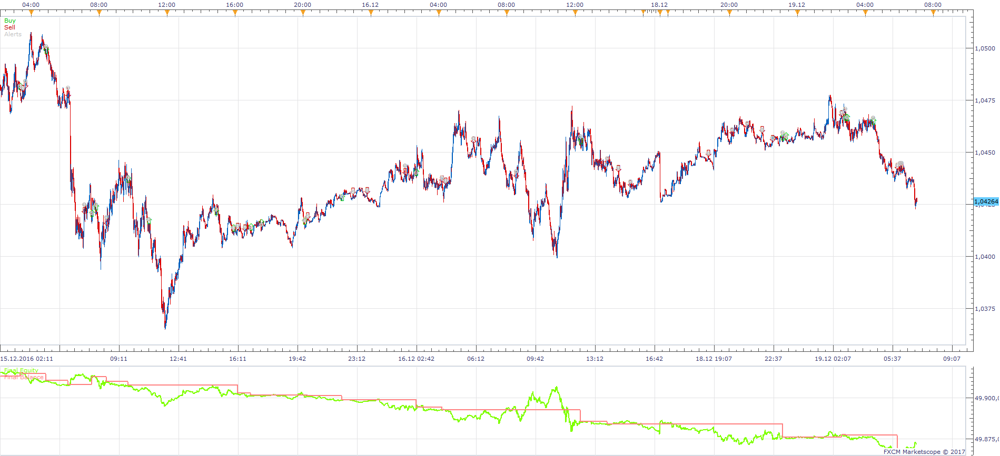
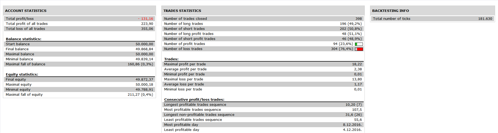

# 2 Moving Averages Price Cross Stochastic Strategy

> Source: https://fxcodebase.com/code/viewtopic.php?f=31&t=64945  
> Forum: 31 · Topic 64945 · 3 post(s)

---

## 2 Moving Averages Price Cross Stochastic Strategy

**Apprentice** · Mon Jul 24, 2017 9:28 am

 

Based on the request.
[viewtopic.php?f=27&t=64937](https://fxcodebase.com/code/viewtopic.php?f=27&t=64937)
Open Long
MA1 above MA2
Price CrossOver MA2
Both Stochastic %K and %D are below 30

Open Short
MA1 below MA2
Price CrossUnder MA2
Both Stochastic %K and %D are above 70

 [2 Moving Averages Price Cross Stochastic Strategy.lua](files/113714/2%20Moving%20Averages%20Price%20Cross%20Stochastic%20Strategy.lua)

The Strategy was revised and updated on January 21, 2019.

---

## Re: 2 Moving Averages Price Cross Stochastic Strategy

**foreveryoung** · Mon Jul 24, 2017 10:14 am

This is great Apprentice, thank you so much, however, there is no option in the strategy dialogue to set the oversold/overbought levels for stochastic %K & %D.

Regards
Nik

---

## Re: 2 Moving Averages Price Cross Stochastic Strategy

**foreveryoung** · Mon Jul 24, 2017 11:10 am

Also, is it possible to have this as signal only? I do not allow this to trade, on the other hand, the sound won't stop playing unless I pause the strategy.

Thanks

Regards
Nik
