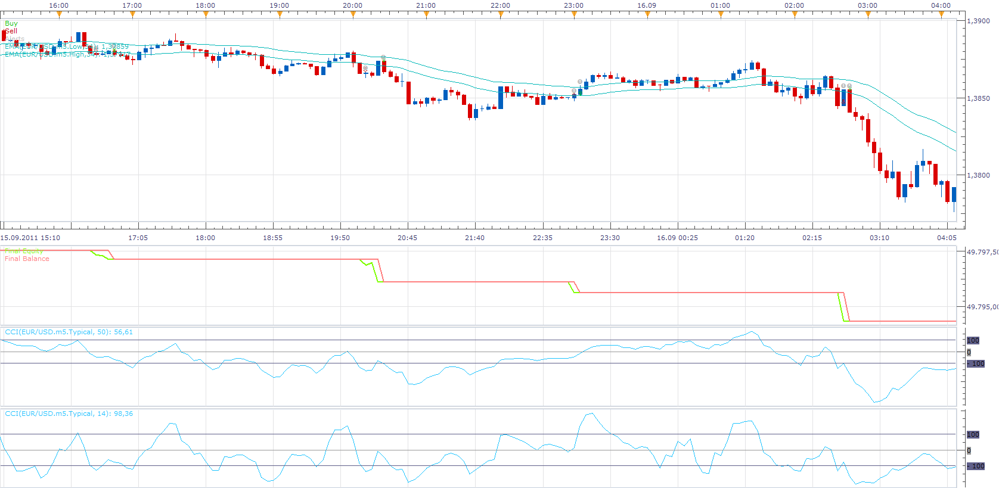

# 2cci ema strategy

> Source: https://fxcodebase.com/code/viewtopic.php?f=31&t=11360  
> Forum: 31 · Topic 11360 · 2 post(s)

---

## 2cci ema strategy

**Apprentice** · Tue Jan 10, 2012 12:36 pm

1. cci [period 14]--- entry cci
buy level [0]
sell level[0]
2. cci[ period 50]---- trend cci
buy level [0]
sell level[0]
3. ema [ period 34] price applied to high
4,ema[ period 34] price applied to low

buy:

1.price > ema 34 price applied to high and
2.trend cci > buy level and
3.entry cci cross over buy level

sell:

1. price < ema 34 price applied to low and
2. trend cci < sell level and
3. entry cci cross under sell level

close buy:

1. price cross under ema 34 price applied to high or
2. trend cci cross under buy level or
3. entry cci cross under buy level

close sell:

1. price cross over ema 34 price applied to low or
2. trend cci cross over sell level or
3. entry cci cross over sell level

 [2cci ema strategy.lua](files/22979/2cci%20ema%20strategy.lua)

The Strategy was revised and updated on November 22, 2018.

---

## Re: 2cci ema strategy

**Apprentice** · Sun Dec 04, 2016 9:02 am

Bump up.
